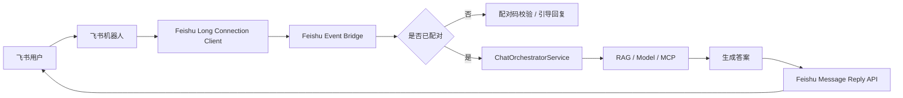
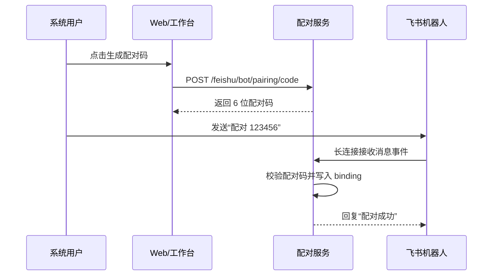
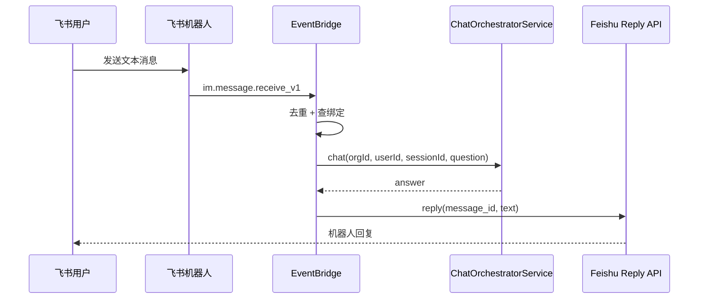

# 飞书机器人长连接集成设计

## 1. 背景

当前项目已经具备以下基础能力：

- 企业内 AI 对话与流式回复
- RAG 知识增强
- MCP 工具编排
- 集成应用配置中心

下一步需要把系统智能体能力接入飞书机器人，使用户可以直接在飞书中与机器人对话，再由机器人把消息桥接到系统内的智能体执行链路。

本设计优先采用飞书官方推荐的 **服务端 SDK + 长连接事件订阅** 模式，而不是自建 Webhook 回调地址。

官方参考：

- [服务端 SDK 概述](https://open.feishu.cn/document/server-docs/server-side-sdk)
- [Java SDK 开发前准备](https://open.feishu.cn/document/uAjLw4CM/ukTMukTMukTM/server-side-sdk/java-sdk-guide/preparations)
- [处理事件](https://open.feishu.cn/document/uAjLw4CM/ukTMukTMukTM/server-side-sdk/java-sdk-guide/handle-events)
- [使用长连接接收事件](https://open.feishu.cn/document/ukTMukTMukTM/uYDNxYjL2QTM24iN0EjN/event-subscription-configure-/request-url-configuration-case)
- [接收消息事件 im.message.receive_v1](https://open.feishu.cn/document/uAjLw4CM/ukTMukTMukTM/reference/im-v1/message/events/receive)
- [发送消息](https://open.feishu.cn/document/uAjLw4CM/ukTMukTMukTM/reference/im-v1/message/create)
- [回复消息](https://open.feishu.cn/document/uAjLw4CM/ukTMukTMukTM/reference/im-v1/message/reply)

## 2. 目标

### 2.1 第一阶段目标

实现以下闭环：

1. 后台可配置飞书自建应用的 `appId / appSecret`
2. 服务端通过飞书 Java SDK 建立长连接并订阅 `im.message.receive_v1`
3. 系统内用户可生成一次性“配对码”
4. 飞书用户给机器人发送“配对码”后，完成飞书账号与系统用户的绑定
5. 配对完成后，飞书单聊文本消息可桥接到系统智能体
6. 智能体回复可通过飞书机器人回发到原对话
7. 保留现有 RAG、MCP 工具和模型路由能力，不重复造轮子

### 2.2 非目标

本轮暂不做：

- 飞书群聊路由
- 图片/文件/音视频消息理解
- 飞书卡片交互回调
- 多飞书应用共享一个 org 的复杂路由策略
- 真正的“已发布 Agent”后端持久化体系

## 3. 官方约束与设计影响

根据官方文档，第一阶段实现需要遵守以下约束：

1. 长连接模式仅支持企业自建应用。
2. 每个应用最多建立 50 个连接。
3. 长连接是集群模式，不广播，同一应用多实例时只会有一个实例收到该条消息。
4. 接收到消息后需要在 3 秒内处理完成，否则会触发超时重推。
5. `im.message.receive_v1` 可能重复投递，如需幂等，应使用 `message_id` 去重，不应依赖 `event_id`。

这些约束带来的架构结论：

- 事件处理入口必须“快速确认 + 异步处理”，不能在飞书回调线程里同步跑完整模型推理。
- 必须按 `message_id` 做幂等去重。
- 当前实例部署策略下，先按“单实例开发 / 小规模部署”实现；后续如多实例部署，需要增加 leader 选举或单点长连接 worker。

## 4. 第一阶段产品方案

### 4.1 绑定对象

第一阶段先绑定到系统内置智能体 `CiCi`，同时在数据结构中预留 `agentCode` 字段，后续可扩展到更多已发布智能体。

约定：

- `agentCode = "cici"` 表示系统内置标准智能体
- 后续可以扩展：
  - `sales_followup`
  - `approval_agent`
  - `published:<agentId>`

### 4.2 配对流程

#### 系统内

1. 用户在系统工作台点击“飞书机器人配对”
2. 前端调用后端生成一次性配对码
3. 系统展示配对码和使用说明

#### 飞书侧

1. 用户打开飞书机器人单聊
2. 发送 `配对 123456` 或 `pair 123456`
3. 机器人校验成功后，建立飞书用户与系统用户的绑定关系
4. 机器人回复“配对成功”

#### 绑定后

1. 飞书用户继续发送文本消息
2. 后端根据绑定关系找到系统用户、所属 org 和目标智能体
3. 复用现有 `ChatOrchestratorService` 生成答案
4. 通过飞书回复消息接口回到原会话

### 4.3 第一阶段交互规则

- 仅支持飞书机器人 **单聊**
- 仅支持 `message_type = text`
- 未配对时：
  - 若消息不是配对命令，回复引导文案
- 已配对时：
  - 文本消息直接进入智能体问答链路
- 重复消息：
  - 基于 `message_id` 忽略重复处理

## 5. 技术方案

### 5.1 总体架构



### 5.2 模块拆分

新增后端模块职责如下：

1. `FeishuBotConfigService`
   - 读取 `integration_app` 中的飞书机器人配置
   - 供连接管理器、配对服务读取

2. `FeishuBotClientManager`
   - 为已启用 org 建立或关闭飞书长连接
   - 支持应用启动时自动拉起
   - 支持配置变更后按 org 热重载

3. `FeishuBotEventBridgeService`
   - 处理 `im.message.receive_v1`
   - 解析消息、做去重、识别配对命令
   - 对已配对消息异步桥接到智能体

4. `FeishuPairingService`
   - 生成一次性配对码
   - 校验配对命令
   - 落库绑定关系

5. `FeishuBotMessenger`
   - 调用飞书“回复消息”接口
   - 统一封装文本回复

6. `FeishuConversationService`
   - 将飞书消息映射为系统 `sessionId`
   - 复用现有 `ChatOrchestratorService`

## 6. 数据设计

### 6.1 复用表

继续复用：

- `integration_app`
  - 存飞书机器人 app 配置
- `chat_session`
  - 作为飞书侧会话落库容器
- `chat_message`
  - 存系统问答消息

### 6.2 新增表：`feishu_bot_binding`

用途：存储飞书用户与系统用户的绑定关系。

建议字段：

| 字段 | 类型 | 说明 |
| --- | --- | --- |
| `id` | BIGSERIAL PK | 主键 |
| `org_id` | VARCHAR(64) | 所属组织 |
| `user_id` | VARCHAR(64) | 系统用户 ID |
| `tenant_key` | VARCHAR(128) | 飞书租户标识 |
| `open_id` | VARCHAR(128) | 飞书用户 open_id |
| `union_id` | VARCHAR(128) | 飞书用户 union_id，可空 |
| `chat_id` | VARCHAR(128) | 最近一次单聊 chat_id，可空 |
| `agent_code` | VARCHAR(64) | 当前绑定智能体，第一阶段默认 `cici` |
| `status` | VARCHAR(32) | `ACTIVE` / `UNBOUND` |
| `paired_at` | TIMESTAMP | 首次配对时间 |
| `last_message_at` | TIMESTAMP | 最近消息时间 |
| `created_at` | TIMESTAMP | 创建时间 |
| `updated_at` | TIMESTAMP | 更新时间 |

唯一约束建议：

- `uk_feishu_binding_org_open` on (`org_id`, `tenant_key`, `open_id`)

### 6.3 Redis key 设计

为减少第一阶段复杂度，短期状态使用 Redis，不新增第二张业务表。

#### 配对码

- key: `feishu:pair:code:{orgId}:{code}`
- value:
  ```json
  {
    "userId": "...",
    "agentCode": "cici",
    "expiresAt": "..."
  }
  ```
- TTL: `10 min`

#### 消息去重

- key: `feishu:msg:dedupe:{messageId}`
- value: `1`
- TTL: `24 h`

## 7. 配置设计

在 `integration_app` 中新增内置应用：

- `appCode = "feishu_bot"`
- `appName = "飞书机器人"`

第一阶段配置项：

| key | 必填 | 说明 |
| --- | --- | --- |
| `appId` | 是 | 飞书应用 App ID |
| `appSecret` | 是 | 飞书应用 App Secret |
| `defaultAgentCode` | 否 | 默认绑定智能体，缺省为 `cici` |
| `pairingCommandHint` | 否 | 提示文案，可选 |

说明：

- 长连接模式第一阶段不依赖 `verificationToken` / `encryptKey`
- 如果未来切回 Webhook 模式，再补相关配置

## 8. 接口设计

### 8.1 用户侧接口

#### `GET /feishu/bot/pairing/me`

返回当前用户的飞书绑定状态：

```json
{
  "paired": true,
  "agentCode": "cici",
  "tenantKey": "xxx",
  "openId": "ou_xxx",
  "pairedAt": "..."
}
```

#### `POST /feishu/bot/pairing/code`

生成一次性配对码：

请求体：

```json
{
  "agentCode": "cici"
}
```

响应体：

```json
{
  "code": "123456",
  "expiresInSeconds": 600,
  "command": "配对 123456"
}
```

#### `DELETE /feishu/bot/pairing/me`

解除当前用户绑定。

### 8.2 管理侧接口

管理侧继续复用：

- `GET /integrations`
- `PUT /integrations/feishu_bot`

无需新增专用管理接口。

## 9. 消息桥接设计

### 9.1 消息解析

仅处理：

- `chat_type = p2p`
- `message_type = text`

文本内容从事件中的 `message.content` 解析 JSON 后取 `text` 字段。

### 9.2 会话映射

飞书消息映射为系统会话：

```text
sessionId = "feishu:" + tenantKey + ":" + chatId
```

优点：

- 单聊天然稳定
- 同一飞书单聊会持续落到同一系统会话
- 与系统现有 `chat_session` 兼容

### 9.3 智能体调用

第一阶段直接复用：

- `ChatOrchestratorService.chat(...)`

参数映射：

- `orgId` -> 绑定关系中的 `org_id`
- `userId` -> 绑定关系中的 `user_id`
- `sessionId` -> `feishu:{tenantKey}:{chatId}`
- `question` -> 飞书文本内容
- `kbIds` -> 暂传空，沿用系统默认 RAG/工具路由

### 9.4 回复策略

第一阶段统一使用“回复消息”接口：

- 优先回复原消息 `message_id`
- 回复类型固定为 `text`

这样可以：

- 保持上下文清晰
- 避免自己计算 `receive_id_type`
- 兼容单聊后续扩展为群聊回复

## 10. 关键流程

### 10.1 配对



### 10.2 日常对话



## 11. 异常与降级策略

### 11.1 未配对

回复：

> 还没有完成配对。请先在系统工作台生成配对码，再发送“配对 123456”完成绑定。

### 11.2 非文本消息

回复：

> 当前版本先支持文本消息。你可以直接发送文字问题给我。

### 11.3 模型或工具失败

回复简短兜底文案：

> 这次处理失败了，请稍后重试，或回到系统工作台继续处理。

同时写日志，保留后续接入告警的空间。

### 11.4 重复投递

如果 `message_id` 已处理，直接忽略。

## 12. 实现步骤

### Step 1

- 新增设计文档
- 在 `IntegrationAppService` 中注册内置 `feishu_bot`

### Step 2

- 新增 `feishu_bot_binding` 表
- 新增实体与仓储

### Step 3

- 引入飞书 Java SDK
- 实现长连接客户端管理器

### Step 4

- 实现用户侧配对码接口
- 实现配对码 Redis 存储

### Step 5

- 实现 `im.message.receive_v1` 处理器
- 打通 `ChatOrchestratorService -> 飞书回复消息`

### Step 6

- 在工作台新增“飞书机器人配对”入口
- 展示当前绑定状态与配对指令

## 13. 第一阶段验收标准

满足以下条件视为完成：

1. 管理员可在后台配置飞书机器人应用凭证
2. 后端服务启动后，能成功建立飞书长连接
3. 系统用户可生成配对码
4. 飞书用户发送配对命令后能收到成功提示
5. 配对完成后，飞书单聊文本能驱动系统智能体回复
6. 回复链路复用现有模型、RAG 和 MCP 工具能力
7. 相同 `message_id` 的重复投递不会重复生成回复

## 14. 后续演进

后续可在本方案上继续扩展：

1. 支持群聊 @ 机器人场景
2. 支持卡片消息与审批卡片交互
3. 绑定到已发布智能体而不是固定 `CiCi`
4. 增加飞书联系人信息同步
5. 引入消息队列与独立 worker，强化 3 秒响应约束下的稳定性
6. 增加监控、告警和连接健康检查
