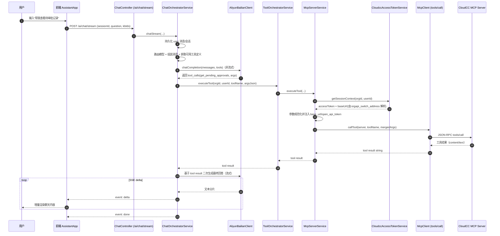

# MCP 对话调用链路说明（CloudCC 待审批查询）

本文档说明从用户在聊天界面提出“查看待审批记录”，到 MCP 工具返回数据并展示在前端的完整调用过程，包含与大模型的交互阶段。

## 一、整体时序图

## 二、关键模块职责

- `frontend/src/assistant/AssistantApp.tsx`
  - 发起 `streamAiChat`，接收 SSE `delta`，将片段拼接到最后一条 assistant 消息。
- `backend/src/main/java/com/codehouse/ciciassistant/ai/api/ChatController.java`
  - 对外暴露 `/ai/chat/stream`，把请求转给编排服务。
- `backend/src/main/java/com/codehouse/ciciassistant/ai/service/ChatOrchestratorService.java`
  - 编排中枢：会话持久化、模型路由、工具调用循环、流式回传。
- `backend/src/main/java/com/codehouse/ciciassistant/ai/service/AliyunBailianClient.java`
  - 与大模型通信（非流式拿 `tool_calls` + 流式返回最终答案）。
- `backend/src/main/java/com/codehouse/ciciassistant/ai/service/ToolOrchestratorService.java`
  - 工具定义转换（OpenAI function calling 格式）和执行转发。
- `backend/src/main/java/com/codehouse/ciciassistant/mcp/service/McpServerService.java`
  - 选择工具所属 MCP 服务、注入 CloudCC 会话参数、参数规范化后执行工具。
- `backend/src/main/java/com/codehouse/ciciassistant/integration/service/CloudccAccessTokenService.java`
  - 用组织与用户上下文获取 CloudCC token，并将 `orgapi_switch_address` 解析为实际 `orgapi_address`（最终 `base_url`）。
- `backend/src/main/java/com/codehouse/ciciassistant/mcp/service/McpClient.java`
  - JSON-RPC over HTTP 调用 MCP：`initialize` / `tools/list` / `tools/call`。

## 三、与大模型的交互过程（两阶段）

### 1) 工具规划阶段（非流式）

- 编排器先向模型提交：
  - 对话上下文（system + user + 可选 RAG）
  - 可用工具列表（函数签名 + 参数 schema）
- 模型返回：
  - 若需要调用工具，输出 `tool_calls`（如 `get_pending_approvals`）
  - 若不需要工具，直接返回最终文本

### 2) 结果生成阶段（流式）

- 工具执行结果被追加为 `role=tool` 消息后，再次请求模型。
- 模型将工具结果组织为用户可读文本，后端通过 SSE 分片推送到前端。

## 四、CloudCC 参数注入与规范化规则

CloudCC 工具执行前，后端会自动处理以下规则：

1. 通过 `CloudccAccessTokenService.getSessionContext` 获取：
   - `accessToken`
   - `baseUrl`（由 `orgapi_switch_address` 调用 apidomain 后拿到 `orgapi_address`）
2. 强制覆盖/注入参数：
   - `base_url`
   - `open_api_token`
3. 统一分页参数键名与类型：
   - `pageNum` -> `page_num`
   - `pageSize` -> `page_size`
4. 移除驼峰同义字段，减少 MCP 端 schema 校验冲突：
   - 移除 `baseUrl`、`openApiToken`

## 五、常见失败点与排查顺序

1. **前端配置字段名不匹配**
   - 现标准字段为：`orgapi_switch_address`
2. **CloudCC 鉴权失败**
   - 检查 `orgId/clientId/secretKey`
   - 检查用户是否已绑定 CloudCC 用户名与安全码
3. **模型输出占位符未被替换**
   - 以服务端日志中 `Calling MCP tool ... args` 为准，确认最终是否包含真实 `base_url/open_api_token`
4. **MCP 服务可连通但业务调用失败**
   - 区分 `discover/health` 成功 与 `tools/call` 业务参数错误是两类问题

## 六、建议日志观测点

- `ChatOrchestratorService`: `Calling MCP tool: ... args: ...`
- `ToolOrchestratorService`: `Executing MCP tool: org=..., user=..., tool=...`
- `CloudccAccessTokenService`: token 获取失败或网关解析失败
- `McpServerService`: 工具执行失败日志（server/tool/error）

通过这四类日志，基本可以在 1~2 轮定位问题是“模型参数生成问题”、“会话凭证问题”还是“MCP/外部系统问题”。

