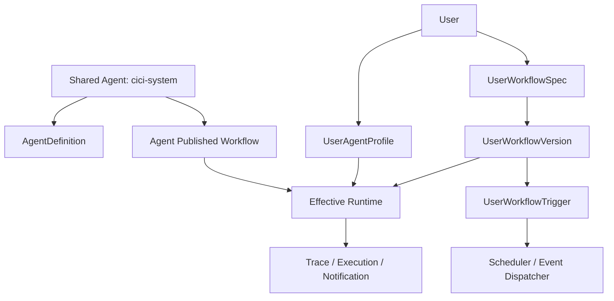

# 思思共享助手 + 个人工作流 Overlay 重构设计

更新时间：2026-04-21  
适用项目：`cc-cici-assistant`

## 1. 文档目标

本文用于定义一套新的产品与技术方案，使系统内置共享助手 `思思（cici-system）` 保持为统一维护的共享 Agent，同时支持每个员工为自己配置、编译、发布、执行专属工作流程。

本文重点回答 4 个问题：

1. `思思` 作为共享助手时，个人专属流程应该落在哪一层。
2. 用户应该在哪个前端入口定义自己的 `UserWorkflow`。
3. 后端应如何设计数据模型、API、编译与运行时合成逻辑。
4. 如何按阶段推进前后端改造，先落地个人定时流程，再扩展到会话态个性化流程。

---

## 2. 核心结论

### 2.1 不做“每人一份私有 Agent”，改做“共享 Agent + 个人 Workflow Overlay”

本项目中，`思思` 继续作为系统内置共享助手存在：

- `AgentDefinition.agentId = cici-system`
- 由平台统一维护默认能力、工具边界、知识边界、安全边界、默认发布版本

每个用户不再复制一份完整 `AgentDefinition / AgentSpec / AgentWorkflowVersion`，而是在 `cici-system` 之上维护自己的：

- `UserAgentProfile`
- `UserWorkflowSpec`
- `UserWorkflowVersion`
- `UserWorkflowTrigger`

也就是说：

**对用户来说，是“我的思思”；对系统来说，是“共享思思 + 我的个人 workflow overlay”。**

### 2.2 个人工作流是用户资产，不是组织级 Agent 配置

`UserWorkflow` 的归属应明确是：

- 所属人：当前登录用户
- 作用域：`(orgId, userId, agentId)`
- 生命周期：草稿、编译、发布、回滚、启停、执行记录
- 权限模型：用户只能管理自己的个人工作流，组织管理员不能通过共享 Agent Builder 直接改写个人配置

因此，`UserWorkflow` 不应直接放入当前组织级 `Agent Builder` 中。

### 2.3 个人工作流是 Overlay，不是 Replace

个人工作流不是去覆盖 `思思` 的全部行为，而是在共享助手之上叠加：

- 新增我的定时任务
- 新增我的事件监听
- 新增我的提醒规则
- 新增我的个人通知动作
- 收窄到我自己的工具使用偏好和资源绑定

但它不能突破共享助手的基础边界，例如：

- 不能调用 `思思` 未授权的工具
- 不能访问 `思思` 未授权的知识域
- 不能绕过平台安全策略和审批策略

因此运行时应采用：

`平台安全策略 -> 思思共享版本 -> 用户个人 Workflow Overlay -> 当前会话指令`

---

## 3. 目标产品形态

## 3.1 用户心智

用户看到的不是“我要创建一个新的私有智能体”，而是：

- 我在使用系统内置助手 `思思`
- 我可以给 `思思` 配置“替我工作的个人流程”
- 这些流程只有我自己可见、可编译、可发布、可执行

典型示例就是用户提供的自然语言流程 Spec：

1. 上午 9 点查收今天和昨天的新邮件并把摘要发飞书
2. 上午 9 点 30 查看待审批并按预算/有效期规则提醒
3. 每 10 分钟检查邮箱中的重点客户邮件
4. 上午 10 点抓取 CRM 新闻并生成社媒内容
5. 上午 11 点汇总全球最新 AI 大事
6. 下午 5 点发送会议邀请
7. 下午 6 点生成当日工作总结

这些都不是新的 Agent 身份，而是用户个人的“工作流包”。

## 3.2 目标对象关系



---

## 4. 前端产品与入口设计

## 4.1 结论：个人工作流的主入口放在“个人信息 / 个人设置”，不是 Agent Builder

推荐将当前头像入口 `个人信息` 扩展为 `个人设置中心`，新增 Tab：

- `我的资料`
- `我的邮箱`
- `我的工作流`
- `执行记录`

原因：

1. 个人工作流是私有资产，不是组织级共享配置。
2. 当前 `Agent Builder` 已是组织管理员心智，主要维护共享 Agent。
3. 如果把个人工作流塞进 `Agent Builder`，会混淆“共享定义”和“个人定制”的边界。
4. 用户会天然从“我的设置”理解“让助手替我做事”的能力。

### 4.2 辅助入口：工作台中的“我的流程”

虽然主入口放在 `个人设置中心`，但建议在 `思思` 工作台中增加快捷入口：

- 位置：`思思` 顶部卡片或右侧信息卡
- 文案：`我的流程`
- 行为：点击后打开 `个人设置中心 > 我的工作流`，并默认选中 `cici-system`

这样既不打散边界，也保留工作台内的高频可达性。

## 4.3 前端页面结构

建议新增组件：

- `MyWorkflowStudio.tsx`
- `MyWorkflowHistoryPanel.tsx`
- `MyWorkflowTriggerList.tsx`
- `MyWorkflowDebugPanel.tsx`

并将当前 `MyEmailAccountsModal.tsx` 演进为更通用的 `MySettingsModal.tsx`，邮箱能力作为其中一个 Tab。

### 4.4 “我的工作流”页面结构

页面建议分为 6 个区块：

1. **助手信息区**
   - 当前助手：`思思（系统内置）`
   - 当前状态：`使用共享内核 + 个人流程`
   - 用户时区、通知目标、个人绑定资源摘要

2. **自然语言流程 Spec 区**
   - 大文本框，作为 `UserWorkflowSpec.sourceText`
   - 支持写多条自然语言流程
   - 支持模板插入，如“每日提醒”“监控型任务”“日报型任务”

3. **资源与前置绑定区**
   - 我的邮箱账号
   - 我的飞书接收目标
   - 我的 CRM 身份
   - 可使用工具清单
   - 来自 `思思` 的允许范围显示为只读
   - 个人可启用开关显示为可编辑

4. **编译结果区**
   - 流程摘要
   - 解析出的 routine 列表
   - trigger 预览
   - 风险与依赖提示
   - 只读流程图预览
   - 生成代码 / manifest

5. **版本与发布区**
   - 当前草稿
   - 历史版本
   - 发布 / 回滚
   - 启用 / 停用个人工作流

6. **执行与调试区**
   - 最近执行记录
   - 手动试运行
   - trace 详情
   - 失败原因与重试

## 4.5 交互原则

### 4.5.1 页面归属

- 个人工作流编辑：任何登录用户可用
- 共享 `思思` 能力边界编辑：仅组织管理员可用，仍在 `Agent Builder`

### 4.5.2 发布含义

个人工作流的“发布”含义是：

- 对当前用户生效
- 不影响其他用户
- 不改变 `思思` 的共享发布版本

### 4.5.3 开关语义

建议支持两层开关：

- `个人工作流总开关`
- `routine 级开关`

这样用户可以整体关闭，也可以只关闭某一条个人流程。

---

## 5. 后端对象模型设计

## 5.1 设计原则

1. 复用现有 `AgentDefinition / AgentSpec / AgentWorkflowVersion` 命名风格。
2. 明确区分共享对象与个人对象。
3. 个人对象必须带 `org_id + user_id + agent_id` 作用域。
4. 继续坚持“自然语言 Spec -> 编译版本 -> 发布版本 -> 执行记录”的主线。

## 5.2 新增对象一：`user_agent_profile`

用途：保存用户在某个共享 Agent 下的个人资料与绑定。

建议字段：

- `id`
- `org_id`
- `user_id`
- `agent_id`
- `timezone`
- `locale`
- `notification_target_json`
- `personal_context_json`
- `enabled`
- `created_at`
- `updated_at`

说明：

- 一个用户可在不同 Agent 下有不同 profile。
- MVP 下主要先承载 `cici-system` 的个人设置。
- 这里保存个人通知目标、默认时区、个人上下文摘要，不保存执行版本本体。

唯一键建议：

- `uk_user_agent_profile (org_id, user_id, agent_id)`

## 5.3 新增对象二：`user_workflow_spec`

用途：保存用户编写的自然语言工作流源文本。

建议字段：

- `id`
- `org_id`
- `user_id`
- `agent_id`
- `source_text`
- `status`
- `draft_version_no`
- `published_version_id`
- `created_at`
- `updated_at`

说明：

- `source_text` 是个人工作流的 source of truth。
- MVP 建议每个 `(org_id, user_id, agent_id)` 只保留一份当前 spec 草稿。
- spec 内部可包含多条 routine，不要求用户拆成多个文档。

建议状态枚举：

- `DRAFT`
- `COMPILED`
- `PUBLISHED`
- `DISABLED`

唯一键建议：

- `uk_user_workflow_spec (org_id, user_id, agent_id)`

## 5.4 新增对象三：`user_workflow_version`

用途：保存用户工作流的编译结果与版本治理。

建议字段：

- `id`
- `org_id`
- `user_id`
- `agent_id`
- `spec_id`
- `version_no`
- `version_label`
- `spec_text`
- `workflow_code`
- `workflow_manifest`
- `workflow_preview`
- `compile_summary`
- `warnings`
- `dependencies`
- `publish_status`
- `created_at`

说明：

- 结构尽量与现有 `agent_workflow_version` 保持一致。
- `dependencies` 中应 pin 住依赖的共享 Agent 版本、skill 版本、工具声明版本。

建议状态枚举：

- `DRAFT`
- `PUBLISHED`
- `ROLLED_BACK`
- `ARCHIVED`

## 5.5 新增对象四：`user_workflow_trigger`

用途：把编译出的 routine trigger 物化为可调度对象。

建议字段：

- `id`
- `org_id`
- `user_id`
- `agent_id`
- `version_id`
- `routine_key`
- `routine_name`
- `trigger_type`
- `cron_expr`
- `timezone`
- `interval_seconds`
- `event_type`
- `event_filter_json`
- `enabled`
- `next_fire_at`
- `last_triggered_at`
- `created_at`
- `updated_at`

说明：

- schedule / interval / event trigger 统一沉淀在这里。
- `workflow_manifest` 里仍保留完整 trigger 描述；本表只用于高效查询与调度。

建议枚举：

- `trigger_type`: `SCHEDULE` / `INTERVAL` / `EVENT` / `MANUAL`

## 5.6 新增对象五：`user_workflow_execution`

用途：保存每次执行记录、trace 与失败原因。

建议字段：

- `id`
- `org_id`
- `user_id`
- `agent_id`
- `version_id`
- `trigger_id`
- `routine_key`
- `trigger_source`
- `scheduled_at`
- `started_at`
- `finished_at`
- `status`
- `trace_json`
- `output_summary`
- `error_code`
- `error_message`
- `created_at`

建议状态枚举：

- `QUEUED`
- `RUNNING`
- `SUCCESS`
- `FAILED`
- `SKIPPED`
- `CANCELLED`

---

## 6. 编译模型设计

## 6.1 核心原则

共享 Agent 和个人工作流共用同一条文本优先编译主线，但编译目标不同：

- `AgentSpec` 编译为共享顶层 workflow
- `UserWorkflowSpec` 编译为个人 workflow overlay

建议扩展现有 `SpecCompilerService` / `AgentCompileService`，支持：

- `targetType = AGENT`
- `targetType = USER_WORKFLOW`

## 6.2 UserWorkflow 编译产物

用户写的自然语言流程 Spec 编译后，至少生成：

- `workflowCode`
- `workflowManifest`
- `workflowPreview`
- `compileSummary`
- `warnings`
- `dependencies`
- `routines[]`

其中 `workflowManifest` 需要显式携带多个 routine：

```json
{
  "type": "user_workflow_pack",
  "agentId": "cici-system",
  "scope": {
    "orgId": "demo-org",
    "userId": "u123"
  },
  "routines": [
    {
      "routineKey": "morning_email_digest",
      "name": "早间邮件摘要",
      "trigger": {
        "type": "schedule",
        "cronExpr": "0 0 9 * * *",
        "timezone": "Asia/Shanghai"
      },
      "steps": [
        "读取昨天和今天的邮件",
        "抽取重点事项",
        "生成摘要",
        "发送飞书"
      ],
      "toolPolicy": {
        "allowedTools": ["email_list_inbox", "email_get_message"]
      },
      "outputTarget": {
        "type": "feishu_dm"
      }
    },
    {
      "routineKey": "vip_mail_watch",
      "name": "重点客户邮件监控",
      "trigger": {
        "type": "interval",
        "intervalSeconds": 600
      },
      "filter": {
        "senders": ["奔驰", "和利时"]
      }
    }
  ]
}
```

## 6.3 编译约束

个人工作流编译时必须做边界检查：

1. 不能引用共享 Agent 未授权的工具。
2. 不能引用共享 Agent 未授权的知识域。
3. 不能绕过平台安全等级与人工兜底规则。
4. 不能写入超出个人权限范围的目标系统。

若违反约束：

- 编译可返回 warning
- 发布应阻断
- UI 需明确提示是“超出共享助手允许范围”

---

## 7. 运行时合成设计

## 7.1 Effective Runtime 组成

运行时不直接“执行一个私有 Agent”，而是先构造：

`EffectiveRuntimeContext = SharedAgentRuntime + UserAgentProfile + PublishedUserWorkflowVersion`

加载顺序建议：

1. 平台安全策略
2. `cici-system` 的 `AgentDefinition`
3. `cici-system` 已发布的 `AgentWorkflowVersion`
4. 当前用户的 `UserAgentProfile`
5. 当前用户已发布的 `UserWorkflowVersion`
6. 当前请求上下文或定时触发上下文

## 7.2 合成规则

### 7.2.1 能力边界

- 工具、知识、渠道的最终可用范围 = 共享 Agent 白名单与个人启用项的交集
- 个人只能做“收窄”与“选择启用”，不能做“扩大授权”

### 7.2.2 行为边界

- 共享 Agent 默认流程仍然存在
- 个人 workflow 可新增 personal routine
- 在聊天态下，个人 workflow 可作为优先提醒、个性化偏好和自动 follow-up 策略参与路由
- 但不能把共享 Agent 的核心安全逻辑替换掉

### 7.2.3 通知目标

- 个人 workflow 中的飞书、邮箱等发送目标来自 `UserAgentProfile`
- 如未绑定必要个人资源，则对应 routine 不可发布或执行

## 7.3 两类执行模式

建议明确区分两类运行时：

1. **主动执行模式**
   - 来自 schedule / interval / event trigger
   - 例如每天 09:00 生成邮件摘要

2. **会话增强模式**
   - 来自用户与 `思思` 的聊天
   - 例如“优先关注奔驰和和利时的邮件”可在会话态优先命中个人监控规则

MVP 优先做主动执行模式。

---

## 8. 后端 API 设计

## 8.1 设计原则

共享 Agent API 继续保留在 `/agents/**`。  
个人工作流 API 统一归到 `/me/**`，体现用户私有资产属性。

## 8.2 推荐 API 路径

以 `cici-system` 为例，推荐增加：

- `GET /me/agents/{agentId}/workflow`
  - 获取当前用户在该 Agent 下的 profile + spec + published version 摘要

- `PUT /me/agents/{agentId}/profile`
  - 更新 `UserAgentProfile`

- `PUT /me/agents/{agentId}/workflow/spec`
  - 保存自然语言工作流草稿

- `POST /me/agents/{agentId}/workflow/compile`
  - 编译当前草稿，生成一个 `user_workflow_version` 草稿版本

- `GET /me/agents/{agentId}/workflow/versions`
  - 查询版本列表

- `POST /me/agents/{agentId}/workflow/publish`
  - 发布指定版本，仅对当前用户生效

- `POST /me/agents/{agentId}/workflow/rollback`
  - 回滚到指定版本

- `GET /me/agents/{agentId}/workflow/triggers`
  - 获取 routine trigger 列表

- `PUT /me/agents/{agentId}/workflow/triggers/{triggerId}`
  - 启停某个 routine 或修改调度参数

- `POST /me/agents/{agentId}/workflow/debug`
  - 调试一次 personal routine / dry run

- `GET /me/agents/{agentId}/workflow/executions`
  - 查看执行记录

- `GET /me/agents/{agentId}/workflow/executions/{executionId}`
  - 查看 trace 详情

- `POST /me/agents/{agentId}/workflow/run-now`
  - 手动触发一次某个 routine

## 8.3 权限规则

- `/agents/**`：继续由 `ORG_ADMIN` 维护共享 Agent
- `/me/**`：普通登录用户可管理自己的 `UserWorkflow`
- 后端必须强制以登录态 userId 为准，不能信任前端传入的 userId

---

## 9. 调度与执行设计

## 9.1 调度器

新增：

- `UserWorkflowScheduler`
- `UserWorkflowDispatchService`
- `UserWorkflowExecutionService`

职责划分：

- `Scheduler`：扫描待触发 trigger
- `DispatchService`：把 trigger 转成具体执行任务
- `ExecutionService`：执行 workflow、写 trace、写执行记录、写通知结果

## 9.2 触发源

MVP 支持：

- `schedule`
- `interval`
- `manual`

后续扩展：

- `email_received`
- `approval_pending_changed`
- `crm_record_changed`
- `calendar_event_near_due`

## 9.3 执行闭环

1. 读取当前用户已发布 `UserWorkflowVersion`
2. 读取该版本物化出的启用 trigger
3. 创建 `user_workflow_execution`
4. 合成 `EffectiveRuntimeContext`
5. 执行 routine
6. 记录 trace
7. 更新执行状态
8. 推送飞书或其他个人通知目标

---

## 10. 前后端改造建议

## 10.1 前端改造

### 10.1.1 新入口

改造 [frontend/src/assistant/AssistantApp.tsx](/Volumes/workspace/codehouse/automan-projects/cc-cici-assistant/frontend/src/assistant/AssistantApp.tsx)：

- 将现有头像入口从“我的邮箱”单一 modal 扩展为“个人设置中心”
- 新增 `我的工作流` Tab
- `思思` 工作台增加 `我的流程` 快捷入口

### 10.1.2 新组件

建议新增：

- `frontend/src/assistant/MySettingsModal.tsx`
- `frontend/src/assistant/MyWorkflowStudio.tsx`
- `frontend/src/assistant/MyWorkflowHistoryPanel.tsx`
- `frontend/src/assistant/MyWorkflowTriggerList.tsx`

### 10.1.3 与现有 Agent Builder 的边界

[frontend/src/assistant/AgentBuilderShell.tsx](/Volumes/workspace/codehouse/automan-projects/cc-cici-assistant/frontend/src/assistant/AgentBuilderShell.tsx) 继续只负责：

- 共享 Agent 基本信息
- 共享 Agent Spec
- 共享 bindings
- 共享版本发布

不负责：

- 当前登录用户的个人 workflow 草稿
- 当前登录用户的个人 trigger
- 当前登录用户的个人执行记录

## 10.2 后端改造

### 10.2.1 数据层

新增 Flyway migration，创建：

- `user_agent_profile`
- `user_workflow_spec`
- `user_workflow_version`
- `user_workflow_trigger`
- `user_workflow_execution`

### 10.2.2 领域与服务层

建议新增：

- `UserWorkflowProfileEntity / Repository`
- `UserWorkflowSpecEntity / Repository`
- `UserWorkflowVersionEntity / Repository`
- `UserWorkflowTriggerEntity / Repository`
- `UserWorkflowExecutionEntity / Repository`
- `UserWorkflowService`
- `UserWorkflowCompileService`
- `UserWorkflowRuntimeResolver`
- `UserWorkflowScheduler`
- `UserWorkflowExecutionService`

### 10.2.3 编译复用

扩展现有 `SpecCompilerService`，复用统一编译主干，不另起一套个人专用编译器。

### 10.2.4 运行时复用

运行时优先复用当前：

- `SkillResolverService`
- `SkillPromptAssembler`
- `ToolOrchestratorService`

再在其前面增加：

- `EffectiveRuntimeResolver`
- `UserWorkflowOverlayAssembler`

即先合成个人上下文，再进入原有技能解析和工具编排链路。

---

## 11. 分阶段实施建议

## 11.1 Phase 1：个人工作流 Studio + 定时任务 MVP

范围：

- `cici-system` 固定为唯一支持的共享助手
- 用户可在个人设置中维护一份 `UserWorkflowSpec`
- 支持编译、发布、回滚
- 支持 schedule / interval / manual trigger
- 支持飞书通知、邮件摘要、审批摘要等 routine
- 支持执行记录

目标：

- 先打通“写个人流程 -> 发布 -> 到点执行 -> 给我发消息”的闭环

## 11.2 Phase 2：工作台会话态 Overlay

范围：

- 聊天时加载已发布 `UserWorkflowVersion`
- 让 `思思` 在对话中体现用户个人偏好、关注对象、提醒优先级
- 支持从聊天中快速追加 personal routine

## 11.3 Phase 3：事件触发与更强观察性

范围：

- 邮件到达、审批变化、CRM 变更事件触发
- `debug` 接口返回真实 trace
- UI 展示命中分支、工具调用、通知动作

## 11.4 Phase 4：多共享 Agent 复用

范围：

- 不只 `思思`
- 允许其他共享 Agent 也支持 `UserWorkflow Overlay`
- 形成统一 `Shared Agent + User Overlay` 框架

---

## 12. 本方案与当前项目现状的关系

本方案是对当前架构的延续，不是推翻重来：

1. 保留 `思思` 作为系统内置共享助手。
2. 保留 `Agent Builder` 作为共享 Agent 构建入口。
3. 保留 `自然语言 Spec -> 编译 -> 发布版本` 主线。
4. 新增个人工作流层，承接“每人可配置专属工作流程”的诉求。

因此，后续产品结构会更清晰：

- 组织管理员维护“共享助手怎么工作”
- 普通员工维护“助手如何替我工作”

---

## 13. 最终建议

对于当前项目，建议正式采用以下判断：

1. `思思` 继续作为系统内置共享助手。
2. 每个用户不创建自己的私有 Agent，而是维护 `cici-system` 下的 `UserWorkflow Overlay`。
3. 个人工作流的主入口放在 `个人设置中心 > 我的工作流`。
4. `Agent Builder` 与 `My Workflow Studio` 严格分层，分别服务“共享定义”和“个人定制”。
5. 实施顺序优先做 `Phase 1`，先打通“个人定时流程闭环”。

这套方案既满足“每个人都能定义自己的专属工作流程”，也避免把系统演化成“每人一份私有 AgentDefinition”的高维护形态。
