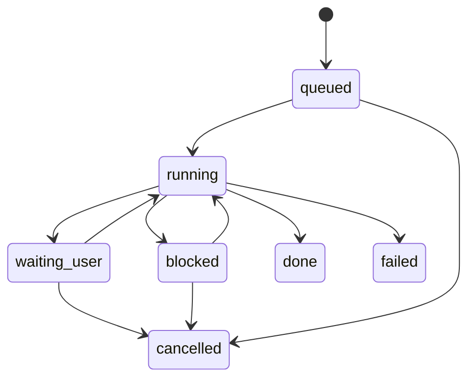

# FEAT-006 Virtual Human Multitask Workbench

> 历史说明：该特性曾用于虚拟人场景页 MVP 探索，已在 2026-04-29 按 `FEAT-007` 正式下线；本文档仅保留历史设计记录，不再代表当前产品能力。

## Goal

在现有 CiCi 助手工作台上实现类似参考图的沉浸式 Web 交互体验：

- 页面背景是一个可动态响应的虚拟人，可以通过语音或输入与用户互动。
- 用户可以同时推进多个任务，每个任务以独立浮层、卡片或区域呈现。
- 虚拟人、语音、文字回复、工具执行状态、任务卡片状态需要保持同步。
- 第一阶段优先落地 Web 可控、低延迟、低成本的 MVP，不直接依赖重型实时视频渲染。

## Current Baseline

当前项目已经具备可复用基础：

- 前端：`frontend/` 使用 React + Vite，助手入口在 `/`，核心 UI 位于 `frontend/src/assistant/AssistantApp.tsx`。
- 语音输入：已有 `useAsrVoiceInput`，通过 `/ws/asr` 进行浏览器麦克风采集和实时 ASR。
- 对话流式输出：已有 `/ai/chat/stream` SSE，前端 `streamAiChat` 已能消费 `delta`、`phase`、`tool_call`、`tool_result`。
- 会话状态：已有 `chat_session_state` 与 `ChatSessionStateService`，适合作为多任务上下文底座。
- Agent 能力：已有 Agent runtime、workflow execution log、tool orchestration、skill resolver，可承载任务分流与执行。

## Product Experience

### Target Layout

页面分为四层：

1. **Atmosphere Background**
   - 负责背景光效、柔和景深、玻璃质感、环境粒子。
   - 不承载业务信息，只营造沉浸感。

2. **Virtual Human Layer**
   - 居中或偏中显示虚拟人。
   - 支持待命、聆听、思考、说话、任务完成、错误提示等状态动作。
   - 根据 TTS 音频或模型输出状态驱动口型、表情和轻微身体动作。

3. **Task Workspace Layer**
   - 多个任务以浮层卡片出现，例如翻译、会议记录、邮件草稿、审批、检索、CRM 跟进。
   - 卡片位置可以由系统布局，也可以允许用户拖拽和折叠。
   - 每个任务拥有独立状态：`queued`、`running`、`waiting_user`、`blocked`、`done`、`failed`。

4. **Input Control Layer**
   - 底部输入框、麦克风按钮、语音状态、快捷任务入口。
   - 支持文本输入、按住说话、连续聆听模式。

### Interaction Flow

1. 用户说话或输入：“帮我把刚才会议整理成纪要，并顺便生成英文摘要。”
2. 前端将语音转文字或直接文本发送到后端。
3. 后端识别为一个用户意图下的两个子任务：
   - 会议纪要任务
   - 英文摘要任务
4. 前端收到 `task_created` 事件，为每个子任务创建独立卡片。
5. 后端持续推送任务状态、工具调用、模型输出片段。
6. 虚拟人状态同步切换：
   - ASR 中：聆听
   - LLM 推理：思考
   - TTS 播放：说话
   - 工具执行：处理中
   - 等待用户确认：注视 / 提示
7. 任务完成后，卡片保留结果摘要，并允许展开查看完整内容或继续追问。

## Technology Dependencies

### Frontend Rendering

推荐组合：

- React 19 + Vite：沿用现有技术栈。
- CSS 变量 + CSS 动画：实现背景光效、玻璃卡片、模糊层、入场动效。
- Three.js + `@pixiv/three-vrm`：MVP 推荐的 3D 虚拟人方案。
- 可选替代：
  - Live2D Cubism SDK：如果希望偏二次元 2D 角色，资源制作成本较低，Web 性能更稳。
  - Ready Player Me / VRoid / VRM 资产：如果希望快速获得 3D 角色资产。
  - Unreal Pixel Streaming：仅适合后期追求影视级实时渲染，成本、带宽、部署复杂度明显更高。

MVP 建议使用 **VRM/Three.js 或 Live2D**，不要第一阶段使用实时视频流虚拟人。浏览器本地渲染更容易与任务 UI、语音状态、口型同步。

### Voice Input

当前已有：

- 浏览器 `getUserMedia`
- PCM 降采样到 16k
- WebSocket `/ws/asr`
- 阿里云实时 ASR

需要补充：

- 连续聆听模式与手动按键模式。
- ASR partial/final 的 UI 分层展示。
- 语音中断：用户说“停一下”“重来”时取消当前 TTS 或任务回复。
- 噪声、权限失败、WebSocket 断开后的明确降级提示。

### Voice Output And Lip Sync

需要新增 TTS 链路：

- 后端封装 TTS Provider，例如阿里云、火山、Azure、MiniMax、ElevenLabs。
- 前端接收文本后请求 TTS 音频，或后端按句子流式合成。
- 前端用 Web Audio API 播放音频，同时驱动虚拟人口型。

口型同步分三档：

- MVP：用音频音量 RMS 驱动 mouth open，成本低、效果可接受。
- V1：按中文音素或英文 phoneme 生成 viseme 时间轴。
- V2：使用 TTS 服务返回的字级时间戳 / viseme 数据，精细驱动口型。

### Conversation And Task Runtime

沿用现有：

- `/ai/chat/stream`
- `ChatOrchestratorService`
- `ChatSessionStateService`
- `AgentWorkflowRuntimeService`
- `ToolOrchestratorService`

需要扩展：

- 将“单条 assistant 回复流”升级为“会话事件流”。
- 增加 task/thread 层级，让一个 session 内可同时存在多个 task。
- 将工具调用、工作流执行、用户确认、最终结果都归属到 task。

### Realtime Transport

第一阶段推荐继续使用 SSE：

- 服务端已有 SSE 基础。
- 浏览器消费简单。
- 适合 LLM 文本、任务状态、工具结果等单向推送。

需要 WebSocket 的场景：

- 前端向后端持续推送音频，已有 `/ws/asr`。
- 未来如果要支持多人协作、任务拖拽同步、低延迟双向控制，可新增 `/ws/workbench`。

### Storage

新增任务级数据模型，建议表：

- `chat_task`
  - `id`
  - `org_id`
  - `session_id`
  - `agent_id`
  - `title`
  - `intent`
  - `status`
  - `priority`
  - `position_json`
  - `input_summary`
  - `output_summary`
  - `created_at`
  - `updated_at`

- `chat_task_event`
  - `id`
  - `org_id`
  - `session_id`
  - `task_id`
  - `event_type`
  - `payload_json`
  - `created_at`

第一阶段可以先只落库 `chat_task` 和关键事件；高频 token delta 不建议全部长期保存，除非用于审计或回放。

## Architecture

```mermaid
flowchart LR
  User[User] -->|Voice/Text| Frontend[React Workbench]
  Frontend -->|PCM WebSocket| ASR[/ws/asr]
  ASR --> ASRProvider[ASR Provider]
  Frontend -->|POST| ChatStream[/ai/chat/stream]
  ChatStream --> Orchestrator[ChatOrchestratorService]
  Orchestrator --> SessionState[ChatSessionStateService]
  Orchestrator --> TaskRuntime[Task Runtime]
  TaskRuntime --> AgentRuntime[AgentWorkflowRuntimeService]
  TaskRuntime --> Tools[ToolOrchestratorService]
  Orchestrator --> LLM[Model Provider]
  ChatStream -->|SSE Events| Frontend
  Frontend -->|Text Segment| TTS[/ai/tts]
  TTS --> TTSProvider[TTS Provider]
  TTS -->|Audio + Timing| Frontend
  Frontend --> Avatar[VRM/Live2D Avatar]
  Frontend --> TaskCards[Task Cards]
```

## Event Protocol

扩展 `/ai/chat/stream` 的事件类型。现有事件保持兼容，新增事件如下：

```json
{
  "event": "task_created",
  "data": {
    "taskId": "task_123",
    "sessionId": "session_abc",
    "agentId": "meeting-agent",
    "title": "整理会议纪要",
    "intent": "meeting_summary",
    "status": "queued",
    "layout": { "region": "left", "order": 1 }
  }
}
```

```json
{
  "event": "task_delta",
  "data": {
    "taskId": "task_123",
    "contentType": "markdown",
    "text": "## 会议结论\n"
  }
}
```

```json
{
  "event": "task_status",
  "data": {
    "taskId": "task_123",
    "status": "running",
    "phase": "retrieving",
    "message": "正在检索会议上下文"
  }
}
```

```json
{
  "event": "avatar_state",
  "data": {
    "state": "thinking",
    "emotion": "focused",
    "intensity": 0.7
  }
}
```

```json
{
  "event": "task_done",
  "data": {
    "taskId": "task_123",
    "status": "done",
    "summary": "已生成会议纪要，共 5 条行动项。"
  }
}
```

## Frontend Module Design

建议拆分为以下模块：

- `VirtualHumanStage`
  - 渲染背景和虚拟人。
  - 接收 `avatarState`、音频播放状态、口型参数。

- `AvatarController`
  - 将业务状态映射为动画状态。
  - 例如 `listening -> idle_breath + ear_focus`，`speaking -> talk + mouth`。

- `VoiceInputBar`
  - 复用 `useAsrVoiceInput`。
  - 管理手动录音、连续聆听、ASR partial/final。

- `TaskCardLayer`
  - 管理任务卡片布局、增删、折叠、焦点。
  - 根据 `task_created`、`task_delta`、`task_status`、`task_done` 更新任务。

- `WorkbenchEventReducer`
  - 将 SSE 事件归一化为前端状态。
  - 避免业务事件处理散落在大组件中。

- `TtsPlayer`
  - 播放语音。
  - 输出播放状态、音量包络、可选字级时间戳。

## Backend Module Design

建议新增或扩展：

- `TaskRuntimeService`
  - 负责把用户输入拆成一个或多个 task。
  - 维护 task 状态机。
  - 统一发送 task event。

- `TaskEventEmitter`
  - 对 `SseEmitter` 做类型化封装。
  - 防止控制器和服务层手写字符串事件。

- `ChatTaskEntity` / `ChatTaskEventEntity`
  - 记录任务元数据和关键事件。

- `TtsController`
  - `POST /ai/tts`
  - 输入文本、voice、emotion、speed。
  - 输出音频 URL / base64 / stream，以及可选 timing。

- `AvatarProfileService`
  - 管理组织或用户的虚拟人配置。
  - 字段包括 avatar asset、voice、默认情绪、品牌色。

## Task State Machine

任务状态建议保持简单：



状态含义：

- `queued`：任务已创建但还未开始执行。
- `running`：模型、RAG、工具或 workflow 正在处理。
- `waiting_user`：需要用户确认、补充字段或授权。
- `blocked`：依赖外部系统、权限、数据或人工动作，暂时无法继续。
- `done`：任务完成，有可展示结果。
- `failed`：任务失败，可重试。
- `cancelled`：用户取消。

## Implementation Milestones

### Phase 1: Visual MVP

目标：先做出参考图式的可交互页面，但虚拟人可先使用轻量动画。

- 在助手端新增沉浸式 workbench 布局。
- 背景层、虚拟人占位层、任务卡片层、输入层完成。
- 复用现有 `/ai/chat/stream` 和 `/ws/asr`。
- SSE 事件先支持单任务卡片更新。
- 虚拟人状态支持 idle、listening、thinking、speaking。

### Phase 2: Real Avatar And TTS

目标：虚拟人开始“说话”，并与回复内容同步。

- 接入 VRM/Live2D runtime。
- 新增 `/ai/tts`。
- 前端 TTS 播放与 mouth open 音量驱动。
- 模型回复按句子切分，边生成边播放。
- 支持用户打断 TTS。

### Phase 3: Multitask Runtime

目标：一个用户请求可拆为多个任务卡片并并行/串行执行。

- 新增 `chat_task` 和 `chat_task_event`。
- 后端输出 `task_created`、`task_status`、`task_delta`、`task_done`。
- 前端按 taskId 聚合内容。
- Agent runtime / tool result 归属到具体 task。

### Phase 4: Production Hardening

目标：可用于真实企业场景。

- 任务恢复：刷新页面后恢复 session 内未完成任务。
- 审计：保留任务关键事件和工具执行摘要。
- 权限：任务、语音、知识库、工具调用全部继承 `org_id` 与用户权限。
- 性能：虚拟人渲染帧率监控、低端设备降级。
- 可配置：管理员可配置 avatar、voice、任务卡片模板和默认布局。

## Technical Choices

### Recommended MVP Choice

- 虚拟人：Three.js + VRM，或 Live2D 二选一。
- 语音输入：复用当前 `/ws/asr`。
- 语音输出：新增后端 TTS proxy，前端 Web Audio 播放。
- 实时事件：继续使用 SSE。
- 多任务：新增 task event protocol，不改掉现有 chat stream 兼容事件。
- UI：在现有助手入口内新增 workbench 子组件，避免重写登录、鉴权、会话列表。

### Trade-offs

- VRM/Three.js：
  - 优点：3D 空间感更接近参考图，可与背景光效融合。
  - 缺点：资产制作和 WebGL 性能调优成本更高。

- Live2D：
  - 优点：Web 成熟、性能稳、口型和表情接入快。
  - 缺点：不如 3D 角色有空间纵深。

- 实时视频虚拟人：
  - 优点：最真实。
  - 缺点：成本高、延迟高、交互状态和 UI 事件同步难，MVP 不推荐。

## Risks And Mitigations

- **低端设备 WebGL 性能不足**
  - 提供静态图 / 轻动画降级。
  - 限制粒子、后处理和模型面数。

- **TTS 与文本流不同步**
  - MVP 按句子播放，不追求 token 级同步。
  - 播放队列支持取消和跳过。

- **多任务上下文混乱**
  - taskId 必须贯穿事件、工具调用、最终结果。
  - session state 记录全局上下文，task state 记录任务局部上下文。

- **UI 大组件继续膨胀**
  - 新 workbench 必须拆为 stage、voice、task layer、event reducer、tts player。
  - 避免把所有交互继续堆进 `AssistantApp.tsx`。

- **虚拟人资源版权与隐私**
  - 角色模型、声音模型需确认商业授权。
  - 声音克隆必须有用户授权和审计记录。

## Acceptance Criteria

MVP 验收标准：

- 用户可以通过文本输入触发模型回复，回复内容流式显示在任务卡片中。
- 用户可以通过语音输入触发同样的任务流程。
- 页面展示虚拟人背景层，并能根据 listening、thinking、speaking、idle 状态切换动画。
- 至少支持两个任务卡片同时存在，并能分别展示状态和结果。
- 刷新页面后，当前 session 的历史消息仍可恢复；任务恢复可在 Phase 3 完成。
- 所有新增接口继续遵守 `org_id` 多租户边界。

## Open Questions

- 虚拟人风格选择：偏真实 3D、半写实 3D，还是 Live2D？
- TTS 供应商选择：是否优先沿用阿里云，还是引入更自然的第三方语音？
- 多任务是否要求真正并行执行，还是 UI 并列展示、后端串行执行即可满足第一阶段？
- 任务卡片是否需要用户自由拖拽，还是先使用系统自动布局？
- 是否需要管理员后台配置虚拟人资产和声音，还是先全局固定一个默认角色？
