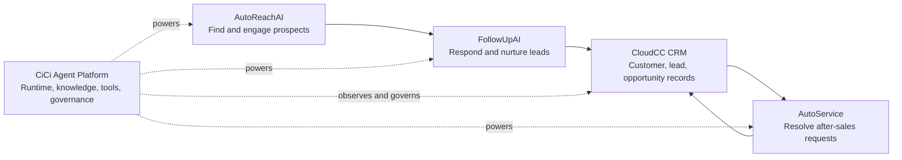

# FEAT-027 - AI 客户运营套件综合网站设计文档

## 1. 背景与目标

AutoReachAI、FollowUpAI 和 AutoService 现在已经形成清晰的三段式客户运营链路：

```text
获客触达 -> 销售跟进 -> 售后服务
```

这三款产品都可以基于 CiCi 智能体平台作为 Agent 运行与治理底座，并结合 CloudCC CRM 作为客户、线索、商机和服务记录的数据底座，形成一个完整的企业落地闭环。

本规格的目标是设计一个独立的综合品牌站，用来表达：

```text
平台 + 应用矩阵 + CRM 闭环
```

该站点不是 AutoService 官网的扩展，也不复用 AutoService 的单产品叙事。它是一个独立主站，负责把 AutoReachAI、FollowUpAI、AutoService、CiCi 平台和 CloudCC CRM 组合成一套企业 AI 客户运营方案。

## 2. 站点定位

### 2.1 工作品牌名

首版设计文档使用工作名：

```text
SalesMost AI Suite
```

原因：

- FollowUpAI 当前公开页面 footer 已出现 `Powered by SalesMost Inc.`。
- `SalesMost` 适合作为产品族或公司级 umbrella brand。
- 它不会把 AutoReachAI、FollowUpAI、AutoService 强行降级为 AgentCiCi 的功能模块。
- 它也不会把 CloudCC CRM 误表达为主品牌，CloudCC 在该叙事中是 CRM 数据与业务系统底座。

待确认项：

- 最终主站品牌名是否使用 `SalesMost AI`、`SalesMost AI Suite`、`AgentCiCi Suite` 或其他名称。
- 首版 UAT 已使用 `agentcici.com` / `www.agentcici.com` 根路径承载中文综合站；最终品牌名和长期域名仍可继续评审。

### 2.2 一句话定位

中文：

```text
面向企业增长、销售转化与售后服务的 AI 客户运营套件。
```

英文：

```text
An AI customer operations suite for outreach, follow-up, service, and CRM-connected agent governance.
```

更直接的首屏表达：

```text
AI employees for the full customer lifecycle.
```

中文首屏表达：

```text
让 AI 员工跑完整个客户生命周期。
```

### 2.3 站点角色

该综合网站承担五个职责：

- 解释三款产品不是孤立工具，而是一个客户运营闭环。
- 明确 CiCi 是 Agent runtime and governance platform，不是单独卖给访客的聊天工具。
- 明确 CloudCC CRM 是客户数据和业务流程底座，不作为主品牌抢夺注意力。
- 把 AutoReachAI、FollowUpAI、AutoService 导流到各自子站点。
- 给企业客户一个完整采购理由：先从一个场景落地，再逐步扩展到全生命周期。

## 3. 与 Marketingforce 的结构关系

### 3.1 相似处

两者都采用：

```text
业务应用矩阵 + 平台能力 + CRM/数据闭环
```

Marketingforce 的结构更像：

```text
营销云 / 销售云 / 商业云 / 智能云 / 分析云 / 组织云
        + AI-Agentforce
        + 企业数据与交付能力
```

我们的结构应表达为：

```text
AutoReachAI / FollowUpAI / AutoService
        + CiCi Agent Platform
        + CloudCC CRM
```

### 3.2 差异化

不要照搬 Marketingforce 的宽矩阵叙事。我们的官网应更尖：

- Marketingforce 是传统企业营销和 CRM 套件的 AI 化。
- 我们是 AI Agent 原生的客户生命周期闭环。
- Marketingforce 覆盖很多云产品，容易显得宽。
- 我们只讲三个关键商业时刻：找到客户、跟进客户、服务客户。

综合站的核心判断：

```text
不是更大的产品目录，而是更清楚的企业落地路径。
```

## 4. 产品架构叙事

### 4.1 产品族分工

| 层级 | 产品 | 外部表达 | 主要价值 |
|---|---|---|---|
| 应用层 | AutoReachAI | AI outbound and lead generation employee | 分析业务、发现潜客、生成个性化外联、执行邮件触达、识别高意向客户 |
| 应用层 | FollowUpAI | AI sales follow-up employee | WhatsApp、Email、CRM 自动跟进，线索响应，转化推进，CRM 同步 |
| 应用层 | AutoService | AI after-sales service employee | 售后问答、知识库、企业微信/WhatsApp/Email 等渠道接入，业务查询，人工接管摘要 |
| 平台层 | CiCi Agent Platform | Agent runtime and governance layer | Agent 编排、知识库、工具、工作流、权限、评测、观测、版本治理 |
| 数据层 | CloudCC CRM | CRM and business data foundation | 客户、线索、商机、联系人、工单、服务记录、业务流程沉淀 |

### 4.2 闭环主图

首页必须出现一个清晰、可读的闭环主图。推荐文案结构：

```text
Attract
AutoReachAI finds and starts the right conversations.

Convert
FollowUpAI keeps every lead warm until the next step is booked.

Serve
AutoService resolves after-sales questions across channels.

Govern
CiCi manages agents, knowledge, tools, evaluations, permissions, and traces.

Remember
CloudCC CRM stores the customer record, pipeline, and service history.
```

中文版本：

```text
获客
AutoReachAI 发现并触达高匹配潜客。

转化
FollowUpAI 持续跟进每个线索，推动下一步成交动作。

服务
AutoService 在多渠道处理售后问题并沉淀服务记录。

治理
CiCi 统一管理智能体、知识、工具、评测、权限与运行轨迹。

沉淀
CloudCC CRM 保存客户、线索、商机和服务历史。
```

### 4.3 信息流



实现时不要把这张图做成普通 SaaS 卡片网格。它应该是首屏之后的核心视觉资产，像一张企业客户运营线路图。

## 5. 网站信息架构

### 5.1 首版页面范围

首版只做单页综合站，避免过早做复杂站群。

首版实现路由：

```text
https://agentcici.com/
https://www.agentcici.com/
/suite
/suite/cn
/suite/global
```

其中 `agentcici.com` 与 `www.agentcici.com` 根路径在 V1.8 UAT 中直接渲染 `/suite/cn` 中文站；`/suite/global` 保留为国际站入口。长期也可迁移到独立域名根路径，例如：

```text
https://salesmost.ai/
```

`autoservice.agentcici.com` 保持产品登录入口，`/autoservice/cn` 保持 AutoService 单产品站。

### 5.2 导航

桌面导航：

- Platform
- Products
- Lifecycle
- CRM Loop
- Use Cases
- Resources
- Request Demo

移动导航：

- Products
- Lifecycle
- Platform
- Request Demo

主 CTA：

```text
Request a lifecycle demo
```

副 CTA：

```text
Explore the products
```

中文：

```text
预约闭环演示
查看产品矩阵
```

### 5.3 页面区块

1. Hero: 3 秒内说明这是完整客户生命周期 AI 员工套件。
2. Lifecycle Map: 获客、跟进、售后、治理、CRM 沉淀的闭环主图。
3. Product Matrix: 三个子产品的角色、输入、输出、连接系统。
4. Platform Layer: CiCi 如何作为底座统一运行和治理三个产品。
5. CRM Loop: CloudCC CRM 如何沉淀数据并反哺 Agent。
6. Use Cases: 出海获客、B2B 销售跟进、售后知识问答、人工接管、客户成功。
7. Deployment Path: 从单点场景到全生命周期的落地路线。
8. Trust and Governance: 权限、审计、评测、观测、人工确认、私有化/混合部署。
9. Product Entry Strip: 跳转 AutoReachAI、FollowUpAI、AutoService 子站点。
10. Final CTA: 预约一场从获客到售后的闭环演示。

## 6. 页面设计方案

### 6.1 Brand Register

该站点是 brand / marketing website，不属于 `/`、`/admin/*`、`/platform/*` 的认证后产品页。

因此：

- 不继承 `鎏金账房` 产品后台视觉。
- 不复用 AutoService 的页面结构、logo 导航、预约弹窗或样式前缀。
- 可以使用更强的品牌表达，但必须保持 B2B 企业可信感。
- 不使用装饰性渐变文字、玻璃拟态、hero metric 模板、重复功能卡宫格。

### 6.2 物理场景句

目标访客是在工作日白天的办公室或视频会议中评估 AI 落地方案的企业负责人、销售负责人、售后负责人或信息化负责人。他们不需要炫技页面，他们需要在 5 分钟内判断这套方案是否能连接现有 CRM、减少人工重复工作、可治理、可交付、可分阶段上线。

因此主题应是明亮、结构化、可信的品牌站，而不是暗色指挥中心或概念海报。

### 6.3 品牌声音

三个具体词：

```text
precise, operational, assured
```

中文：

```text
准确、可运营、可信赖
```

表达方式：

- 句子短。
- 少讲抽象 AI 能力，多讲客户生命周期动作。
- 每个区块都回答企业采购问题：能解决什么、接什么系统、如何治理、怎么上线。

### 6.4 色彩策略

采用 **Full palette**，参考 `https://www.getswan.com/` 的明亮品牌站节奏：白底、强黑标题、饱和蓝 CTA、轻量任务面板、角色化 agent 视觉和清晰产品动作演示。

本页明确不继承 `鎏金账房`，也不使用金色或网格背景。网格纹理容易把品牌站带回 generic AI / control-plane 模板感，且用户已明确否定该方向。

推荐 OKLCH token：

```css
--suite-ink: oklch(17% 0.035 255);
--suite-ink-soft: oklch(32% 0.035 255);
--suite-muted: oklch(48% 0.027 252);
--suite-paper: oklch(98.5% 0.008 250);
--suite-surface: oklch(99.2% 0.006 250);
--suite-blue: oklch(52% 0.2 252);
--suite-sky: oklch(74% 0.13 221);
--suite-lime: oklch(78% 0.18 142);
--suite-coral: oklch(68% 0.18 32);
--suite-violet: oklch(61% 0.16 292);
--suite-lemon: oklch(91% 0.18 105);
```

颜色角色：

- Blue: primary CTA, platform, CiCi, governance, runtime。
- Sky / Lime: AutoReachAI, lead discovery, AI worker avatar。
- Coral: FollowUpAI, sales motion, conversation momentum。
- Violet: AutoService, service resolution and escalation。
- Lemon: tiny folded-paper accent only, never structural fill。

注意：

- 不做背景网格。
- 不使用金色、香槟金、鎏金边框或后台产品页按钮语汇。
- 不做大面积紫蓝渐变。
- 每个颜色只服务品牌记忆、产品分区和流程识别。

### 6.5 字体策略

避免默认 Inter 和普通 SaaS 模板感。

推荐：

- 英文标题：`Manrope` 或 `Aptos Display` 风格。
- 英文正文：系统 sans 或 `Manrope`。
- 中文：`Noto Sans SC` 或系统中文 sans。
- 数据标签：仅在系统名、trace、event、API 片段中少量使用 `ui-monospace`。

不要使用：

- 过度 editorial 的 serif + mono 组合。
- 全站 monospace 假装技术。
- 大面积 italic display。

### 6.6 主视觉

Hero 不使用抽象机器人头像。推荐主视觉是一个横向的 lifecycle operations map：

```text
Prospects -> Conversations -> Opportunities -> Customers -> Service cases
              |                 |                |
              v                 v                v
          AutoReachAI       FollowUpAI       AutoService
                    \          |          /
                    CiCi Agent Platform
                           |
                      CloudCC CRM
```

视觉形式：

- 左侧是大标题和 CTA。
- 右侧是可读的 operational map，不是装饰图。
- 每个节点有状态：active, synced, governed, escalated。
- 背景可以是暖白/浅纸色，不使用深色 hero。

首屏不放大号指标。指标可以进入后面的 proof strip。

## 7. 首屏文案

英文首屏：

```text
SalesMost AI Suite

AI employees for the full customer lifecycle.

Find the right prospects with AutoReachAI, follow up with every lead through FollowUpAI,
resolve after-sales requests with AutoService, and govern every agent on CiCi with CRM data from CloudCC.

Request a lifecycle demo
Explore the products
```

中文首屏：

```text
SalesMost AI Suite

让 AI 员工跑完整个客户生命周期。

AutoReachAI 负责获客触达，FollowUpAI 负责销售跟进，AutoService 负责售后服务。
CiCi 统一运行与治理智能体，CloudCC CRM 沉淀客户、商机与服务数据。

预约闭环演示
查看产品矩阵
```

首屏下方信任条不要堆客户 logo，首版先用能力证明：

```text
Outbound prospecting · WhatsApp and Email follow-up · After-sales support · CRM sync · Agent governance
```

## 8. 核心区块设计

### 8.1 Lifecycle Map

标题：

```text
One lifecycle. Three AI employees. One governed platform.
```

中文：

```text
一个客户生命周期，三类 AI 员工，一个统一底座。
```

展示方式：

- 一条横向主流程：Attract / Convert / Serve。
- 下方一条平台底座：CiCi Agent Platform。
- 最底部一条 CRM 数据底座：CloudCC CRM。
- 交互：hover 每个阶段时，显示该阶段输入、Agent 动作、CRM 输出。

阶段内容：

| 阶段 | 输入 | Agent 动作 | 输出到 CRM |
|---|---|---|---|
| Attract | 目标市场、网站、ICP、线索源 | 分析业务、发现潜客、生成触达内容、执行邮件序列 | Lead、source、campaign、intent score |
| Convert | 新线索、回复、WhatsApp/Email 消息 | 自动回复、持续跟进、安排演示、提醒销售 | activity、next step、opportunity signal |
| Serve | 客户问题、订单/工单/知识库 | 知识问答、查询业务系统、生成接管摘要 | case、service note、customer context |

### 8.2 Product Matrix

不要做三个完全一样的大卡片。推荐做一个三列对比面板，每列结构不同：

AutoReachAI:

- Starts with market and ICP.
- Produces qualified conversations.
- Best for outbound, expansion, international lead generation.
- 子站 CTA: `Visit AutoReachAI`

FollowUpAI:

- Starts with replies and new leads.
- Produces meetings, next steps, clean CRM activity.
- Best for WhatsApp, email, CRM-connected sales teams.
- 子站 CTA: `Visit FollowUpAI`

AutoService:

- Starts with customer questions and service records.
- Produces resolved requests, handoff summaries, service history.
- Best for after-sales, knowledge support, customer operations.
- 子站 CTA: `Visit AutoService`

### 8.3 CiCi Platform Layer

标题：

```text
CiCi is the runtime underneath every AI employee.
```

中文：

```text
CiCi 是每个 AI 员工背后的运行与治理底座。
```

展示能力：

- Agent runtime
- Knowledge base and RAG
- Tools and MCP connections
- Workflow orchestration
- Evaluation sets and regression
- Trace and observability
- Permission and run-as control
- Versioning, release, rollback

设计建议：

- 做成一个横向 platform console strip。
- 不展示真实后台截图首版也可以，但必须像真实控制面，而不是抽象粒子图。
- 后续实现时可从 AgentCiCi 现有产品截图中提炼局部，做脱敏 mock。

### 8.4 CloudCC CRM Loop

标题：

```text
The CRM remembers what every agent learns.
```

中文：

```text
每个智能体学到的客户事实，都回到 CRM。
```

需要明确：

- AutoReachAI 创建和更新 lead/campaign/intention。
- FollowUpAI 写入 follow-up activity、reply status、meeting intent。
- AutoService 写入 case/service note/customer issue。
- CloudCC CRM 不是展示用 logo，而是闭环中的 customer record system。

可视化：

```text
Agent actions -> CRM record -> next best action -> Agent actions
```

### 8.5 Deployment Path

标题：

```text
Start with one AI employee. Expand into the full lifecycle.
```

中文：

```text
先落地一个 AI 员工，再扩展到完整客户生命周期。
```

阶段：

1. Pick one use case: outbound, follow-up, or after-sales.
2. Connect CRM and channels.
3. Add knowledge, policies, and tools.
4. Test with evaluation cases.
5. Launch with monitoring and human handoff.
6. Expand to the next lifecycle stage.

这个区块很重要，它能降低客户对“全套大项目”的抗拒。

## 9. 子站点关系

### 9.1 主站与子站职责

主站：

- 讲完整闭环。
- 讲平台与 CRM 底座。
- 分流到三个子产品。
- 承接“企业闭环演示”的高意向 CTA。

子站点：

- AutoReachAI: 讲 AI 出海获客、冷邮件/线索发现/个性化触达。
- FollowUpAI: 讲 WhatsApp、Email、CRM 自动跟进和销售响应。
- AutoService: 讲售后服务、知识库、业务查询、人工接管。

### 9.2 路由建议

如果在当前前端内首版实现：

```text
/suite
/suite/products
```

外部子站点链接：

```text
https://autoreachai.ai/
https://followupai.ai/
/autoservice/global
/autoservice/cn
```

如果采用独立域名：

```text
https://salesmost.ai/
https://autoreachai.ai/
https://followupai.ai/
https://autoservice.agentcici.com/ or https://autoservice.ai/
```

最终以实际域名策略为准。

### 9.3 不耦合 AutoService 的硬规则

- 不复用 `frontend/src/autoservice/AutoServiceLanding.tsx`。
- 不复用 `autoservice-site.css`。
- 不使用 `as-` class prefix。
- 不复用 AutoService 预约弹窗状态和 copy。
- 不把 `/autoservice/cn` 当作主站入口。
- 不把主站线索命名为 `autoservice_demo_request`，后续应抽象为 `website_lead` 或 `suite_demo_request`。

## 10. 技术落地建议

### 10.1 文件结构

```text
frontend/src/suite/
├── SuiteLanding.tsx
├── suite-copy.ts
├── suite-site.css
├── SuiteHero.tsx
├── SuiteLifecycleMap.tsx
├── SuiteProductMatrix.tsx
├── SuitePlatformLayer.tsx
├── SuiteCrmLoop.tsx
├── SuiteDeploymentPath.tsx
└── SuiteLeadForm.tsx
```

### 10.2 样式隔离

使用独立前缀：

```text
suite-
```

不要污染 `frontend/src/styles.css` 的产品后台样式。

### 10.3 线索表单

首版可以先做前端静态表单或复用现有提交机制的后端思想，但不要复用 AutoService 命名。

建议后续新建：

```text
suite_demo_request
```

字段：

- id
- company_name
- contact_name
- email
- phone
- region
- interested_stage: outreach / followup / service / full_lifecycle / unsure
- crm_stack
- message
- source_path
- utm_source
- utm_medium
- utm_campaign
- created_at
- status
- owner_note

平台运营入口后续可统一到 `/platform/website-leads`，但类型要区分 `AUTOSERVICE` 和 `SUITE`。

## 11. SEO 与元信息

推荐英文 title：

```text
SalesMost AI Suite | AI Employees for the Full Customer Lifecycle
```

推荐英文 description：

```text
SalesMost AI Suite connects AutoReachAI, FollowUpAI, AutoService, CiCi Agent Platform, and CloudCC CRM into a governed AI customer operations loop for outreach, sales follow-up, and after-sales service.
```

推荐中文 title：

```text
SalesMost AI Suite | 企业 AI 客户运营套件
```

推荐中文 description：

```text
SalesMost AI Suite 将 AutoReachAI、FollowUpAI、AutoService、CiCi 智能体平台与 CloudCC CRM 连接成完整客户运营闭环，覆盖获客、跟进、售后与智能体治理。
```

Open Graph 图片：

- 1200x630。
- 展示三段客户生命周期和底部 CiCi / CloudCC 双底座。
- 不使用机器人头像。

## 12. 视觉反模式

明确禁止：

- 把首页做成三个普通产品卡片加一个 CTA。
- 用大面积蓝紫渐变表达 AI。
- 用巨大的 `24/7`、`100%`、`5 min` hero metric 模板作为首屏重点。
- 用玻璃拟态浮层。
- 用和 AutoService 完全相同的主视觉、导航和 CTA。
- 把 CloudCC 或 CiCi 写成和三个应用平级的第四、第五个子产品。
- 让产品关系看起来像松散友情链接。

必须做到：

- 3 秒内看懂三款产品与一个闭环。
- 10 秒内看懂 CiCi 和 CloudCC 分别承担什么。
- 30 秒内知道客户可以从单点场景开始落地。
- 子站入口清楚，但主站仍有独立转化目标。

## 13. 实施阶段

### Phase 1: 设计文档

本规格完成后进入评审，确认：

- umbrella brand 名称。
- 主站域名或路由。
- 英文优先、中文优先或双语策略。
- 是否新建 suite demo request 后端。
- 是否需要真实产品截图或先做脱敏 mock。

### Phase 2: 静态单页原型

- 新增 `/suite` route。
- 完成首页区块。
- 子站点链接可点击。
- CTA 表单可先 mock 或写入现有线索系统的通用类型。
- 桌面和移动截图验收。

当前进度：Phase 2 已完成，并在 V1.8 发布到阿里云 ECS UAT；`agentcici.com` / `www.agentcici.com` 已切换为中文综合站。

### Phase 3: 线索闭环

- 新增 suite 线索提交接口。
- 平台侧 website leads 增加来源和产品族筛选。
- 支持 UTM 和来源路径。
- 可将高意向线索同步到 CloudCC CRM。

### Phase 4: 多语言和部署

- 英文站与中文站分别优化，不做简单逐字翻译。
- 配置 SEO、OG、sitemap。
- 根据域名策略部署。

## 14. 验收标准

设计文档验收：

- 明确主站不是 AutoService 子页面。
- 明确 AutoReachAI、FollowUpAI、AutoService 是子站点和应用矩阵。
- 明确 CiCi 是智能体运行与治理底座。
- 明确 CloudCC CRM 是客户数据与业务流程闭环底座。
- 明确首屏、信息架构、视觉策略、核心文案、路由和技术隔离。
- 明确后续是否需要新线索模型。

实现验收：

- `/suite` 或最终主站路径可访问。
- 桌面和 390px 移动端无横向滚动。
- Hero 首屏不依赖说明文字也能看出三段闭环。
- 子站链接正确。
- CTA 不跳到 AutoService 预约弹窗。
- 样式不污染 `/`、`/admin/*`、`/platform/*` 和 `/autoservice/*`。
- 通过 `npm run build`。
- 通过浏览器截图检查。

## 15. 实现进展

- 2026-05-10: 已创建综合网站设计文档。当前仅为设计规格，尚未实现页面、路由、样式或后端线索模型。
- 2026-05-10T12:19:24Z: 已实现综合门户静态原型：
  - 新增 `/suite` 重定向到 `/suite/cn`，新增 `/suite/cn` 中文站与 `/suite/global` 国际站。
  - 新增 `frontend/src/suite/SuiteLanding.tsx` 和 `frontend/src/suite/suite-site.css`，使用独立 `suite-` 样式前缀，不复用 AutoService 组件、`as-` 样式或预约弹窗。
  - 中文站内容强调企业微信、微信客服、飞书、钉钉、CloudCC CRM、私有化/混合部署和可审计治理，不再使用地域化标签作为叙事关键词。
  - 国际站内容强调 global outbound、WhatsApp/email follow-up、Salesforce/HubSpot/Zendesk/Intercom/ServiceNow/custom API、跨境增长和 CRM-centered operations。
  - 两站都包含 Hero、生命周期闭环主图、产品矩阵、CiCi 平台层、CloudCC CRM loop、市场差异区、落地路径和内联演示需求表单。
  - CTA 表单目前是前端静态提交成功态，尚未接入新的 `suite_demo_request` 或通用 website leads 后端模型。
  - 验证通过：`frontend npm run build`（保留 Vite chunk-size warning）、目标 `git diff --check`、Playwright/system Chrome 桌面与 390px 移动截图。
  - 截图产物：`output/playwright/suite-cn-desktop.png`、`output/playwright/suite-cn-mobile.png`、`output/playwright/suite-global-desktop.png`、`output/playwright/suite-global-mobile.png`。
- 2026-05-10T12:54:14Z: 已按用户反馈重构 FEAT-027 视觉方向：
  - 参考 `https://www.getswan.com/` 的轻量品牌站表达，把首屏从流程地图改成 prompt-to-workflow 的 AI 员工演示面板。
  - 移除全页背景网格和金色/鎏金色 token，改为白底、强黑标题、饱和蓝 CTA、sky/lime/coral/violet agent 分区和少量折纸感视觉。
  - `frontend/src/suite/SuiteLanding.tsx` 新增 hero showcase 与产品 avatar 结构；`frontend/src/suite/suite-site.css` 整体重写为非鎏金、非网格的品牌站样式。
  - 移动端针对中文超大标题与英文单词换行做响应式收敛，避免首屏横向裁切。
  - 验证通过：`frontend npm run build`（保留 Vite chunk-size warning）、目标 `git diff --check -- frontend/src/suite/SuiteLanding.tsx frontend/src/suite/suite-site.css`、system Chrome 桌面/390px 移动截图。
  - 截图产物：`output/playwright/suite-cn-redesign-desktop-v2.png`、`output/playwright/suite-cn-redesign-mobile-v8.png`、`output/playwright/suite-global-redesign-mobile-v4.png`。
- 2026-05-10T13:20:36Z: 已按用户反馈收敛中文站叙事：
  - `frontend/src/suite/SuiteLanding.tsx` 将中文站 SEO、hero 可视化标题、生命周期 intro、平台层 intro、市场差异 kicker 和 intro 中的地域化表达改为“全链路客户运营”“企业客户”“落地治理”等业务表述。
  - 根据浏览器截图反馈，可视化标题从语言维度继续收敛为“全链路客户运营闭环”。
  - 中文站仍保留企业微信、微信客服、飞书、钉钉、CloudCC CRM、私有化/混合部署和可审计治理等具体能力，但不再把地域标签作为页面叙事重点。

## 16. 交接说明

下一位接手者应先确认三个问题：

1. 主站最终品牌名和域名。
2. 首版是英文优先、中文优先，还是双语。
3. CTA 线索是否新建 `suite_demo_request`，还是先扩展现有 website leads。

若继续推进，优先确认最终品牌名/域名和线索模型，然后把当前静态表单接入后端。实现时继续保持与 AutoService 代码和样式隔离。
