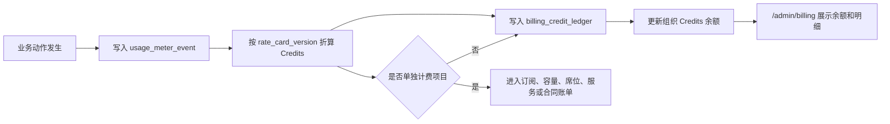

# FEAT-063 统一 Credits 计费设计

## 背景与目标

当前官网定价已经按阿里云公开成本和目标毛利重算，降低了套餐内含 Credits、知识库容量、文档处理量和并发额度。但如果官网继续把 `高级检索 RCU 包`、`文档处理包`、`OCR/扫描件处理包`、`模型 token`、`工具调用` 等底层资源逐项卖给客户，会让客户同时面对太多计费维度，理解成本过高，也不利于销售解释和后续账单争议处理。

本设计确认新的计费原则：

- 官网只展示少数客户可理解的商业条目。
- 系统内部保留细粒度 usage meter events 和 rate card。
- 除了必须单独计费的长期容量、席位/并发、实施服务和合同项目，所有执行型资源统一折算为 `Credits`。
- 组织管理员可以在系统内查看 Credits 的具体消耗明细，知道每笔 Credits 用在了什么动作、哪个模型、哪个知识库、哪个文档任务或哪个工具调用上。

## 产品原则

1. 客户购买的是“智能体工作量”，不是底层云资源。
2. 官网定价必须简化，避免把内部成本结构直接暴露给客户。
3. Credits 是所有执行型消耗的统一货币，包括模型、检索、文档处理、OCR、转写、摘要、工具和洞察。
4. 知识库容量是长期占用资源，应独立作为 GB 容量权益，不应在客户无操作时持续扣 Credits。
5. 系统内部必须可审计，所有 Credits 扣减都能追溯到 usage event、rate card version 和原始业务对象。
6. 私有化或客户自带资源默认不二次强收费，除非合同明确由 AgentCiCi 平台代付或托管。

## 官网计费条目

官网 Pricing 只展示以下一线计费条目：

| 官网条目 | 对客户解释 | 是否使用 Credits | 说明 |
| --- | --- | --- | --- |
| 套餐月费 | 标准版、专业版、企业版，包含平台运行、治理能力、基础容量和月度 Credits | 部分包含 | 套餐内含 Credits 和容量，不拆底层成本 |
| Credits 包 | 对话、检索、文档处理、OCR、转写、摘要、工具调用和洞察任务的统一工作量额度 | 是 | 客户超额时优先购买 Credits，不购买底层 RCU/OCR/token 包 |
| 知识库容量扩展 | 扩展原文、向量索引、元数据、日志和备份保留容量 | 否 | 以 GB/月计费，属于长期容量，不随动作扣减 |
| 并发与构建扩展 | 增加运行并发、构建席位和团队治理容量 | 否 | 属于能力和峰值资源，不混入单次 Credits |
| 上线服务 | 场景梳理、知识库初始化、连接器配置、技能整理、培训和验收支持 | 否 | 服务项目按合同或服务包计费 |
| 企业合同项 | SSO、SLA、专属支持、专属连接器、私有化部署等 | 否 | 按合同报价，不放入通用 Credits |

官网不再把以下内容作为一线商品展示：

- 高级检索 RCU 包。
- 普通文档处理包。
- OCR/扫描件处理包。
- qwen token 包。
- rerank 包。
- 工具调用包。
- 转写/摘要单项包。

这些项目保留在系统内部 rate card 中，并统一折算为 Credits。

## 系统内真实 Credits 计费项目

系统内部仍按真实动作记录 usage meter events，再通过版本化 rate card 折算为 Credits。首版建议使用以下计费项目：

| 计费域 | item code | 计量单位 | 建议 Credits | 官网映射 | 说明 |
| --- | --- | --- | ---: | --- | --- |
| `assistant_chat` | `conversation_credit` | turn | 1.00 / turn | Credits 包 | 有效用户对话轮次基础消耗 |
| `model_usage` | `qwen36_plus_input_0_256k` | 1k input tokens | 0.10 / 1k | Credits 包 | qwen3.6-plus 常规上下文输入 |
| `model_usage` | `qwen36_plus_output_0_256k` | 1k output tokens | 0.50 / 1k | Credits 包 | qwen3.6-plus 常规上下文输出 |
| `model_usage` | `qwen36_plus_input_long_context` | 1k input tokens | 0.40 / 1k | Credits 包 | 256K-1M 长上下文输入，按 4 倍倍率 |
| `model_usage` | `qwen36_plus_output_long_context` | 1k output tokens | 2.00 / 1k | Credits 包 | 256K-1M 长上下文输出，按 4 倍倍率 |
| `rag_retrieval` | `retrieval_query_credit` | query | 0.50 / query | Credits 包 | 单次知识库检索基础消耗 |
| `rag_retrieval` | `returned_context_chunk` | chunk | 0.20 / chunk | Credits 包 | 返回给模型的上下文切片 |
| `rag_retrieval` | `rerank_candidate_chunk` | candidate chunk | 0.01 / chunk | Credits 包 | 高级 rerank 候选切片，不在官网单列 RCU |
| `kb_indexing` | `plain_text_page_processing` | page | 0.40 / page | Credits 包 | 普通文本解析、切分、清洗、向量化和索引构建 |
| `kb_indexing` | `ocr_page_processing` | page | 1.00 / page | Credits 包 | OCR 或扫描件处理，倍率高于普通文本 |
| `kb_indexing` | `complex_layout_page_processing` | page | 2.00 / page | Credits 包 | 表格、图片密集、版面恢复或重试成本较高的文档 |
| `tool_call` | `readonly_tool_call` | call | 0.50 / call | Credits 包 | 平台内置或客户自有只读工具调度 |
| `tool_call` | `platform_paid_external_call` | call | 3.00-5.00 / call | Credits 包 | 平台代付搜索、富化或第三方托管连接器 |
| `workflow_run` | `standard_workflow_run` | run | 1.00 / run | Credits 包 | 标准工作流运行基础治理消耗 |
| `audio_minutes` | `speech_transcription_minute` | minute | 1.00 / min | Credits 包 | 云端语音识别或托管转写 |
| `summary` | `meeting_summary_credit` | task | 2.00 / task | Credits 包 | 会议摘要、章节、待办生成 |
| `insight` | `customer_insight_generation` | task | 5.00 / task 起 | Credits 包 | 客户洞察、画像、风险和机会生成 |

以上数值是 `official-credits-v1` 的首版设计口径。后续价格变化时，不修改历史账本，新增 rate card version。

## 必须单独计费的项目

以下项目不应折算为 Credits，避免用户产生“没用系统也被扣额度”的困惑：

| 单独计费项目 | 计费方式 | 原因 |
| --- | --- | --- |
| 平台套餐月费 | 按月或按年订阅 | 平台运行、基础治理和产品能力，不是单次用量 |
| 知识库容量 | GB/月或合同容量 | 长期存储资源，不应在无操作时扣 Credits |
| 构建席位 | 席位/月或合同包 | 权限和治理能力，不是运行消耗 |
| 并发扩展 | 并发档位/月或合同包 | 峰值保障和资源预留，不是单次任务 |
| 上线服务 | 服务包或项目制 | 人工实施、培训、验收，不属于自动化用量 |
| SLA 和专属支持 | 合同项 | 服务承诺和响应等级 |
| 私有化部署许可 | 年费授权 | 私有化商业模式，不以 SaaS Credits 为主收费口径 |
| 客户自有模型/GPU/第三方账号 | 客户自付 | 客户已直接承担供应商成本，AgentCiCi 默认只做治理归因 |
| 平台代付但合同指定转售的第三方资源 | 合同转售或代付账单 | 需按合同、税务或供应商账单单独处理 |

## Credits 消耗明细视图

系统内组织管理员必须能在 `/admin/billing` 查看 Credits 消耗明细。平台运营人员可在 `/platform/billing` 或后续成本中心查看跨组织配置和聚合视图。

### 组织管理员可见字段

每条 Credits 消耗明细应包含：

- 时间：`occurredAt`。
- 业务动作：对话、检索、文档处理、OCR、工具调用、转写、摘要、洞察等。
- 展示名称：面向用户的中文说明。
- Credits 消耗：本次扣减数量。
- 数量和单位：tokens、page、chunk、call、minute、task 等。
- 资源来源：Agent、会话、知识库、文档任务、工具、工作流或 Open API。
- 模型信息：模型厂商、模型名、上下文档位、input/output tokens。
- 计费类型：`platform_paid`、`included`、`customer_paid`、`non_billable`。
- 官网映射：统一显示 `Credits 包`，除非是容量、席位、服务等单独计费项目。
- 追踪编号：trace id、request id、source id 或幂等键。

### 明细解释文案

账单明细不应展示难懂的底层 SKU。建议展示为：

- `模型推理：qwen3.6-plus 输出 2,000 tokens，消耗 1.00 Credits`
- `知识库检索：返回 6 个上下文片段，消耗 1.20 Credits`
- `文档处理：普通文本 120 页，消耗 48.00 Credits`
- `OCR 处理：扫描件 30 页，消耗 30.00 Credits`
- `外部搜索：平台代付搜索 1 次，消耗 5.00 Credits`

后台可以保留内部字段：

- `billableDomain`
- `billableItemCode`
- `rateCardVersion`
- `quantity`
- `unit`
- `unitCredits`
- `officialPricingItem`
- `metadataJson`

但默认用户界面应先展示业务解释，再允许展开技术明细。

## 计费流程

规则：

- 同一业务事实只生成一个可幂等识别的 usage event。
- Credits 扣减只追加 ledger，不改写历史。
- 非计费失败、平台配置错误和空响应记录为 `non_billable`，不得扣 Credits。
- `customer_paid` 资源记录用量事实，但默认不消耗 Credits。
- `platform_paid` 和合同约定的托管资源进入 Credits。

## 官网与系统文案要求

官网 Pricing 的口径：

- “Credits 覆盖对话、检索、文档处理、OCR、转写、摘要、工具调用和洞察任务。”
- “知识库容量只表示长期存储和索引容量，超出后购买容量扩展。”
- “普通文本、OCR、扫描件、高级检索、长上下文模型会按不同倍率消耗 Credits，可在账单明细中查看。”

系统账单页的口径：

- 总览：展示本月 included Credits、已消耗、剩余、消耗趋势和预警。
- 明细：按业务动作解释每笔扣减。
- 展开：提供内部 item code、数量、单位、模型和 trace 信息。
- 单独计费：容量、席位、并发、服务和合同项目在订阅或合同模块展示，不混入 Credits ledger。

## 后续实现要求

- 将 `高级检索 RCU 包` 从官网一线加购项移除，保留为内部 rate card 或平台运营配置项。
- 将 `文档处理包` 和 `OCR/扫描件处理包` 从官网一线加购项移除，统一进入 Credits 包说明。
- 后端 rate card 应支持按 `model_name`、`context_window_tier`、`document_processing_type`、`billing_type` 和 `rate_card_version` 区分倍率。
- `usage_meter_event.metadata_json` 应保留足够上下文，支持账单明细解释和售后争议复核。
- `/admin/billing/usage-events` 应返回用户友好的 `displayName`、`explanation` 和可展开技术明细。
- 平台运营应能配置 rate card，但历史账本必须保持原 rate card version。

## 验收标准

- 官网 Pricing 只保留套餐、Credits 包、知识库容量扩展、并发与构建扩展、上线服务等少数条目。
- 官网不再展示高级检索 RCU、普通文档处理、OCR/扫描件处理等底层技术包作为一线购买项。
- 系统内所有执行型资源都能折算成 Credits，并映射到 `officialPricingItem = Credits 包`。
- 组织管理员能看到每笔 Credits 消耗的业务解释、数量、单位、Credits 和追踪信息。
- 必须单独计费的容量、席位、并发、服务、SLA、私有化许可和客户自付资源不进入 Credits 扣减。

## 交接说明

下一步建议将 FEAT-061 官网 Pricing 和 FEAT-037 billing catalog seed 按本文档收敛：

1. 官网移除 `高级检索 RCU 包` 的一线展示。
2. 官网把文档处理和 OCR 统一写入 Credits 包覆盖范围。
3. 后端保留内部 rate card 和明细解释能力。
4. `/admin/billing` 用业务语言展示 Credits 明细，技术字段默认折叠。
