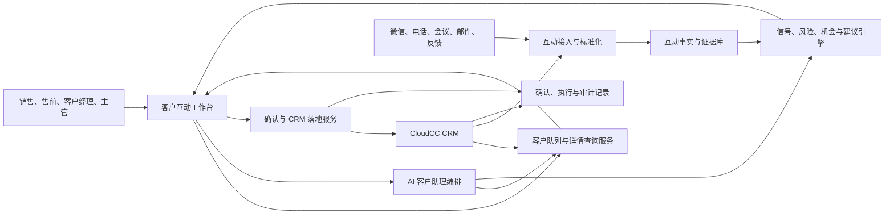

# FEAT-081 - 客户互动工作台

## 背景与目标

客户互动工作台是一个面向销售、售前、客户经理和销售主管的 AgentCiCi AI 应用。它不把“拜访记录”作为核心概念，而是把微信沟通、电话、会议、客户反馈、售前交流和 CRM 已有数据统一理解为“客户互动事实”，再通过 AI 帮助用户识别推进机会、客户风险、下一步行动和可落地 CRM 更新。

本特性同时走两条交付线路：

- AgentCiCi 侧：构建客户互动工作台 AI 应用、支撑智能体、技能、工具调用和演示数据服务。
- CloudCC CRM 侧：复用 CRM 标准对象和标准字段，补充必要模块入口、页面承载和演示数据，让工作台可以反向嵌入或联动 CRM。

最终目标是达到生产就绪：用户可在 AgentCiCi AI 应用列表进入工作台，从客户列表进入客户详情，查看新客户推进和老客户经营视图，使用右侧 AI 客户助理通过文字或语音指令查询、整理、生成跟进任务、查看风险、沉淀互动摘要，并能把建议落地到 CRM。

## 引用依据

- CloudCC 平台文档：`platform/overview introduction`、`platform/capabilityMap introduction`、`platform/standardCapabilities introduction`。
- CloudCC 方法论：`methodology/moduleDesign devguide`。
- 目标租户已通过 MetadataService `standard-catalog` 验证：8 个应用、141 个菜单、192 个对象、4854 个字段。
- AgentCiCi 产品事实源：`PRODUCT.md`、`DESIGN.md`、`DESIGN.json`。

## 能力路径

CloudCC 侧命中：

```text
standard-catalog -> Account/Contact/Lead/Opportunity/Task/Event 复用判断
-> fields/recordType/pagelayout -> menu/application -> OpenAPI/pagecomponent
-> profile/sharingRule
```

AgentCiCi 侧命中：

```text
AI app -> agent/skill/tool bindings -> CloudCC integration session
-> customer interaction APIs -> workbench UI -> seeded demo data
-> runtime audit and production validation
```

## 用户与场景

### 角色

- 销售：快速判断新客户是否值得推进，生成下一步跟进任务，补齐联系人和商机信息。
- 售前：从散落沟通中提炼需求、痛点、方案关注点、技术风险和待确认事项。
- 客户经理：经营老客户，识别续约、增购、满意度、服务风险和关键人变化。
- 销售主管：查看团队客户推进和老客户经营风险，追踪 CRM 落地情况。

### 场景

- 新客户推进：从线索、客户、联系人、互动摘要和商机信号中判断跟进优先级。
- 老客户经营：围绕已成交或存量客户，识别续约、复购、服务风险、关系健康和价值提升机会。
- 互动整理：把电话、微信、会议、客户反馈等碎片内容整理为摘要、客户事实、需求、风险、行动项和 CRM 建议。
- AI 操作工作台：用户通过右侧 AI 客户助理切换客户、查询互动、生成任务、查看风险或采纳建议。

## CloudCC 标准对象复用判断

目标租户已扫描：是。

命中的标准对象：

- `Account`：客户主档，作为工作台客户列表和客户详情主对象。
- `Contact`：联系人与关键人信息。
- `Lead` / `cloudcclead`：潜在客户和市场线索。
- `Opportunity`：商机、新客户推进和成交机会。
- `Task` / `Event`：跟进任务、会议、电话、拜访等可执行活动。
- `Case` / 服务对象：老客户服务风险和客户反馈的可选来源。
- `Contract` / `Order` / `Quote`：老客户经营中的合同、订单、报价、续约或增购线索。

复用原则：

- 不新建“拜访记录”对象。互动日志不等于拜访，首版以 AgentCiCi 侧的互动聚合数据和 CRM 标准活动对象承载可落地动作。
- 不新建客户主档、联系人、商机、任务的同义对象。
- 只有当客户互动事实需要独立审计、来源追踪和 AI 分析版本时，AgentCiCi 平台侧新增本地表；CRM 侧仍优先用标准对象承载最终行动。

## 全局对象地图

| 领域 | 对象/模块 | 归属 | 说明 |
|---|---|---|---|
| 客户主档 | Account | CloudCC 标准对象 | 客户列表、客户详情、客户分层、负责人 |
| 联系人 | Contact | CloudCC 标准对象 | 关键人、角色、联系方式 |
| 线索 | Lead/cloudcclead | CloudCC 标准对象 | 新客户早期来源 |
| 商机 | Opportunity | CloudCC 标准对象 | 新客户推进和增购机会 |
| 活动/任务 | Task/Event | CloudCC 标准对象 | 跟进任务、会议、电话、拜访等落地动作 |
| 服务风险 | Case/服务对象 | CloudCC 标准对象优先 | 老客户服务反馈和风险 |
| 互动事实 | customer_interaction_event | AgentCiCi 平台表 | 微信、电话、会议、反馈等统一事实流 |
| AI 建议 | customer_workbench_recommendation | AgentCiCi 平台表 | CRM 落地建议、置信度、采纳状态 |
| 工作台客户画像 | customer_workbench_snapshot | AgentCiCi 平台表 | 客户摘要、健康度、风险、机会、下一步行动 |

## AgentCiCi 数据模型

新增 Flyway 迁移，建议文件：`V72__customer_interaction_workbench.sql`。

### customer_interaction_event

用于记录从 CRM、演示数据或外部渠道同步来的互动事实。

| 字段 | 类型 | 说明 |
|---|---|---|
| id | uuid/string | 主键 |
| org_id | varchar | AgentCiCi 组织 |
| crm_account_id | varchar | CloudCC Account id |
| crm_contact_id | varchar | 可选联系人 id |
| source_type | varchar | `WECHAT`、`PHONE`、`MEETING`、`EMAIL`、`CRM_TASK`、`CUSTOMER_FEEDBACK`、`DEMO` |
| occurred_at | timestamp | 互动发生时间 |
| subject | varchar | 主题 |
| raw_summary | text | 原始摘要或演示摘要 |
| ai_summary | text | AI 整理摘要 |
| sentiment | varchar | `POSITIVE`、`NEUTRAL`、`NEGATIVE` |
| intent_tags | json/text | 需求、风险、预算、竞品、服务、续约等标签 |
| lifecycle_area | varchar | `NEW_CUSTOMER`、`EXISTING_CUSTOMER`、`MIXED` |

### customer_workbench_recommendation

用于保存 AI 可落地建议。

| 字段 | 类型 | 说明 |
|---|---|---|
| id | uuid/string | 主键 |
| org_id | varchar | 组织 |
| crm_account_id | varchar | 客户 |
| recommendation_type | varchar | `CREATE_TASK`、`UPDATE_OPPORTUNITY`、`CREATE_OPPORTUNITY`、`UPDATE_RISK`、`ADD_CONTACT`、`CREATE_CASE` |
| title | varchar | 建议标题 |
| rationale | text | 依据 |
| confidence | numeric | 置信度 |
| status | varchar | `PENDING`、`ACCEPTED`、`DISMISSED`、`APPLIED` |
| crm_payload | json/text | 拟写入 CRM 的 payload |
| applied_crm_id | varchar | 落地后 CRM 记录 id |

### customer_workbench_snapshot

用于快速驱动页面。

| 字段 | 类型 | 说明 |
|---|---|---|
| id | uuid/string | 主键 |
| org_id | varchar | 组织 |
| crm_account_id | varchar | 客户 |
| segment | varchar | `NEW`、`EXISTING`、`STRATEGIC`、`RISK` |
| health_score | integer | 老客户健康分 |
| progress_score | integer | 新客户推进分 |
| risk_count | integer | 风险数 |
| next_action_count | integer | 下一步行动数 |
| snapshot_json | json/text | 页面聚合快照 |

## 状态机

### AI 建议状态

```text
PENDING -> ACCEPTED -> APPLIED
PENDING -> DISMISSED
ACCEPTED -> PENDING (用户撤销采纳)
APPLIED 为终态，后续修改需要产生新建议。
```

### 客户经营状态

```text
新客户：待识别 -> 待跟进 -> 方案沟通 -> 评估决策 -> 商机推进 -> 成交/暂缓/流失
老客户：健康 -> 需关注 -> 风险中 -> 挽回中 -> 稳定/流失
```

注意：状态不是强制按拜访阶段切分互动内容。一次互动可以同时命中新客户推进、方案需求、服务风险和老客户经营多个标签。

## API 设计

### 双向登录与身份一致性

客户互动工作台必须遵循以下 token 边界：

- CloudCC CRM 页面运行态 token 只作为 CloudCC 当前登录用户的身份入口和服务端校验凭据，不得作为 AgentCiCi 登录 token 使用。
- AgentCiCi 登录 token 只用于访问 AgentCiCi 工作台和平台 API，不得作为 CloudCC OpenAPI 或 CloudCC MCP 调用凭据。
- CloudCC OpenAPI / CloudCC MCP 调用必须统一使用 AgentCiCi 后端通过当前 AgentCiCi 用户绑定信息生成的 CloudCC accessToken，即 `CloudccAccessTokenService` 产出的 `CloudccSessionContext.accessToken`。
- 同一个 CloudCC 用户无论从 CloudCC CRM 嵌入页进入，还是从 AgentCiCi AI 应用列表进入，都必须映射到同一个 AgentCiCi `organization_member`；否则客户数据权限会漂移。
- 首版不做自动创建 AgentCiCi 用户。CRM 免登录进入时，必须能在当前 AgentCiCi 组织中找到 `cc_username` 匹配的已启用成员，并且该成员已有可生成 CloudCC accessToken 的绑定信息；找不到时返回“请先绑定 CloudCC 账号”。

推荐登录链路：

```text
CloudCC pagecomponent
  -> $CCDK.CCToken.getOpenApiToken()/getToken + $CCDK.CCUser.getUserInfo()
  -> POST /auth/cloudcc-sso/ticket
  -> AgentCiCi 服务端校验 CloudCC token 可被 CloudCC setup read endpoint 接受
  -> 按 orgId + ccUsername 映射 AgentCiCi 成员
  -> 确认可通过 CloudccAccessTokenService 生成 CloudCC accessToken
  -> 返回 60 秒一次性 ssoTicket
  -> iframe 打开 /app?aiApp=customer-workbench&ssoTicket=...
  -> POST /auth/cloudcc-sso/consume
  -> 写入 AgentCiCi 登录态
```

接口：

- `POST /auth/cloudcc-sso/ticket`
  - public endpoint。
  - 请求体包含 `agentOrgId`、`cloudccAccessToken`、`cloudccUser`、`parentOrigin`、`targetPath`。
  - 后端不得信任前端传入的用户名；必须先校验 CloudCC token，再与用户映射结果交叉校验。
  - 返回一次性 `ticket`、`expiresAt`、`targetUrl`。
- `POST /auth/cloudcc-sso/consume`
  - public endpoint。
  - 请求体包含一次性 `ticket`。
  - 成功后返回与 `/auth/password/login` 一致的登录 payload。

### 工作台 API

- `GET /customer-workbench/accounts`
  - 返回客户列表、客户分层、负责人、最近互动、风险数、建议数。
- `GET /customer-workbench/accounts/{accountId}`
  - 返回客户详情聚合快照。
- `GET /customer-workbench/accounts/{accountId}/timeline`
  - 返回互动时间线。
- `GET /customer-workbench/accounts/{accountId}/recommendations`
  - 返回 CRM 落地建议。
- `POST /customer-workbench/recommendations/{id}/accept`
  - 采纳建议。
- `POST /customer-workbench/recommendations/{id}/apply`
  - 写入 CloudCC CRM。
- `POST /customer-workbench/interaction-drafts`
  - 从文本/语音转写内容生成互动草稿和建议。
- `POST /customer-workbench/assistant`
  - 工作台右侧客户助理对话入口，支持页面切换指令。

### CloudCC 工具能力

工作台智能体可绑定以下技能/工具：

- 查询客户列表和客户详情。
- 查询联系人、线索、商机、任务、活动、服务反馈。
- 生成互动摘要、风险信号和下一步行动。
- 创建或更新 CRM 跟进任务。
- 创建商机或更新商机阶段。
- 补充联系人建议。
- 生成主管视角客户风险汇总。

高风险写入动作必须进入确认或采纳流程，不允许 AI 静默写 CRM。

## 前端设计

### 入口

客户互动工作台出现在 AgentCiCi AI 应用列表中。进入后仍在认证后主界面内运行，不做营销页。

### 主页面布局

延续用户确认的三栏工作台：

- 顶部：`新客户推进 / 老客户经营` 为主模式切换。两者是不同客户队列之间的互斥切换，不是单个客户详情里的页签。
- 左侧：根据当前主模式展示对应客户队列，含搜索、分组、筛选、客户列表和风险/建议标记；切换主模式时同步切换客户池和首个客户。
- 中间：客户详情，顶部为客户名、CRM 打开入口、摘要指标；主内容根据当前主模式展示不同页签。
  新客户推进模式含 `推进概览 / 互动时间线 / 推进信号 / CRM 落地建议 / 下一步行动`。
  老客户经营模式含 `经营概览 / 互动时间线 / 服务问题 / 价值兑现 / 续约增购 / 关系地图`。
- 右侧：AI 客户助理，对话、语音输入、快捷操作和页面切换指令。

### 新客户推进

展示：

- 商机成熟度。
- 关键联系人覆盖。
- 需求明确度。
- 预算/时间/决策链信号。
- 下一步建议。

### 老客户经营

展示：

- 健康度与风险趋势。
- 续约/增购机会。
- 服务问题和客户反馈。
- 关键人关系维护。
- 最近价值触点。

### 视觉方向

注册表面：`product`。

物理场景：销售或客户经理在 27 英寸办公显示器上，一边看 CRM 客户数据，一边把刚结束的电话、微信和会议内容整理成可执行行动，环境是白天办公场景，需要高密度、低疲劳、可信的业务工作台。

方向：克制的企业客户经营舱。使用暖象牙底、墨色文本、香槟金结构线；客户状态用少量蓝、绿、红、琥珀语义色辅助，不使用大面积渐变、玻璃拟态或营销式 hero。

### 高保真实现约束

用户最新确认的 CRM 标准蓝/鎏金工作台稿是当前实现基准。工作台首屏必须保留：

- 顶部 AgentCiCi 品牌与 `AI 应用 / 客户互动工作台` 面包屑、CloudCC CRM 已连接状态、通知/帮助/用户区域。
- 顶部右侧保留 `新客户推进 / 老客户经营` 主模式切换；严禁使用旧的销售导向命名。
- 左侧队列随主模式切换：新客户模式显示 `新客户推进队列`，含重点推进、待跟进、风险客户、待确认建议；老客户模式显示 `老客户经营队列`，含续约90天、健康下降、服务异常、增购信号。
- 中间客户详情，包含客户名、`Account`、`Opportunity`、负责人、关注状态、最近互动、打开 CRM 客户主页按钮和 4 个摘要指标；页签必须随主模式切换，不能把 `新客户推进` 和 `老客户经营` 作为同一客户详情内的并列页签。
- 概览首屏必须同时露出互动时间线和 CRM 落地建议，两列卡片不能被底部截断。
- 客户区域下方必须保留业务汇总框：新客户模式为 `推进关键项`，老客户模式为 `服务与关系预警`，用于承载从工单、会议、微信和 CRM 更新中提取的关键风险/机会。
- `新客户推进` 必须展示 5 段推进阶段、推进信号、建议动作和 CRM 补齐项。
- `老客户经营` 必须展示续约稳定、服务响应、增购机会、关系覆盖，以及经营信号、风险与阻塞、客户价值动作。
- 右侧 AI 客户助理必须保留语音/输入指令入口、对话区、快捷操作、输入框和 AI 内容提示。

## 演示数据

首版需补充足够演示数据，覆盖：

- 12 个客户，包含新客户、存量客户、战略客户、风险客户。
- 每个客户 3 到 8 条互动事实，来源覆盖微信、电话、会议、客户反馈、CRM 任务。
- 至少 5 个新客户推进场景，含方案沟通、预算确认、竞品比较、决策链不清、待约演示。
- 至少 5 个老客户经营场景，含续约、增购、服务风险、满意度下降、关键人变化。
- 至少 20 条 AI 建议，覆盖创建任务、更新商机、补充联系人、创建服务风险、生成复盘摘要。

演示数据必须可重复初始化，不依赖生产真实客户数据。

## 权限与安全

- 所有 API 必须按 org 隔离。
- CRM 写入动作必须校验 CloudCC 连接绑定和当前用户权限。
- AI 建议采纳和写入 CRM 必须可审计。
- 敏感信息进入模型或审计前应复用 FEAT-080 的安全网关。

## 生产就绪验收

- AI 应用列表能看到并进入“客户互动工作台”。
- 客户列表能加载 CRM/演示客户，并能进入客户详情。
- 新客户推进和老客户经营两个主视图可用。
- 右侧 AI 客户助理能根据用户指令切换客户、查询风险、总结互动、生成跟进任务建议。
- 采纳建议后能进入确认流程，确认后能写入 CloudCC CRM 或在演示模式下写入本地模拟结果。
- CloudCC MetadataService/OpenAPI 连通验证通过。
- 演示数据初始化后页面有完整可讲述故事线。
- 后端测试、前端构建和桌面端 Playwright 验证通过。

## 当前实现状态

更新时间：2026-07-09T19:21:00+08:00。

- AgentCiCi 侧已完成首版实现：后端新增客户互动事实、CRM 落地建议和客户快照模型；初始化 12 个演示客户、36 条互动事实、24 条建议；提供客户列表、客户详情、建议采纳/落地和 AI 客户助理 API。
- 智能体/技能侧已新增内置技能 `customer-interaction-workbench`，绑定到系统助手和销售助手，默认提示约束 AI 先读取 CRM/互动事实、再生成可确认的 CRM 落地建议。
- 前端已在认证后主界面 AI 应用列表新增“客户互动工作台”，实现左侧客户推进队列、中间客户详情、新客户推进、老客户经营、CRM 落地建议、右侧 AI 客户助理和语音入口。
- AgentCiCi `/app?aiApp=customer-workbench` 仍作为平台内 AI 应用直达入口；CloudCC CRM 嵌入必须使用 `/app?aiApp=customer-workbench&embed=crm`。`embed=crm` 是 CRM 专用轻量入口，只渲染客户互动工作台主体，不渲染 AgentCiCi 左侧平台栏、AI 应用列表、主页 header 或其他平台无关内容。
- CloudCC CRM 侧已通过 OpenAPI 验证 `Task`、`Event`、`Opportunity` 标准对象可查询；页面组件 `customer-workbench` 和预构建 UMD bundle 已通过安全临时项目发布到 CloudCC 云端。当前线上有效组件 id 为 `6a4d348fe4b0a577cbba1ebf`，apiName 为 `custc_202607Hdhm60zo`，本地 `frontend/pagecomponents/customer-workbench/config.json` 已同步该 id。
- CloudCC 页面组件默认工作台地址必须为 `https://x.agentcici.com/app?aiApp=customer-workbench&embed=crm`，SSO `targetPath` 也必须使用同一路径。pagecomponent 自身只负责 CloudCC token 读取、换取 AgentCiCi 一次性 `ssoTicket` 和 iframe 承载，不再显示“AI 应用”“打开工作台”等 AgentCiCi 平台级头部。
- 生产版本 `2.2.7` 和 CloudCC pagecomponent V8 已验证该嵌入形态：CRM 运行态加载 `component-customer-workbench-V8.0.js`，iframe 使用 `/app?aiApp=customer-workbench&embed=crm&ssoTicket=...`，iframe 内无 AgentCiCi 平台侧栏、无 AI 应用列表，仅显示客户互动工作台主体。
- 最新本地高保真 UI 修复已恢复用户设计稿中的工作台细节和业务页签：Playwright 1496x1064 截图 `output/playwright/task171-workbench-fidelity-local-v4.png` 验证首屏无横向/纵向页面溢出，概览页两个“查看全部”入口完整露出；`output/playwright/task171-workbench-new-customer-panel.png` 和 `output/playwright/task171-workbench-existing-customer-panel.png` 验证 `新客户推进` 与 `老客户经营` 业务内容可用。
- CloudCC HTML 组件已通过 devconsole API 保存，作为 CRM 内可承载的 iframe 包装页。线上 HTML 组件 id 为 `6a4d37ece4b0a577cbba1ec0`，apiName 为 `customer_interaction_workbench`，访问路径为 `/oss/html/org0720f814430017229/customer_interaction_workbench-v1.html`。
- 不得直接从当前仓库根目录执行 `cloudcc publish pagecomponent customer-workbench .`，除非先修复 CLI 的 pagecomponent 依赖收集白名单；根目录发布曾把项目配置打入 `compContentVue`，对应云端组件已立即删除。
- CloudCC customPage 已通过 devconsole API 创建并验证：线上 customPage id 为 `6a4d3b831b8c6d0ec6dd22ef`，页面标签 `客户互动工作台`，pageApi `customer_interaction_workbench`。
- CloudCC CRM 菜单已通过 setup 服务创建并绑定销售云：页面菜单 id 为 `acf2026C53BE54B9R1Iu`，tab label `客户互动工作台`，lightning page `customer_interaction_workbench#lightning`，已对 6 个简档授权，并已在销售云应用 `ace20220322Salesloud` 的 `selectedTabList` 中验证可见。
- MSAPI 菜单计划 `pla2026E964195FlLpjf` 仍因当前 OpenAPI JWT 缺少 `metadata:apply` scope 无法 apply；但本任务已通过 CloudCC setup/devconsole API 完成同等页面和菜单配置，该限制不再阻塞 CRM 可见入口。
- 桌面端 Playwright 验收通过，截图为 `output/playwright/task171-customer-workbench-desktop.png`；直达入口验收通过，截图为 `output/playwright/task171-customer-workbench-deeplink.png`。验证工作台标题、AI 应用入口、老客户经营 tab、AI 快捷指令、CRM 落地建议、`置信度 92%`、无横向溢出和控制台 0 error/0 warning。
- 生产发布完成：`2.2.2` 发布主功能，`2.2.3` 修复 HTTPS vhost 对 `/customer-workbench/*` 的代理。当前生产 `/system/version` 返回 `version=2.2.3`、`imageTag=2.2.3`、`gitCommit=f0ec47509bde`；认证后 `/customer-workbench/accounts` 返回 12 个演示客户，客户详情和 AI 客户助理 smoke 均通过。

## 非目标

- 不在首版实现移动端专属适配。
- 不把微信、电话等真实外部渠道打通作为硬依赖；首版用演示数据和可扩展接口。
- 不让 AI 自动静默改 CRM 关键数据。
- 不重建 CRM 客户、联系人、商机、任务等标准对象。

## 生产版详细功能设计与差距审计

### 1. 审计基线与结论

本节以 2026-07-10 生产版本 `2.3.9`、当前前端与后端代码、用户提供的工作台截图为基线。前文 `2.2.x` 内容是首版交付历史，不再代表当前生产成熟度。

当前工作台已经完成以下真实链路：

- AgentCiCi 与 CloudCC CRM 双向登录、同用户映射及 CRM 嵌入页面链路。
- 工作台三栏页面、新客户推进与老客户经营互斥切换、客户详情加载。
- 右侧 AI 客户助理调用真实 `ChatOrchestratorService`、模型路由、运行 Trace 和技能解析。
- 底部麦克风接入服务端实时 ASR，识别文本先回填输入框，由用户确认后发送。
- 建议“采纳”状态可以持久化到 AgentCiCi 数据库。

当前仍未达到业务生产闭环的核心原因：

- 客户队列、互动、指标和建议的运行时事实源仍主要是 AgentCiCi 本地快照，不是持续同步的 CloudCC CRM 与外部互动事实。
- 建议“落地 CRM”仍生成 `demo-crm-*` 模拟 ID，没有创建或更新真实 CloudCC 记录。
- 智能体能真实回答，但返回的页面动作恒为 `NONE`，无法可靠切换客户、聚焦页签、生成草稿或发起确认流程。
- 多数视觉控件没有对应后端能力，部分数字和业务判断由前端固定公式或固定文案生成。

因此本特性状态从 `implemented` 调整为 `in_implementation`。当前版本适合产品演示和交互验证，不应宣称已经完成生产业务闭环。

### 2. 产品目标与业务边界

客户互动工作台的生产目标不是记录一次拜访，而是完成以下闭环：

```text
多渠道互动事实进入
  -> 关联客户、联系人、商机、合同或服务事项
  -> AI 提取事实、风险、机会、承诺、异议和行动项
  -> 用户校对并确认
  -> 写入 CloudCC 标准对象
  -> 形成后续任务和经营跟踪
  -> 新互动再次验证结果
```

必须坚持四条边界：

- CloudCC 是客户、联系人、商机、任务、合同、订单和服务记录的业务事实源。
- AgentCiCi 保存互动标准化结果、AI 分析版本、建议草稿、证据引用、确认状态和审计记录，不复制 CRM 主数据所有权。
- 一次互动可以同时包含新客户推进、服务风险、续约、增购、关系变化等多个主题，不按单一阶段强制归档。
- 任何 CRM 写入必须经过“建议生成、用户确认、权限校验、执行、回读验证、审计记录”六步，禁止只在页面上显示成功。

### 3. 用户角色与核心场景

| 角色 | 核心问题 | 工作台必须提供的结果 |
|---|---|---|
| 销售 | 哪些新客户今天最值得推进，下一步做什么 | 优先队列、推进信号、决策链缺口、可确认任务与商机更新 |
| 售前 | 客户真实需求、技术限制和未决问题是什么 | 互动证据、需求/异议提取、方案缺口、责任人与截止日期 |
| 客户经理 | 老客户是否健康，续约和增购机会在哪里 | 健康趋势、服务闭环、价值兑现、续约倒计时、关系覆盖 |
| 销售主管 | 团队是否真正推进，风险是否有人负责 | 可下钻的风险队列、逾期行动、建议采纳率、CRM 落地率 |

### 4. 总体功能架构



### 5. 页面逐元素功能落地设计

#### 5.1 顶部区域

| 页面元素 | 生产行为 | 数据与接口 | 状态与异常 |
|---|---|---|---|
| 新客户推进 / 老客户经营 | 切换两套客户池、指标、页签、排序规则和 AI 上下文；记住用户最近模式 | 前端路由参数 `mode=new|existing`；用户偏好服务 | 切换失败保留原模式并提示，不允许客户详情与队列模式错配 |
| CloudCC CRM 已连接 | 显示当前用户的连接、token、权限和最近同步状态，不使用固定文案 | `GET /customer-workbench/integration-status` | `CONNECTED`、`READ_ONLY`、`TOKEN_EXPIRED`、`PERMISSION_MISMATCH`、`DISCONNECTED` |
| 通知 | 打开与当前用户相关的客户风险、待确认建议、CRM 写入失败和任务逾期通知 | `GET /customer-workbench/notifications` | 未读数、全部已读、空状态、拉取失败 |
| 帮助 | 打开工作台帮助抽屉，内容根据当前页签定位 | 产品帮助配置 | 不离开当前客户，不遮断未提交草稿 |
| 用户区域 | 显示真实当前用户、CRM 用户映射和业务角色 | `/auth/me` 与 CloudCC 用户绑定 | 身份不一致时阻断 CRM 数据读取并提示重新绑定 |

#### 5.2 左侧客户队列

| 页面元素 | 生产行为 | 数据与接口 | 关键规则 |
|---|---|---|---|
| 队列标题 | 根据模式显示新客户推进队列或老客户经营队列 | 队列 API 返回 `mode` 与统计口径 | 不用前端根据演示分段猜测客户归属 |
| 筛选按钮 | 打开字段化筛选面板，包括负责人、团队、客户分层、行业、阶段、风险等级、最近互动时间 | `GET /customer-workbench/filter-options` | 筛选条件可保存为个人视图 |
| 列表设置 | 控制展示字段、摘要行、排序字段和每页数量 | 用户偏好 API | 不改变数据权限，只影响呈现 |
| 搜索 | 服务端搜索客户名、负责人、联系人、商机、标签和互动关键词 | `GET /customer-workbench/queues?q=...` | 300ms 防抖；返回命中字段；最少 2 个字符触发全文搜索 |
| 新客户筛选 | `重点推进`、`待跟进`、`风险客户`、`待确认建议` | 服务端过滤参数 | 每个筛选项使用明确规则并返回真实数量 |
| 老客户筛选 | `续约90天`、`健康下降`、`服务异常`、`增购信号` | 服务端过滤参数 | 续约日期来自合同；服务异常来自工单/服务对象；不得用健康分公式代替事实 |
| 排序 | 支持推进优先、风险优先、最近互动、任务逾期、续约时间、金额影响 | `sort` 与 `direction` 参数 | 排序口径由服务端统一，前端不自行计算 |
| 客户总数 | 显示当前筛选条件下的真实 `totalElements` | 分页响应 | 禁止使用 `Math.max(..., 38/26)` 伪造数量 |
| 客户卡片 | 展示客户、负责人、阶段/健康、最近互动、风险、建议和摘要 | 队列投影 DTO | 每个数字可下钻；摘要必须可追溯到互动事实 |
| 分页 | 服务端分页、保留筛选与选中客户；支持上一页/下一页和总页数 | `page`、`size`、`totalPages` | 删除固定 `1 / 5`；无结果显示可解释空状态 |

新客户队列归属规则：存在有效 Lead/Account 且尚未成交，或存在进行中的新购商机；风险客户仍属于新客户池，但以风险排序增强。

老客户队列归属规则：存在已成交商机、有效合同、订单或客户成功关系；新增商机属于老客户的增购机会，不把该客户移回新客户池。

#### 5.3 客户标题与实体信息

| 页面元素 | 生产行为 | 数据来源 |
|---|---|---|
| 客户名称与更多菜单 | 展示 CloudCC Account 名称；菜单提供复制链接、刷新客户、查看同步日志 | Account 与同步状态 |
| Account | 点击打开 CRM 客户记录详情 | CloudCC Account id 与租户 baseUrl |
| Opportunity 数量 | 展示当前模式下有效商机数，点击打开商机列表 | Opportunity 实时/增量同步结果 |
| 负责人 | 展示真实 Owner 与团队，遵循 CRM 可见性 | Account Owner / sharing |
| 关注 | 订阅该客户的重要变化、风险和建议；再次点击取消 | `PUT /customer-workbench/accounts/{id}/follow` |
| 最近互动 | 展示真实最近互动时间、渠道和联系人；点击定位时间线 | interaction fact 最新记录 |
| 打开 CRM 客户主页 | 在新标签打开当前 Account；嵌入态可使用 CloudCC SDK 导航 | 记录深链服务 |

#### 5.4 指标区

所有指标必须返回 `value`、`definition`、`source`、`lastCalculatedAt`、`drilldownTarget`，点击后进入对应明细。禁止由前端使用 `Math.max`、固定下限或简单分数换算生成。

新客户指标：

- 未确认建议：状态为 `PENDING` 且未过期的建议数量。
- 风险信号：当前有效、未关闭的风险信号数量。
- 下一步任务：CRM Task 中未完成且与当前客户/商机相关的任务数量。
- 最近互动：所选统计周期内去重后的互动事实数量。

老客户指标：

- 客户健康度：由续约、服务、使用/价值、关系覆盖和付款/合同风险按租户可配置权重计算，并展示趋势。
- 续约倒计时：取最近到期且未完成续约的有效合同日期。
- 未闭环问题：未关闭服务工单、投诉、承诺和升级事项数量。
- 增购信号：有效且未转化为商机的增购信号数量。

#### 5.5 中间页签

新客户推进页签：

| 页签 | 生产内容 | 用户动作 |
|---|---|---|
| 推进概览 | 时间线、CRM 落地建议、推进关键项 | 查看证据、采纳/修改/忽略建议、进入明细 |
| 互动时间线 | 全量互动，按渠道、联系人、主题、日期筛选 | 查看原文/录音/纪要，修正客户关联和 AI 标签 |
| 推进信号 | 需求、预算、决策链、竞争、时机、方案适配信号及证据 | 确认、驳回、补充证据、转风险/任务/商机字段 |
| CRM 落地建议 | 待确认、已采纳、执行中、已落地、失败、已忽略建议 | 修改草稿、确认执行、重试、查看 CRM 回读结果 |
| 下一步行动 | 来自 CRM Task 和 AI 建议的统一行动清单 | 创建任务、分配负责人、设截止时间、完成或延期 |

老客户经营页签：

| 页签 | 生产内容 | 用户动作 |
|---|---|---|
| 经营概览 | 健康趋势、互动、经营动作、服务与关系预警 | 下钻异常指标、生成经营计划 |
| 互动时间线 | 老客户全渠道互动和服务触点 | 关联合同、工单、订单、联系人 |
| 服务问题 | 工单、投诉、SLA、升级和承诺闭环 | 创建/更新 Case 或服务任务，确认责任人与时限 |
| 价值兑现 | 承诺价值、交付里程碑、使用成效、QBR 材料 | 生成 QBR 草稿，补充量化证据 |
| 续约增购 | 合同到期、续约条件、增购触发、商务风险 | 创建续约/增购商机和跟进任务 |
| 关系地图 | 联系人角色、影响力、态度、互动频率和覆盖缺口 | 补充联系人、调整角色、安排关系维护动作 |

#### 5.6 互动时间线

时间线事件必须由标准化互动事实驱动，每条包含：

- 渠道与来源系统、原始记录 ID、发生时间、参与人、关联客户/联系人/商机。
- 原始内容或原始内容受控链接、AI 摘要、情绪、主题、承诺、异议和行动项。
- AI 提取版本、置信度、证据片段、人工修正状态和数据权限标签。
- 去重键，防止同一会议同时从 CRM Event、会议纪要和手工录入重复出现。

渠道接入优先级：

1. CloudCC Task、Event、Note、商机更新和服务对象。
2. AgentCiCi 会议纪要、语音转写和手工粘贴文本。
3. 企业微信/微信客服、邮件、电话平台等经授权连接器。

“全部类型”必须打开真实筛选菜单；“查看全部互动记录”必须切换到时间线页签并保留当前客户，不得是无响应按钮。

#### 5.7 CRM 落地建议

每条建议包含：建议类型、目标对象、目标记录、字段差异、业务依据、证据引用、置信度、风险等级、创建人/模型版本、有效期和状态。

操作定义：

- 采纳：只表示用户认可建议，进入可编辑确认状态，不立即写 CRM。
- 修改：打开内联编辑或侧栏编辑，校验必填字段、字段类型、选项值和当前用户权限。
- 忽略：必须保存 `DISMISSED` 状态、原因和操作者；相同证据短期内不得重复生成同一建议。
- 确认落地：展示最终字段差异，用户二次确认后调用 CloudCC OpenAPI/MCP 写入。
- 回读验证：写入后用返回 ID 查询 CRM，确认记录存在且字段一致，状态才变为 `APPLIED`。
- 失败处理：保留请求摘要、错误码和可重试性，不保存 accessToken 或敏感原文。

建议状态机：

```text
DRAFT -> PENDING -> ACCEPTED -> CONFIRMED -> APPLYING -> APPLIED
             |          |           |            |
             v          v           v            v
         DISMISSED    PENDING      FAILED <---- RETRYING
```

#### 5.8 推进关键项与服务关系预警

底部区域不是固定文案区，而是高价值信号聚合区。每项必须包含信号类型、标题、影响、证据数、最近发生时间、责任人、处理状态和下钻入口。

新客户模式至少支持：决策链缺口、预算不清、需求不完整、竞争风险、方案适配缺口、时间窗口变化。

老客户模式至少支持：关键人覆盖不足、服务压力、SLA 风险、价值证明缺口、续约风险、增购机会、付款或合同异常。

AI 只能生成候选信号。需要用户确认或由确定性 CRM 规则验证后，才能进入高风险队列或触发主管通知。

#### 5.9 AI 客户助理

右侧助理必须保持当前无可见滚动条的视觉要求，但聊天历史仍可通过触控板、滚轮和键盘在内部滚动。顶部固定、关闭按钮必须有真实行为：固定控制面板是否随客户切换保留，关闭只隐藏面板并提供重新打开入口。

助理输入分为三类：

- 查询类：总结互动、查看风险、解释指标、查联系人/商机/任务。
- 导航类：切换客户、切换模式、打开时间线、聚焦某条建议。
- 动作类：生成任务、更新商机、补充联系人、创建服务问题、生成 QBR 或经营计划。

智能体不得直接返回自由文本后结束。应返回结构化结果：

```json
{
  "reply": "面向用户的说明",
  "uiActions": [
    {"type": "SWITCH_ACCOUNT", "accountId": "001..."},
    {"type": "OPEN_TAB", "tab": "recommendations"}
  ],
  "proposals": [
    {"proposalId": "...", "type": "CREATE_TASK", "requiresConfirmation": true}
  ],
  "citations": [
    {"interactionId": "...", "label": "07-04 方案评审会"}
  ],
  "runId": "..."
}
```

语音输入只负责转写并回填输入框，禁止转写结束后自动执行动作。发送后若识别为 CRM 写入意图，必须先生成 proposal 并在中间建议区展示确认界面。

首次打开客户时，助理欢迎语必须基于当前客户和真实最近互动动态生成，不能固定显示“北京智造科技有限公司最近三次沟通”。切换客户后应创建或恢复该用户与该客户独立的会话。

### 6. 后端服务与 API 设计

#### 6.1 查询 API

| 方法 | 路径 | 说明 |
|---|---|---|
| GET | `/customer-workbench/queues` | 服务端客户队列、搜索、筛选、排序、分页 |
| GET | `/customer-workbench/accounts/{id}/summary` | 客户标题、指标和概览投影 |
| GET | `/customer-workbench/accounts/{id}/timeline` | 分页互动事实与来源筛选 |
| GET | `/customer-workbench/accounts/{id}/signals` | 新客户推进或老客户经营信号 |
| GET | `/customer-workbench/accounts/{id}/recommendations` | 建议列表与状态筛选 |
| GET | `/customer-workbench/accounts/{id}/actions` | CRM 任务与 AI 建议行动统一列表 |
| GET | `/customer-workbench/accounts/{id}/relationship-map` | 联系人关系图数据 |
| GET | `/customer-workbench/integration-status` | 当前用户 CRM 连接和同步状态 |

队列响应必须使用分页结构：

```json
{
  "items": [],
  "page": 1,
  "size": 20,
  "totalElements": 38,
  "totalPages": 2,
  "filterCounts": {},
  "dataAsOf": "2026-07-10T16:00:00+08:00"
}
```

#### 6.2 建议与动作 API

| 方法 | 路径 | 说明 |
|---|---|---|
| POST | `/customer-workbench/recommendations/{id}/accept` | 采纳建议 |
| PATCH | `/customer-workbench/recommendations/{id}` | 修改建议草稿，使用版本号防并发覆盖 |
| POST | `/customer-workbench/recommendations/{id}/dismiss` | 忽略并保存原因 |
| POST | `/customer-workbench/recommendations/{id}/confirm` | 二次确认并冻结执行 payload |
| POST | `/customer-workbench/recommendations/{id}/apply` | 执行真实 CRM 写入 |
| POST | `/customer-workbench/recommendations/{id}/retry` | 对可重试失败重新执行 |
| POST | `/customer-workbench/actions/task-draft` | 从行动建议生成 Task 草稿 |
| POST | `/customer-workbench/interaction-drafts` | 从文本/语音/纪要生成互动事实草稿 |

所有写 API 必须支持 `Idempotency-Key`，保存操作者、原版本、目标记录、请求摘要、执行结果和 CRM 回读结果。

#### 6.3 助理 API

`POST /customer-workbench/assistant` 保留统一入口，但返回 `uiActions`、`proposals`、`citations` 和运行审计字段。页面只执行白名单内的 UI 动作；CRM 动作只创建建议，不由浏览器直接调用 CloudCC。

### 7. 数据模型补充

现有三张表保留，但需要补充以下生产实体：

| 实体 | 目的 | 关键字段 |
|---|---|---|
| `customer_interaction_source` | 原始来源与去重 | sourceSystem、sourceObject、sourceRecordId、contentHash、permissionLabel |
| `customer_signal` | 风险、机会和关键项 | signalType、mode、severity、status、evidenceIds、assignee、expiresAt |
| `customer_recommendation_evidence` | 建议与证据多对多 | recommendationId、interactionId、excerpt、confidence |
| `customer_crm_write_proposal` | 冻结确认后的 CRM payload | targetObject、targetId、beforeJson、afterJson、version、confirmedBy |
| `customer_crm_write_audit` | 执行和回读审计 | proposalId、requestHash、resultId、status、errorCode、verifiedAt |
| `customer_follow_subscription` | 用户关注客户 | orgId、userId、accountId、notificationPolicy |
| `customer_health_snapshot` | 老客户健康趋势 | componentScores、totalScore、ruleVersion、calculatedAt |
| `customer_assistant_session` | 客户级会话关联 | userId、accountId、sessionId、lastMode、lastTab |

现有 `snapshot_json` 只作为可重建投影缓存，不能继续承载不断扩展的核心业务状态。

### 8. CloudCC 交互设计

| 工作台能力 | CloudCC 对象 | 读写策略 |
|---|---|---|
| 客户队列与详情 | Account | 按当前用户 accessToken 查询，保留 CRM 记录级权限 |
| 联系人与关系地图 | Contact | 读取角色、部门、联系方式；角色判断需人工确认 |
| 新客户推进 | Lead、Opportunity | 读取阶段、金额、预计日期；确认后创建/更新商机 |
| 下一步行动 | Task、Event | 读取未完成活动；确认后创建任务或会议 |
| 服务问题 | Case 或租户服务对象 | 读取状态、SLA、升级；确认后创建/更新服务事项 |
| 续约增购 | Contract、Order、Quote、Opportunity | 读取有效期和商务事实；生成续约/增购商机草稿 |
| 互动证据 | Task、Event、Note 及连接器 | 增量同步，保存来源 ID 和权限标签 |

严格遵循既定 token 规则：CloudCC CRM 运行态 token 只用于身份换票；AgentCiCi 后端生成的 CloudCC accessToken 才用于 CloudCC OpenAPI/MCP。所有查询和写入使用当前映射用户，不使用组织级超级账号代替业务用户。

### 9. 智能体与技能设计

现有 `customer-interaction-workbench` 技能只绑定四个 CloudCC 只读工具，生产版需拆分为可治理技能：

| 技能 | 职责 | 工具边界 |
|---|---|---|
| 客户上下文查询 | 查询客户、联系人、商机、任务、合同和服务事实 | 只读 CloudCC 工具 |
| 互动事实整理 | 摘要、标签、承诺、异议、行动项、客户关联 | 不写 CRM，输出结构化草稿 |
| 推进信号识别 | 需求、预算、决策链、竞争、时机和方案信号 | 必须返回证据与置信度 |
| 老客户经营分析 | 健康、服务、价值、续约、增购和关系覆盖 | 规则分与模型推断分离 |
| CRM 建议生成 | 生成字段级 proposal 和差异预览 | 不执行写入 |
| CRM 确认执行 | 校验确认、权限、幂等、写入和回读 | 仅服务端工具，强制审计 |
| 工作台导航 | 将自然语言转换为白名单 UI action | 不接触 CRM 写权限 |

模型输出必须经过 JSON Schema 校验。无法校验时只显示自然语言回复，不执行 UI 动作或生成可执行 proposal。

### 10. 权限、安全与审计

- 所有本地实体必须使用 `org_id` 隔离，并记录 `created_by`、`updated_by`。
- 客户是否可见以当前用户 CloudCC 查询结果为准，本地快照不能扩大可见范围。
- 本地缓存命中客户在 CRM 中已失去权限时，立即隐藏并清理用户级缓存。
- 原始微信、电话和会议内容按来源权限展示；摘要不能绕过原文权限。
- CRM 写入必须校验对象权限、字段权限、记录权限和当前记录版本。
- accessToken、CRM runtime token、录音临时地址和敏感原文不得写入审计日志。
- 每个 AI 结论展示证据和生成时间；主管看到的团队数据仍按角色和共享规则过滤。

### 11. 加载、空状态与错误状态

| 状态 | 页面处理 |
|---|---|
| 首次加载 | 队列、指标、时间线分别显示稳定骨架，不用整页空白 |
| 无客户权限 | 显示“当前账号没有可访问客户”，提供检查 CRM 权限入口 |
| CRM 未连接 | 禁用 CRM 查询和落地按钮，允许查看已授权的本地历史数据 |
| 同步延迟 | 显示 `dataAsOf` 和“刷新 CRM 数据”，不把旧数据伪装为实时 |
| AI 失败 | 保留用户问题，可重试；不生成假回复 |
| CRM 写入失败 | 建议状态为 `FAILED`，展示业务错误和重试入口 |
| 并发冲突 | 展示 CRM 当前值与建议值，要求用户重新确认 |
| 无互动 | 提供粘贴记录、上传纪要或创建 CRM 活动的明确入口 |

### 12. 当前生产差距矩阵

| 优先级 | 功能 | 当前代码事实 | 生产目标 | 判定 |
|---|---|---|---|---|
| P0 | 客户列表事实源 | API 查询本地 `customer_workbench_snapshot`；无运行时 CloudCC 队列查询 | 按当前用户权限查询/同步 CloudCC，并返回服务端分页队列 | 未闭环 |
| P0 | CRM 真写入 | `applyRecommendation` 生成 `demo-crm-*`，返回模拟模式 | 真实创建/更新 CloudCC，回读验证和审计 | 未实现 |
| P0 | 数据权限持续一致 | SSO 用户映射已完成，但工作台本地快照查询只按 org 隔离 | 每次查询同时受 CRM 记录级权限约束 | 局部实现 |
| P0 | 建议确认链路 | 只有 accept/apply；缺少 edit、dismiss、confirm、retry | 完整状态机与字段差异确认 | 未实现 |
| P0 | 真实指标 | 多个指标使用 `Math.max`、固定下限和分数换算 | 服务端指标定义、来源、时间和下钻 | 未实现 |
| P0 | 动态关键项 | 推进关键项与服务预警是前端固定数组 | 信号表、证据、责任人和处理状态 | 未实现 |
| P1 | 智能体问答 | 已进入真实编排、模型、Trace 和技能链路 | 保持现有能力并增加结构化输出 | 已实现基础 |
| P1 | 智能体页面控制 | 后端 `action` 恒为 `NONE` | 可校验的 `uiActions` 白名单 | 未实现 |
| P1 | 智能体动作建议 | 只能输出文本，不能生成可确认 proposal | 助理生成建议并联动中间区确认 | 未实现 |
| P1 | 首屏对话 | 初始客户和总结文本写死 | 按当前客户动态加载会话与欢迎语 | 未实现 |
| P1 | 语音输入 | 服务端 ASR 已接入，识别后回填输入框 | 保持并增加权限/错误/可观测性 | 基础已实现 |
| P1 | 队列搜索 | 前端对已加载数组本地过滤 | 服务端多字段搜索与命中解释 | 局部实现 |
| P1 | 队列筛选 | 前端按少数字段过滤 | 后端业务规则、真实计数、可保存视图 | 局部实现 |
| P1 | 排序 | “推进优先/风险优先”按钮无行为 | 服务端多口径排序 | 未实现 |
| P1 | 客户总数与分页 | 总数使用固定最小值，分页固定 `1 / 5` | 真实分页元数据和交互 | 未实现 |
| P1 | 队列工具 | 筛选、列表设置、密度按钮无行为 | 筛选面板、字段设置和用户偏好 | 未实现 |
| P1 | 关注客户 | “关注”是固定标签 | 持久化订阅与通知策略 | 未实现 |
| P1 | CRM 连接状态 | 详情 API 能判断 session，但顶部文案固定已连接 | 动态状态、失效和权限异常 | 局部实现 |
| P1 | 通知/帮助/用户菜单 | 只有视觉按钮或固定用户 | 真实通知、帮助与当前用户数据 | 未实现 |
| P1 | 实体深链 | Account/Opportunity 仅展示，无真实打开行为 | 打开 CRM 对应记录或列表 | 未实现 |
| P1 | 时间线来源 | 当前表结构可存互动，但生产主要为演示/预置摘要 | 多来源增量接入、去重、证据与权限 | 局部实现 |
| P1 | 时间线筛选/查看全部 | 按钮无行为 | 筛选和页签跳转 | 未实现 |
| P1 | 建议修改/忽略 | 只显示 notice，不持久化 | 编辑、驳回原因、去重抑制 | 未实现 |
| P1 | 下一步任务 | “生成跟进任务”无点击逻辑 | Task 草稿、确认、CRM 写入和回读 | 未实现 |
| P1 | 老客户服务问题 | 页签复用同一信号组件和固定说明 | 真实 Case/SLA/投诉闭环 | 未实现 |
| P1 | 价值兑现 | 仅复用健康分和固定动作 | 价值承诺、里程碑、量化证据、QBR | 未实现 |
| P1 | 续约增购 | 续约天数与增购分由前端公式生成 | 合同到期与真实增购信号 | 未实现 |
| P1 | 关系地图 | 当前只是列表式信号，不是关系数据 | 联系人角色、影响力、覆盖和互动频率 | 未实现 |
| P2 | 会话恢复 | 前端内存保存本次页面消息 | 客户级会话恢复、跨入口一致 | 未实现 |
| P2 | 解释与反馈 | 只有置信度和固定“依据”文字 | 证据下钻、反馈、模型/规则版本 | 未实现 |
| P2 | 主管视图 | 当前以单客户工作台为主 | 团队风险、落地率、逾期率和分配动作 | 未实现 |
| P2 | 运营观测 | 助理已有 runId/Trace | 增加同步、建议、CRM 写入成功率和延迟指标 | 局部实现 |

### 13. 分阶段落地计划

#### 阶段一：生产真实性与安全闭环（P0）

- 接入当前用户 CloudCC 客户队列和记录级权限。
- 建立建议编辑、忽略、确认、执行、回读和审计状态机。
- 实现 Task、Opportunity、Contact、Case 的首批真实写入适配器。
- 将指标、关键项、连接状态全部改为服务端真实数据。
- 加入幂等、并发冲突、失败重试和审计测试。

完成标志：页面不再显示任何无法解释来源的数字；CRM 落地成功后能在 CloudCC 中读取到对应记录。

#### 阶段二：客户价值闭环（P1）

- 建立互动增量接入、去重、证据引用和人工修正。
- 实现新客户推进信号和老客户经营六个页签的真实查询模型。
- 实现队列搜索、筛选、排序、分页、关注和通知。
- 助理返回结构化 UI 动作与 proposal，形成“对话发起、页面确认、CRM 落地”闭环。

完成标志：销售可从一段微信/电话/会议内容生成可校对建议，并完成 CRM 任务或商机更新。

#### 阶段三：规模化经营与治理（P2）

- 增加主管团队视图、客户健康趋势、建议采纳率和 CRM 落地率。
- 增加模型评测集、信号准确率反馈、建议去重和租户级规则配置。
- 完成同步延迟、模型运行、写入失败和权限异常观测。

完成标志：主管能追踪团队客户风险和行动闭环，平台能持续评估 AI 建议质量。

### 14. 生产验收标准

- 当前用户在 AgentCiCi 与 CRM 嵌入入口看到的客户集合、客户数量和记录权限一致。
- 队列搜索、筛选、排序和分页均由后端返回真实结果，页面不存在固定总数或固定页码。
- 每个指标和关键项都有数据来源、计算时间、证据或明细下钻。
- 至少完成 Task、Opportunity 两类 CloudCC 真实写入，成功后回读字段一致；失败可审计和重试。
- 建议修改、忽略、确认、落地的状态在刷新页面后保持一致。
- AI 客户助理能完成总结互动、查看风险、切换客户、打开页签和生成任务草稿，所有动作使用结构化白名单。
- 语音识别只回填输入框，不自动执行 CRM 动作。
- 新客户推进和老客户经营使用各自真实数据口径，不使用固定数组或前端推导假数。
- 至少一个微信/电话/会议来源完成端到端互动接入、去重、AI 提取、人工确认和 CRM 落地验证。
- 后端单元/集成测试、前端交互测试、桌面端 Playwright、CloudCC 真实嵌入验证和 CRM 回读验证全部通过。
