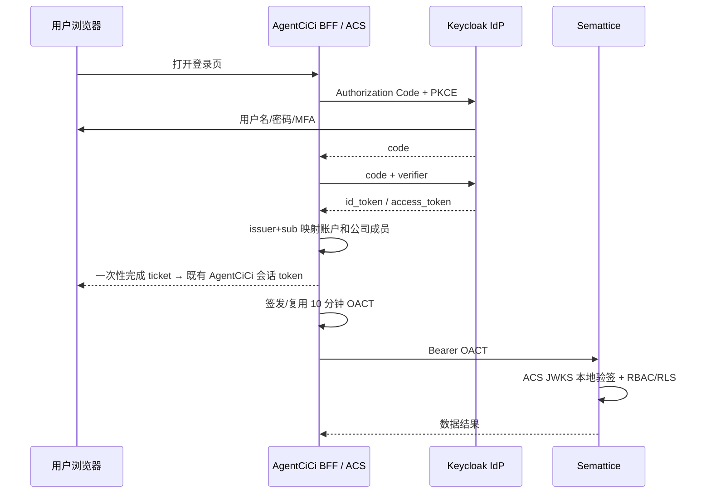

# FEAT-136 - Keycloak 统一身份与官方应用访问令牌

## 背景与目标

- AgentCiCi、CloudCC Semattice 数据平台和后续 FollowUp 都是官方应用，但原先各自持有认证体系。用户要求以已上线的 `https://sso.agentcici.com` Keycloak 为唯一身份提供方（IdP），避免每次跨应用请求向 IdP 换取或校验令牌。
- AgentCiCi 保留自己的全局账户 `user_account` 与公司成员 `company_member` 领域模型；Keycloak 只负责身份认证、会话、MFA 与第三方服务账号。
- AgentCiCi 认证服务（ACS，首期随 AgentCiCi backend 部署）在用户已登录并选定公司后，签发面向官方资源服务的短期 Official Access Context Token（OACT）。Semattice 和未来官方应用只本地 JWKS 验签与本地授权，不回调 Keycloak。

## 范围

### In Scope

- 在 AgentCiCi V95 之后新增前向迁移，存储 Keycloak `(issuer, sub)` 到 AgentCiCi 全局账户的一对一外部身份绑定；同一 issuer/sub 只能绑定一个账户。
- 采用 Authorization Code + PKCE 将 AgentCiCi 登录入口接入 Keycloak；服务端保存短时 state/nonce/PKCE verifier，浏览器不保存 Keycloak refresh token。
- 登录回调根据外部身份绑定恢复全局账户，并在有效公司成员身份下建立现有 AgentCiCi 会话。
- 签发 10 分钟 OACT：`iss=ACS`、`sub=Keycloak subject`、`aud` 为官方资源服务、`company_id`、`member_id`、`account_id`、角色、scope、membership version 与过期时间；以轮换 RSA 签名密钥签发，并公开只含公钥的 JWKS。
- OACT 仅在 AgentCiCi 后端刷新窗口中续签，用户请求及 AgentCiCi→Semattice 调用复用尚未到期的令牌；到期前刷新，刷新失败则要求重新完成 IdP 登录。
- 以当前 `semattice_provisioning_binding.company_id -> semattice_tenant_id` 作为唯一的 AgentCiCi→Semattice 租户映射来源。不得跨库写入 Semattice。
- 对 AgentCiCi、Semattice、Keycloak 的部署、密钥、回滚、验证步骤形成可审计发布记录。

### Out Of Scope

- 不迁移或明文导出生产用户密码。旧密码仅在确认的受控迁移窗口按已验证 PBKDF2 格式导入 Keycloak，或由用户重置密码完成迁移。
- 不把内部 HMAC 受控开户接口扩展为用户认证协议；它仍仅用于既有开户生命周期。
- 不为未知第三方服务创建共享官方客户端。第三方必须使用独立 Keycloak confidential client + service account，按其许可签发的 Keycloak access token 调用 Semattice。
- 不为未来 FollowUp 写入具体业务接入代码；只固定其应遵守的 OACT/JWKS 契约。

## 用户场景

1. 用户打开 AgentCiCi：AgentCiCi 将浏览器重定向到 Keycloak；Keycloak 验证用户名、密码及 MFA 后回调 AgentCiCi。AgentCiCi 绑定全局账户、选择有效公司成员身份并建立本地会话。
2. AgentCiCi 调用 Semattice：后端以已缓存且未到期的 OACT 发起调用。Semattice 使用配置的 ACS JWKS 本地验证签名、issuer、audience、exp、公司/成员和 scope，再执行本地 RBAC/RLS。
3. OACT 临近到期：AgentCiCi 在安全刷新窗口内本地重签；若 Keycloak 会话已失效或成员资格已被撤销，停止签发并要求用户重新认证。
4. 第三方无人工页面服务：通过自己的 Keycloak service-account client 使用 `client_credentials` 获取面向 Semattice 的 token；不获得官方应用的 OACT。

## 现状与约束

- Keycloak 26.7.0 已在 `115.29.222.70` 以 systemd、PostgreSQL、Nginx TLS 部署，`sso.agentcici.com` discovery/JWKS/health 已验证；realm 为 `agentcici`。
- AgentCiCi 线上基线为 tag `2.8.9` / 数据库 V95；当前已存在 V93 Semattice provision binding 和 V94 `company_id` 统一，但 V94/V95 尚有独立维护窗口任务，旧二进制不能连接 V94 后 schema。
- Semattice 已实现 Keycloak/ACS 多 issuer 的 RS256 + JWKS 本地验签初版，尚待与 AgentCiCi OACT JWKS 和生产 migrator 一并发布。
- 令牌、私钥、client secret、数据库密码只存在服务端受限文件或密钥系统，绝不提交仓库、日志或测试报告。

## 方案设计

- Keycloak 的认证结果不能直接替代 AgentCiCi 领域授权。ACS 必须在每次签发/续签 OACT 时读取当前有效 `company_member` 和 `semattice_provisioning_binding`，拒绝停用成员、无绑定公司或无授权 scope。
- OACT 的 `aud` 精确匹配资源服务 ID，如 `semattice-api`；不可使用通配 audience。Semattice 对每个 endpoint 校验最小 scope。
- JWKS 缓存由资源服务控制（建议 5 分钟，未知 `kid` 最多强制刷新一次）。所有验签、过期、not-before、issuer、audience 和授权均本地完成。
- Keycloak access/refresh token 保持在 AgentCiCi 服务端受限 Redis 记录中（refresh token 以现有 AES-GCM 服务端密钥加密）；浏览器只接收一次性完成 ticket 和既有 AgentCiCi 会话 token，绝不接收 Keycloak token。现有 SPA 仍通过其本地会话 token 调用 AgentCiCi；后续可独立演进为全 HttpOnly BFF cookie，不能将该演进与 IdP 切换混为一次破坏性发布。

## 接口与数据影响

| 对象 | 变更 |
| --- | --- |
| AgentCiCi DB | 新增 `account_external_identity`，唯一约束 `(issuer, subject)` 与 `account_id`；只映射全局账户，不直接映射公司成员。 |
| AgentCiCi 登录 API | 新增 OIDC start/callback/一次性 complete；现有密码登录保留到明确迁移完成后再下线。 |
| ACS JWKS | `GET /.well-known/agentcici-oact-jwks.json`，只返回当前/前一签名公钥与 `kid`。 |
| Semattice | 仅接受已配置 issuer/JWKS/audience 的 RS256 令牌；官方 OACT 进入本地 principal/RBAC/RLS，第三方 Keycloak service account 走独立 audience/scope 策略。 |

## 任务拆分

- TASK-243：AgentCiCi 身份绑定、OIDC BFF、OACT 签发、配置、测试和生产发布协调。
- Semattice FEAT-029：完成 ACS JWKS 资源服务接入、principal 投影契约和专用 migrator 后发布。
- 后续任务：按同一 OACT 契约接入 FollowUp，不共享第三方 client credentials。

## 验收标准

- Keycloak 登录成功后，AgentCiCi 能以 `(issuer, sub)` 找到唯一全局账户并只在有效公司成员范围内建立本地会话。
- 身份绑定冲突、未知账户、失效成员、无 Semattice 绑定、错误 issuer/audience/scope 的请求全部 fail closed。
- OACT 由 RSA 私钥签名，Semattice 可在不请求 Keycloak 的条件下通过 JWKS 本地验签；重复请求不产生逐请求 token exchange/JWKS 回调。
- OACT 到期前续签成功，成员被撤销或 IdP 会话失效时不继续授权。
- 迁移、定向单测、AgentCiCi 编译、Semattice Go 测试、镜像构建、备份、生产 smoke 和回滚路径均有真实证据。

## 风险与回滚

- AgentCiCi V94 迁移和本 feature 的 V96+ 迁移都只可正向执行；若应用回滚，不应回滚数据库，应关闭 Keycloak 登录入口并恢复旧登录路径，使用正向修复。
- OACT 私钥泄露时立刻移除对应 `kid`、轮换私钥、缩短 token TTL 并强制重新登录；资源服务保留前一公钥只覆盖短暂重叠窗口。
- IdP 故障不影响尚未到期 OACT 的 Semattice 调用；新登录和刷新受影响，按 session 过期策略安全拒绝。

## 实现进展

- 已完成：Keycloak 基础设施、realm/client 骨架、PBKDF2 兼容性无真实用户验证、Semattice 本地 JWKS 验签初版；AgentCiCi V96 外部身份映射、OIDC Code+PKCE、加密 Redis refresh-token 存储、一次性完成 ticket、OACT/JWKS 与定向单元测试。
- 进行中：先执行 V96 生产前向迁移，再导入/绑定现有 24 个全局账户，最后开启 OIDC 和发布前端入口；OACT 的 Semattice resource server、主体投影和专用 migrator 仍待联合发布。

## 交接说明

- 先阅读本规格、`.claw/tasks/TASK-243.md`、`docs/production-release-runbook.md`、`.claw/devops.md`。
- 发布前必须与 TASK-242 的 V94 维护窗口协调，不能将旧 backend 连接到已迁移 schema。
