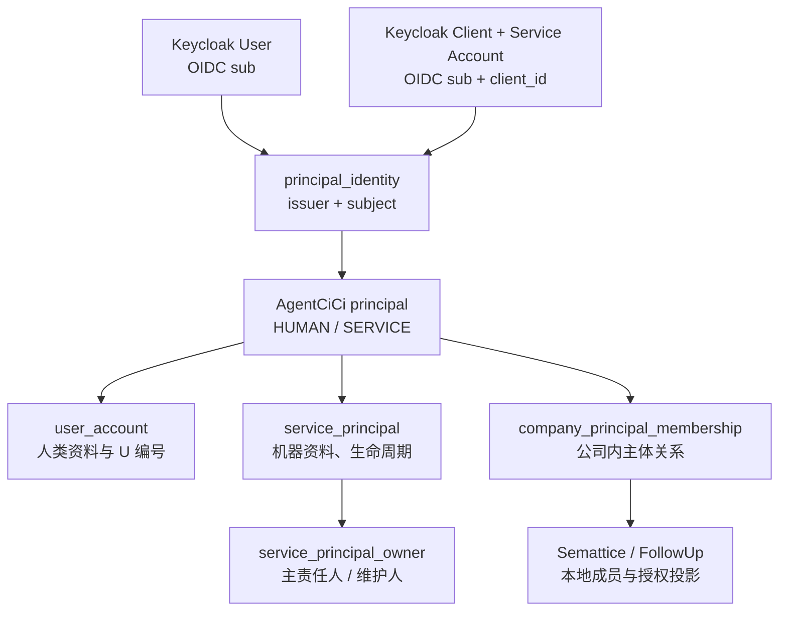
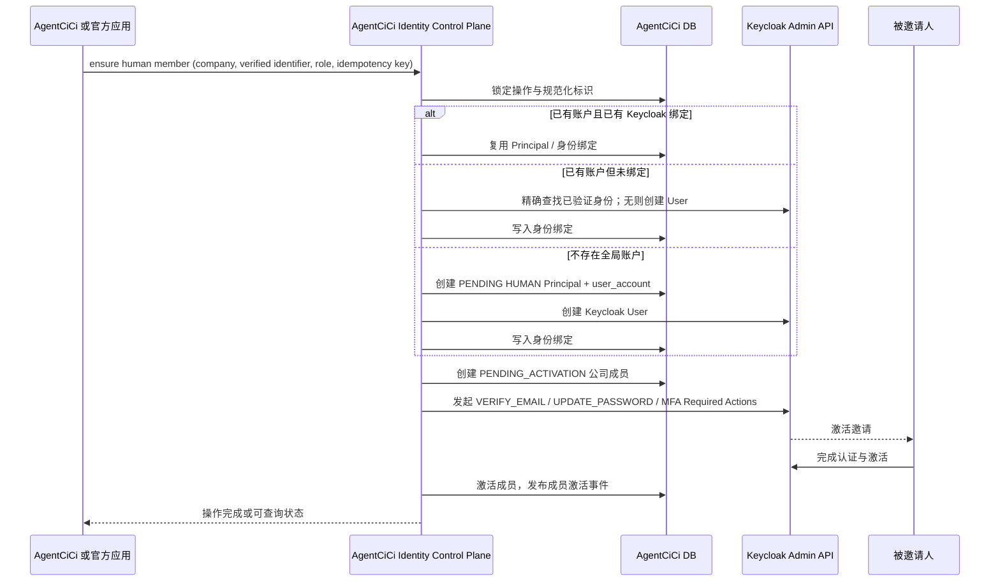

# FEAT-145 - 统一 Principal 身份、机器账户与官方应用治理

## 背景与目标

- 用户已确认：AgentCiCi 全局账户与 Keycloak 人类用户必须一对一绑定；创建公司成员时应确保其全局账户与统一身份存在。
- 用户已确认：Semattice、FollowUp 等官方应用不得各自创造人类身份；它们必须以 AgentCiCi 有效公司成员为前置条件。
- 用户已确认：机器账户可独立以 service account 认证，但必须由有效人类账户与公司成员承担所有权、维护和可撤销责任。

本功能建立统一的 Principal（主体）模型。Principal 表示“被认证、被授权、被审计并承担责任的实体”；人类与机器认证方式不同，但均以 Principal 作为统一引用点。

AgentCiCi 是主体、公司成员、责任人和跨应用开户的治理中心；Keycloak 是密码、MFA、会话和 service-account 凭据中心；Semattice、FollowUp 等官方应用只保存本应用成员与授权投影，不自行创造或合并人类身份。

## 范围

### In Scope

- 统一人类 Principal、机器 Principal、Keycloak 身份绑定和公司成员的目标数据模型。
- 新建公司成员时“确保人类全局账户 + Keycloak 用户 + 身份绑定 + 邀请激活”的受控流程。
- 官方应用以 AgentCiCi 有效公司成员为前置条件的邀请/投影契约。
- 机器 service account 的人类责任人、维护人、最小权限、轮换和移交治理。
- Keycloak realm/client、令牌 claim、内部控制面 API、事件、迁移、审计、安全和验收设计。

### Out Of Scope

- 本任务不实现后端、前端、Flyway 迁移、Keycloak 配置、Semattice/FollowUp 代码或生产发布。
- 不迁移、导出或复制人类密码、MFA Secret、Passkey、refresh token、client secret 或私钥。
- 不把现有公司角色整体搬进 Keycloak，也不让 Keycloak 属性成为公司授权事实源。
- 不允许官方应用直接调用 Keycloak Admin API 创建人类用户或修改全局绑定。
- 不改写既有 `user_account.id`、`company_id` 或 Semattice `tenant_id` 稳定标识。

## 术语与边界

| 术语 | 定义 |
| --- | --- |
| Principal | 统一认证、授权、审计与责任主体；类型为 `HUMAN` 或 `SERVICE`。 |
| 人类 Principal | 真实个人的全局身份；对应一个 AgentCiCi 全局账户和一个 Keycloak User。 |
| 机器 Principal | 程序、自动化任务、第三方服务或官方服务的运行身份；对应 Keycloak Client 的 service account。 |
| 全局账户 | AgentCiCi `user_account`；跨公司可复用的人类业务账户。 |
| 公司成员 | 一个 Principal 在一个 `company_id` 内的成员/可访问关系；不是全局身份。 |
| 应用投影 | Semattice、FollowUp 等应用根据 AgentCiCi 授权事实建立的本地成员/角色记录。 |
| OACT | AgentCiCi 为已登录人类向官方资源服务签发的短期 Official Access Context Token。 |

“数据平台”在本规格中始终仅指 CloudCC Semattice；AgentCiCi 与 FollowUp 是官方应用或集成方。

## 现状与约束

- `user_account.id` 为 UUID v4 全局账户主键；V97 已补齐不可变 `public_id`，格式为 `UYYYYXXXXXXXX`。
- `company_member` 表达账户在公司的成员关系，当前邀请接口按手机号查找/创建 `user_account` 后直接创建 `ACTIVE` 成员。
- V96 `account_external_identity` 已以 `account_id` 唯一及 `(issuer, subject)` 唯一保证一对一 Keycloak OIDC 映射。
- OIDC 回调只查找已有绑定；找不到时 fail closed，不会创建账户或 Keycloak 用户。
- Keycloak 26.7.0 已作为 `https://sso.agentcici.com` 的 `agentcici` realm 运行；AgentCiCi BFF 使用 Authorization Code + PKCE。
- AgentCiCi 已签发 10 分钟 RS256 OACT；Semattice 已通过缓存 JWKS 本地校验签名、issuer、audience、过期与 scope，不逐请求回调 Keycloak。
- 当前成员邀请不会创建 Keycloak User、写入绑定或发送激活邀请；也不存在机器主体、责任人/维护人或统一公司主体授权模型。

## 设计原则

1. **身份与成员分离**：一个人一个全局 Principal，可加入多个公司；公司成员不是新用户。
2. **认证与授权分离**：Keycloak 认证“是谁”，AgentCiCi/应用授权“可做什么”。
3. **先证实，再绑定**：手机号/邮箱仅可作为已验证、唯一、可追溯的匹配标识；歧义时停止自动化。
4. **机器独立认证、人类治理兜底**：机器 token 不冒充人类，但每个有效机器主体均有有效人类责任人。
5. **最小权限与本地验签**：人类 OACT 和机器 access token 使用精确 audience/scope；资源服务本地验签和本地授权。
6. **AgentCiCi 为跨应用人类事实源**：官方应用只能请求 AgentCiCi 确保成员，不得直接创建 Keycloak 人类账户。
7. **前向迁移与审计优先**：跨数据库/API 副作用必须可恢复、可重试、可幂等，且不删除历史审计。

## 目标架构



| 域 | 事实源 | 负责内容 | 明确不负责 |
| --- | --- | --- | --- |
| Keycloak | Keycloak realm | 密码、MFA、SSO、Client Secret、标准令牌 | 公司成员、公司角色、应用业务授权 |
| AgentCiCi Identity Control Plane | AgentCiCi | Principal、身份绑定、公司成员、邀请、机器责任人、跨应用开户与审计 | 存储密码或 client secret |
| Semattice / FollowUp | 各应用本地库 | 应用成员投影、应用角色、对象/数据授权、RLS | 创建/合并人类账户、修改 Keycloak 用户 |

## 目标数据模型

### 1. 统一根表 `principal`

```text
principal
- id                         VARCHAR(64) PK，内部 UUID；不可变
- principal_type             HUMAN | SERVICE
- lifecycle_status           PENDING | ACTIVE | SUSPENDED | REVOKED
- display_name
- created_at / updated_at
- suspended_at / revoked_at
- created_by_principal_id    nullable FK principal.id
```

- 人类 Principal 与既有 `user_account` 使用相同 ID（共享主键），实现无重键迁移。
- `principal` 不复制公共编号：人类编号仍由 `user_account.public_id` 维护；机器编号由 `service_principal.public_id` 维护，建议格式 `SYYYYXXXXXXXX`。
- 新的跨类型外键（审计 actor、受控开户操作、责任人、统一授权）一律引用 `principal.id`。

### 2. 人类扩展与登录标识

既有 `user_account` 成为 `principal_type=HUMAN` 的扩展表，保留当前 UUID、`public_id`、姓名、邮箱、手机号、主题等字段。

```text
principal_login_identifier
- id
- principal_id               FK principal.id，且必须是 HUMAN
- identifier_type            MOBILE | EMAIL | USERNAME
- normalized_value
- verified_at                nullable；未验证不得用于自动绑定
- status                     ACTIVE | RETIRED
- is_primary
- created_at / updated_at

unique(identifier_type, normalized_value) where status = ACTIVE
```

- 现有 `account_login_identifier` 在迁移期保留兼容读写，最终演进为此表；不得长期维护两个并列事实源。
- Keycloak User 的 `username` 推荐设置为人类 `public_id`；用户可用已验证邮箱登录。若要求手机号登录，使用 Keycloak 自定义认证器或 User Storage Adapter 查询已验证标识，不能用手机号替代 `sub`。

### 3. 通用身份绑定 `principal_identity`

```text
principal_identity
- id
- principal_id               FK principal.id
- provider                   KEYCLOAK
- identity_type              HUMAN_USER | SERVICE_ACCOUNT
- issuer
- subject                    OIDC sub
- keycloak_client_id         SERVICE_ACCOUNT 必填，HUMAN_USER 为空
- binding_status             PENDING | ACTIVE | REVOKED
- created_at / updated_at / last_verified_at

unique(issuer, subject)
unique(principal_id, provider) where binding_status = ACTIVE
unique(keycloak_client_id) where keycloak_client_id is not null
```

V96 `account_external_identity` 是人类绑定的现有来源。实施时应以正向迁移无损迁入 `principal_identity`，并在兼容期通过同一服务层双读/双写；迁移完成后只能保留一个身份绑定事实源。

### 4. 机器扩展 `service_principal`

```text
service_principal
- principal_id               PK/FK principal.id，类型必须 SERVICE
- public_id                  SYYYYXXXXXXXX，唯一且不可变
- service_kind               OFFICIAL_APP | THIRD_PARTY | AUTOMATION | SYSTEM
- client_id                  Keycloak client_id，唯一
- credential_mode            CLIENT_SECRET | PRIVATE_KEY_JWT | MTLS
- token_audience             精确资源服务 audience
- credential_expires_at
- last_rotated_at
- created_at / updated_at
```

机器凭据仅在 Keycloak 与受限密钥系统保存；本表只能保存类型、轮换时间、失效时间和不可逆引用，绝不保存 secret、私钥、证书正文或 bearer token。

### 5. 机器的人类责任链

```text
service_principal_owner
- service_principal_id       FK service_principal.principal_id
- owner_principal_id         FK principal.id，必须 HUMAN
- company_member_id          当前有效的人类公司成员
- owner_role                 PRIMARY | MAINTAINER
- status                     ACTIVE | TRANSFER_REQUIRED | REVOKED
- assigned_at / revoked_at

unique(service_principal_id, owner_principal_id, company_member_id)
one ACTIVE PRIMARY per service principal
```

- 每个 `ACTIVE` 机器 Principal 必须有一个有效 `PRIMARY`，且该成员必须属于相同 `company_id`。
- 高权限或生产机器主体应至少另有一名 `MAINTAINER`。
- 主责任人被停用、离开公司或不再具备对应治理权限时，机器主体进入 `TRANSFER_REQUIRED`；在配置宽限期内未移交则自动 `SUSPENDED`。
- `SYSTEM` 类主体也不豁免责任链；所有者属于平台运营公司/平台管理人，不得使用匿名“系统”责任人。

### 6. 公司内主体关系与授权

最终目标：

```text
company_principal_membership
- id
- company_id
- principal_id
- membership_type            HUMAN_MEMBER | SERVICE_MEMBER
- membership_status          PENDING_IDENTITY | PENDING_ACTIVATION | ACTIVE | SUSPENDED | REVOKED
- source_application         AGENTCICI | SEMLATTICE | FOLLOWUP
- invited_by_principal_id
- activated_at / revoked_at

unique(company_id, principal_id)

principal_grant
- company_id
- principal_id
- audience
- resource_type / resource_ref
- scope
- effect                     ALLOW | DENY
- effective_from / effective_to
- granted_by_principal_id
```

人类业务档案和角色保留为扩展表：`company_human_member_profile` 保存昵称/头像等，`company_member_role` 保存 `OWNER`、`ORG_ADMIN`、`ORG_USER`。机器不获得上述人类角色，只通过 `principal_grant` 获得精确资源和 Scope。

为控制首期风险，第一阶段可保留既有 `company_member` 作为人类兼容表，并新增 `company_service_principal_binding`；待人类邀请稳定后再收敛到通用成员表。不得在一个发布内同时重构全部成员 API。

### 7. 跨系统操作与审计

```text
principal_provisioning_operation
- id / idempotency_key
- requested_by_principal_id
- target_company_id
- request_type               ENSURE_HUMAN_MEMBER | ENSURE_SERVICE_PRINCIPAL | TRANSFER_SERVICE_OWNER
- state                      RECEIVED | RESOLVING | KEYCLOAK_PENDING | IDENTITY_BOUND | INVITATION_SENT | ACTIVATED | COMPENSATING | FAILED | CANCELLED
- result_principal_id / result_membership_id
- failure_code               稳定、脱敏原因码
- created_at / completed_at
```

所有跨系统动作通过 outbox 发布事件，并审计 `actor_principal_id`（谁请求）、`effective_principal_id`（实际执行者）、`owner_principal_id`（机器责任人，如适用）、`company_id`、操作 ID、请求 ID 和不可逆结果摘要。

## 人类账户与邀请流程



规则：

1. 请求必须包含调用方、目标 `company_id`、邀请角色、至少一个规范化标识、幂等键和明确用途。
2. 仅一个 `ACTIVE + verified` 的 `principal_login_identifier` 才允许自动命中人类 Principal。
3. 命中账户且已有有效 Keycloak 绑定时，绝不创建第二个 Keycloak User；无绑定时，只有 Keycloak 侧存在唯一且可证明同一已验证标识时才绑定，否则返回 `IDENTITY_CONFLICT`。
4. 未命中时先创建本地 `PENDING` 人类 Principal 与 `user_account`，再创建 Keycloak User；Keycloak 成功后写入绑定并继续邀请。失败时保留可恢复操作记录，不能留下 `ACTIVE` 成员。
5. Keycloak 用户通过 Required Actions 完成验证/设置凭据；服务端不传递或生成长期明文初始密码。
6. 只有身份激活成功后，成员关系才变为 `ACTIVE`；激活前不得签发可访问业务资源的 OACT。
7. 相同幂等键返回同一操作结果；不同幂等键不得创建重复成员或重复 Keycloak User。

### 撤销规则

- 撤销单个公司成员：停止该公司的 OACT/应用访问，不删除全局 Principal，也不影响其在其他公司的成员资格。
- 全局人类 Principal `SUSPENDED/REVOKED`：禁用 Keycloak User、撤销活动会话/refresh token，并停止该 Principal 的所有新 OACT。
- Keycloak User 被平台禁用或删除时，绑定状态改为 `REVOKED`；恢复必须走受控重新绑定，不得按邮箱自动补绑。

## 机器账户流程

```text
有效人类公司管理员请求创建
→ 校验 company_member、角色、风险级别与审批
→ 创建 PENDING SERVICE Principal
→ 写入 PRIMARY（高权限同时写入 MAINTAINER）责任人
→ AgentCiCi Provisioner 创建 Keycloak confidential client + service account
→ 绑定 Keycloak issuer + service-account sub + client_id
→ 在密钥系统保存/轮换凭据
→ 写入精确 company_id + audience + scope 授权
→ ACTIVE，并发布脱敏审计事件
```

机器调用 Semattice 时采用“一次交换、短期复用”：

1. 机器用其 Keycloak client_credentials 向 Keycloak 获取服务 access token；其 sub 是 service-account 用户，azp 是具体 client_id。
2. 机器以该 token 调用 AgentCiCi POST /openapi/v1/official/service-token。该端点只在交换时通过 Keycloak JWKS 验证签名、iss、exp、sub、azp，并从本地 Principal、PRIMARY owner、公司成员、Semattice 开通绑定和持久化 scope 解析有效上下文。
3. AgentCiCi 签发受众固定为 semattice-api、最长 10 分钟的 OACT，其中 sub/principal_id 为 SERVICE Principal，附带 principal_type=SERVICE、owner_principal_id、client_id、tenant_id、company_id 与精确 scope。
4. Semattice API、MCP 与 CLI 仅本地校验 OACT 的固定 issuer/audience/JWKS、过期时间、Principal 类型、owner 证据和自身授权；不得接受原始 Keycloak service token，也不得逐请求回调 Keycloak 或 AgentCiCi。

交换端点在 routing 层是公开路径，但不是匿名接口：专用前置过滤器仅将该路径的 Authorization Bearer 令牌从 AgentCiCi 公司 JWT 过滤器隔离，控制器仍强制调用 Keycloak 验证和本地状态校验。任何缺失、伪造、过期、错误 azp、失效 owner/成员/公司、未开通 tenant、空 scope 或 feature flag 未开启的请求均 fail closed。

人类责任人用于治理和审计，不把其 member_id 或权限隐式授予机器。

轮换、移交与撤销：

- Client Secret、私钥或 mTLS 证书只通过受控轮换动作产生；审计仅记录 secret 版本/指纹和时间，不能记录秘密正文。
- `PRIMARY` 责任人变更由现责任人或同公司高权限管理员发起，并可按风险要求双人审批。
- `TRANSFER_REQUIRED` 状态只允许轮换、移交、撤销等治理操作；业务请求按风险策略立即拒绝或在短期宽限后拒绝。
- 机器主体撤销时禁用 Keycloak Client、吊销凭据版本、撤销授权投影并发布 `service-principal.revoked`；不物理删除审计记录。

## 官方应用控制面契约

### 调用身份

Semattice、FollowUp 等官方应用调用 AgentCiCi Identity Control Plane 时，必须使用各自的 Keycloak confidential client：

- audience 固定为 `agentcici-identity-control`。
- 仅授予精确 scope，如 `identity.company-member.ensure`、`identity.membership.read`；不授予 Keycloak `realm-management` 权限。
- AgentCiCi 按 `client_id` allow-list、scope、调用方应用 ID、公司边界和幂等键审计请求；可叠加 mTLS 作为服务间传输保障。
- Keycloak Admin API 仅由 AgentCiCi 专用 `agentcici-identity-provisioner` 使用，其凭据存于受限密钥系统，不能下发给官方应用。

### 建议接口

```text
POST /internal/identity/company-members:ensure
POST /internal/identity/service-principals
POST /internal/identity/service-principals/{id}:transfer-owner
GET  /internal/identity/provisioning-operations/{id}
GET  /internal/identity/company-members/{companyId}/{principalId}
```

`company-members:ensure` 请求：

```json
{
  "companyId": "org2sva14i4udjmi2t4s",
  "identifier": { "type": "MOBILE", "value": "<verified input>" },
  "requestedRole": "ORG_USER",
  "sourceApplication": "semattice",
  "idempotencyKey": "caller-generated-opaque-key"
}
```

响应仅返回脱敏且最小的操作 ID、状态、`principalId`、人类 `publicId`、`companyMemberId` 与激活状态；不得返回 Keycloak token、密码、refresh token、secret 或其他公司的成员信息。

### 事件

AgentCiCi outbox 至少发布：

```text
principal.identity.bound
company-membership.pending-activation
company-membership.activated
company-membership.suspended
company-membership.revoked
service-principal.activated
service-principal.transfer-required
service-principal.revoked
```

事件带稳定事件 ID、操作 ID、公司 ID、Principal ID、版本和最小状态；不携带手机号、邮箱、密码、token 或 secret。官方应用消费后只更新自身投影，并按事件 ID 幂等。

## Token 与授权模型

### 人类请求

```text
Keycloak User 登录
→ AgentCiCi BFF 按 issuer + sub 找到 HUMAN Principal
→ 检查当前 ACTIVE 公司成员
→ 签发 10 分钟 OACT
→ Semattice / FollowUp 本地 JWKS 验签 + 本地授权
```

人类 OACT 至少包含相同值的 `sub` / `principal_id`（AgentCiCi HUMAN Principal，即 `user_account.id`）、兼容期 `account_id`、`company_id`、`company_member_id`、精确 `aud`、scope、成员版本、`iat`、`nbf`、`exp`、`jti`。Keycloak `sub` 只保存在 AgentCiCi 的 `principal_identity` / `account_external_identity` 绑定中，不能作为资源侧授权主体。`email`、`mobile`、`public_id` 不是授权 claim。

### 机器请求

```text
Keycloak client_credentials
→ Keycloak access token（service-account sub + azp/client_id）
→ 资源服务本地 JWKS 验签
→ service-principal 受控投影校验
→ 公司、生命周期、责任人和最小授权校验
```

机器访问不使用人类 OACT；人类 OACT 也不得转换成长期机器凭据。第三方机器客户端使用自己的独立 Keycloak Client，不获得官方应用 Client 或 OACT。

## Keycloak 配置设计

### 人类用户

- realm 为 `agentcici`；内部 `id`/OIDC `sub` 由 Keycloak 生成且不可修改。
- `username` 使用 AgentCiCi 人类 `public_id`；`email` 是已验证的可变镜像。
- 首次邀请采用 `VERIFY_EMAIL`、`UPDATE_PASSWORD` 和按策略要求的 MFA Required Actions。
- Realm/Client Role 只承载认证级别或客户端访问能力，不编码公司成员角色、Semattice 数据角色或资源 ACL。

### 服务客户端

- 一个 `SERVICE` Principal 对应一个 Keycloak confidential client，必须启用 service account。
- `client_id` 不可变；使用精确 audience、最小 client scope 和短有效 access token。
- 优先 `private_key_jwt` 或 mTLS；Client Secret 必须可轮换、有到期策略并存于密钥系统。
- `agentcici-identity-provisioner` 与业务服务 client 分离；前者具备最小 Keycloak Admin 权限，后者绝无 `realm-management` 权限。

## 实现进展

- 已完成：目标 Principal 分层、数据模型、Keycloak 边界、人类开户、机器责任治理、跨应用控制面、分期迁移与验收设计。
- 已完成：V98/V99 Principal 迁移与历史回填、受控人类开户实现、Keycloak 最小 provisioner client、机器主体/责任人/scope 模型、机器 Keycloak token 至 OACT 交换端点、Semattice HUMAN/SERVICE OACT 本地投影与生产兼容发布。
- 受控开关：人类 `provisioning`（邮件邀请）与机器 `machine-provisioning`（Keycloak confidential client）相互独立；二者均默认关闭并共用最小权限 provisioner 凭据。生产保持人类 provisioning 与 service-token-exchange 关闭，直至 SMTP、OACT 签名配置、Semattice JWKS 信任与受权 E2E 真实凭据均完成；关闭时所有新交换 fail closed。
- 部署边界：Compose 必须显式传递 `APP_AUTH_OIDC_MACHINE_PROVISIONING_ENABLED` 与 `APP_AUTH_OIDC_SERVICE_TOKEN_EXCHANGE_ENABLED`；缺失环境变量时按 `false` 传入，不能因 Spring 默认值或宿主环境差异意外放开机器开户或交换端点。

## 迁移与分期实施

### Phase 0：预检与基线

- 盘点 `user_account`、`company_member`、`account_external_identity`、手机号/邮箱标识与 Keycloak User 的数量、状态、唯一性冲突和未绑定账户；只产出脱敏统计。
- 为每个既有全局账户确定迁移策略：已绑定、可安全邀请、需要人工处理、不可自动处理。
- 不按未验证手机号/邮箱批量绑定既有 Keycloak User；任何歧义进入人工队列。

### Phase 1：Principal 基座与兼容读写

- 新增 `principal`，以既有 `user_account.id` 同值回填所有 `HUMAN` Principal。
- 将 V96 人类绑定无损迁入 `principal_identity`，保持 `(issuer, subject)` 唯一和“一 Principal 一 Keycloak 绑定”。
- 将成员创建逻辑抽象为 Identity Control Plane，但先保持既有 `/admin/users/invitations` 响应兼容。
- 增加 `PENDING_IDENTITY`、`PENDING_ACTIVATION` 状态；新邀请在未完成 Keycloak 激活时不得直接成为 `ACTIVE`。

### Phase 2：Keycloak 受控开户与人类邀请

- 已实现独立的 AgentCiCi Keycloak provisioner 配置入口（默认关闭）；生产启用时使用独立 confidential client，不复用 BFF client。
- 已实现精确查找/创建 Keycloak User、`issuer + sub` 绑定、`VERIFY_EMAIL` / `UPDATE_PASSWORD` Required Actions 与首次成功 OIDC 登录激活成员；创建失败时本地事务回滚，重试时以 `public_id` 精确查找，避免重复 User。
- 新公司成员入口已接受邮箱。未启用 provisioner 保持兼容；启用后邮箱必填且成员处于 `PENDING_ACTIVATION`，完成激活前不可获得应用会话。
- 既有未绑定成员只通过受控邀请或人工确认补齐，不强制重置密码或静默创建重复用户。

### Phase 3：官方应用成员投影

- Semattice 已发布 OACT principal_id / principal_type 本地投影：HUMAN 兼容旧 OACT，SERVICE 强制 owner/client 证据；不接受原始 Keycloak 服务令牌。
- FollowUp 尚未接入；接入时先调用 AgentCiCi company-members:ensure，再创建自身 PENDING/ACTIVE 投影，并消费成员暂停/撤销事件。
- 应用不得反向写人类主体。

### Phase 4：机器 Principal 与责任治理

- 已新增 `service_principal`、责任人/维护人数据模型与组织管理员创建 API。每个创建请求强制将当前有效公司成员登记为 `PRIMARY` owner，且 Client Secret 仅在创建响应中返回一次，不落库。
- 已新增 service_principal_scope 和受控 Keycloak client-credentials 至 OACT 交换：交换只读取有效 SERVICE Principal、同公司 PRIMARY owner、已开通 Semattice binding 和已授予 scope；OACT 最长 10 分钟，资源请求不再换取 token。
- 新发机器客户端全部纳入人类责任链；已有第三方 Client 分批登记 owner，逾期未登记的客户端进入受控暂停。
- Semattice 已接入 service Principal OACT 投影校验与审计关联；FollowUp 待其独立任务接入。

### Phase 5：成员模型收敛

- 在新流程稳定且历史兼容 API 已迁移后，将 `company_member` 演进为 `company_principal_membership` 的人类扩展或兼容视图。
- 逐步停止旧表/旧服务的独立写入，完成一次性校验后移除双写；不在双写期删除身份数据。

## 风险、失败处理与回滚

| 风险 | 控制措施 |
| --- | --- |
| Keycloak 创建成功、本地写入失败 | 记录操作与 Keycloak 外部 ID；重试时精确查找并补写绑定，不重复创建。 |
| 本地账户创建成功、Keycloak 失败 | Principal/成员保持 PENDING 或 FAILED，不签发 OACT；可重试或由运营取消。 |
| 手机号/邮箱错绑 | 只允许 verified 且唯一的精确匹配；冲突 fail closed，人工审核。 |
| 人类离职后机器继续运行 | owner 状态联动、移交窗口、自动暂停和审计告警。 |
| 应用投影滞后 | 事件幂等、版本号、按 Principal/公司查询回补；高风险请求可同步确认状态。 |
| Keycloak 暂时不可用 | 已签发且未到期 OACT 仍可被资源服务本地验证；新登录、邀请和凭据轮换安全失败。 |
| 前向迁移问题 | 仅正向修复；保留兼容读路径和 feature flag，不回滚数据库迁移。 |

## 验收标准

### 数据与约束

- 每个有效 HUMAN Principal 恰有一个有效 `issuer + sub` Keycloak 人类身份；同一 `(issuer, sub)` 不能绑定多个 Principal。
- 每个有效 SERVICE Principal 恰有一个有效 Keycloak `client_id` 与 service-account identity。
- `ACTIVE` 机器 Principal 存在至少一个同公司、有效的人类 `PRIMARY` owner。
- 同一 Principal 在同一公司最多有一条有效成员关系；同一人可在多个公司有不同角色。
- 人类 `U...`、机器 `S...` 公共编号全局唯一且不可变；内部授权始终使用 UUID。

### 流程与安全

- 新人邀请不会产生重复 AgentCiCi 账户、重复 Keycloak User、重复成员或重复邀请；幂等重试返回同一操作结果。
- 未激活、绑定冲突、失效成员、无责任人的机器主体、错误 issuer/audience/scope 均 fail closed。
- Keycloak 人类密码、MFA、refresh token、私钥和 bearer token 不出现在 AgentCiCi 数据库、日志、事件或 API 响应中；Client Secret 仅能在受控机器账户创建响应中经 TLS 返回一次，随后必须进入受管密钥库，绝不持久化、记录或再次展示。
- 官方应用不能直接创建 Keycloak 人类用户；只能经受控 AgentCiCi API 创建/确保成员。
- Semattice 与 FollowUp 对人类、机器 token 都完成本地 JWT/JWKS 和本地授权校验，不逐请求调用 Keycloak。

### 测试与运行验证

- 迁移：全新 PostgreSQL 和含 V96/V97 历史数据的升级库均通过 Principal 回填、唯一约束、状态迁移和兼容测试。
- 后端：人类开户 Saga、重复请求、Keycloak 失败补偿、身份冲突、邀请激活、成员暂停、owner 移交、机器轮换/撤销的定向与集成测试。
- Keycloak：管理客户端最小权限、Required Actions、用户/Client 重复创建保护、JWKS 轮换和 client credential audience/scope 测试。
- 跨应用：AgentCiCi→Semattice/FollowUp 内部 API 授权、outbox 事件幂等、投影回补、人类 OACT 与机器 token 的负向矩阵测试。
- 生产：按 `docs/production-release-runbook.md` 分阶段灰度、备份、脱敏统计、健康检查、受权会话验收和可验证暂停路径执行；未获得单独授权不得执行。

## 推荐任务拆分

| 后续任务 | 责任角色 | 依赖 | 交付 |
| --- | --- | --- | --- |
| Principal 基座与历史盘点 | backend-agent | FEAT-145 批准 | 迁移、回填、兼容读写、统计与测试 |
| Keycloak Provisioner 与邀请 Saga | integration-agent | Principal 基座 | 最小 Admin Client、开户状态机、激活与补偿 |
| 公司成员 API 演进 | fullstack-agent | 邀请 Saga | PENDING 状态、运营端可见状态、兼容接口 |
| 官方应用成员控制面契约 | integration-agent | 公司成员 API | 受控 API、outbox、Semattice/FollowUp 契约测试 |
| 机器 Principal 与责任治理 | backend-agent | Principal 基座 | Service Client、owner、轮换、移交与审计 |
| Semattice/FollowUp 投影接入 | integration-agent | 控制面契约 | 本地成员/服务投影与撤销联动 |
| 安全与发布验收 | qa-agent / release-agent | 各实现任务 | 迁移、负向、JWKS、灰度与受权验收 |

## 交接说明

- 先阅读本规格、`FEAT-136-keycloak-unified-identity-and-official-access.md`、`FEAT-144-global-user-public-id.md`、当前 `user_account`/`company_member`/`account_external_identity` 代码与 Keycloak 生产发布 runbook。
- 首期优先实现 Principal 基座与受控人类邀请，不要把泛化成员表重构、机器账户和跨应用投影塞进一个发布。
- 在任何 Keycloak Admin API 或生产数据库动作前，必须获得单独授权，并提供密钥最小权限、幂等、补偿、审计和灰度方案。
