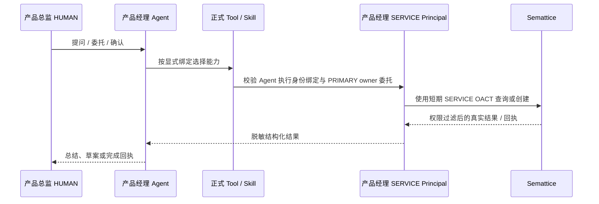

# FEAT-155 - DEV Autopilot 产品经理显式能力与 SERVICE 执行身份

## 背景与问题

生产中的“研发交付产品经理”能够查询和创建 Semattice 研发交付记录，但当前实现仍有两项临时耦合：

1. `SkillResolverService` 根据固定智能体 ID 隐式追加查询/创建工具和系统提示，导致 Agent Builder 显示为 0 个 Tool、0 个 Skill，运行 Trace 却出现工具调用。
2. Semattice 工具以当前登录成员的 HUMAN OACT 执行，数据审计中的实际操作主体不是已创建并受治理的产品经理 SERVICE Principal。

这与既定身份模型不一致，也无法向管理员清晰说明智能体拥有哪些能力、由谁执行以及人类在链路中承担什么责任。

## 产品意图

- 研发交付产品经理显式绑定正式平台 Tool 和正式平台 Skill，管理面配置与运行时事实一致。
- Semattice 读写由产品经理 SERVICE Principal 执行；人类登录用户只作为委托人，并在创建等高影响动作中提供确认或审批上下文。
- 不允许模型、浏览器或工具参数选择 tenant、SERVICE Principal、owner、token 或 scope。
- 保留“自然语言由模型理解、精确确认由服务端门禁、Semattice 回执才代表成功”的现有写入安全边界。

## 目标架构



## 能力模型

### 正式 Tool

- `semattice_project_delivery_query`：平台内置只读 Tool，读取项目、需求、任务、工时和变更。
- `semattice_project_delivery_create`：平台内置受控写 Tool，仅由服务端在精确确认后调用，不进入模型自由 function-calling 列表。
- 两项 Tool 都必须持久化到目标 Agent 的 `agent_tool_binding`，不能依靠固定 Agent ID 注入。

### 正式 Skill

- 新增平台标准 Skill `semattice-project-delivery-management`，中文名“Semattice 研发交付管理”。
- Skill 声明上述两个 Tool、事实查询先检索、创建先草案后确认、失败不伪造成功等提示与输出契约。
- Skill 以 `always-on` 方式显式绑定 `dev-autopilot-pm`，并在 Agent Builder / Skill API 中可见。
- 删除运行时中按 `dev-autopilot-pm` 固定 ID 追加 Tool 和 Prompt 的临时逻辑。确定性查询和确认式写入路由只依赖当前解析出的有效 Tool 授权。

## 执行身份与委托模型

新增 `agent_service_principal_binding`，将公司内 Agent 显式绑定到一个受治理 SERVICE Principal：

```text
agent_service_principal_binding
- company_id
- agent_id
- service_principal_id
- delegation_policy          PRIMARY_OWNER
- enabled
- configured_by_principal_id
- created_at / updated_at
```

首期委托策略为 `PRIMARY_OWNER`：

- 当前登录成员必须 ACTIVE，且其全局 HUMAN Principal 必须是该 SERVICE Principal 的 ACTIVE PRIMARY owner。
- Agent、公司、SERVICE Principal、Keycloak identity mirror、Semattice provisioning binding 均必须有效。
- OACT 的 `sub/principal_id/principal_type` 为产品经理 SERVICE；保留 `owner_principal_id`，并增加 `delegated_by_principal_id` 和 `delegation_policy` 作为委托上下文。
- scope 只从 `service_principal_scope` 读取，并继续受官方应用配置白名单约束。
- 查询无需二次确认；项目/需求/任务创建仍需用户精确确认。人类确认只授权本次动作，不改变实际数据 actor。
- 任一绑定、责任人、租户投影或 scope 校验失败均 fail closed，禁止回退到 HUMAN OACT。

## 管理接口

- `GET /agents/{agentId}/execution-principal`：返回当前执行主体绑定的非敏感摘要。
- `PUT /agents/{agentId}/execution-principal`：具有 Agent EDIT 权限的管理员配置或启停绑定。
- 接口不接收也不返回 client secret、Keycloak token 或 Semattice OACT。
- Agent 详情现有 Tool/Skill 接口继续作为显式能力事实源。

## 迁移与生产配置

- V101 创建执行主体绑定表，并将现有 `dev-autopilot-pm` 的两个平台内置 Tool 迁移为持久化直接绑定。
- 平台标准 Skill 通过既有内置 Skill 同步机制创建并持久化默认绑定。
- 目标租户将 `dev-autopilot-pm` 绑定到既有产品经理 SERVICE Principal `742daca1-ce58-49cc-9e53-530444ba1c47`；不创建或暴露新凭据。

## 验收标准

1. Agent Builder/API 显示产品经理 Agent 已绑定 2 个正式 Tool 和 `semattice-project-delivery-management` Skill。
2. 运行时不再包含按 Agent ID 隐式注入 Tool/Prompt 的代码；未显式绑定的 Agent 不获得这些能力。
3. 产品总监询问项目事实时，先调用正式查询 Tool 并依据线上 Semattice 数据回答。
4. 精确确认创建项目/需求/任务时，由产品经理 SERVICE OACT 调用 Semattice；人类只作为 delegated-by/owner/confirmation 上下文。
5. 删除或禁用执行主体绑定、owner 失效、SERVICE 暂停或 scope 不足时请求失败关闭，且不会回退成人类身份。
6. AgentCiCi Trace 和 Semattice 审计可证明有效 actor 为 SERVICE，owner/delegator 为产品总监 HUMAN；响应与日志不泄露 token/secret。
7. 定向单元测试、迁移回归、后端构建、生产发布及线上真实查询/确认写入验证通过。

## 风险与回滚

- V101 为前向兼容新增表并补充绑定，不删除历史数据；旧镜像可忽略新表，但回滚后不得继续声称已实现 SERVICE 执行。
- 发布前保留 PostgreSQL 与部署配置备份。应用回滚时停止新对话验证；已由 SERVICE 创建的业务记录保留真实审计，不做自动删除。
- 写 Tool 继续不暴露给模型自由选择，避免正式注册被误解为取消确认门禁。
