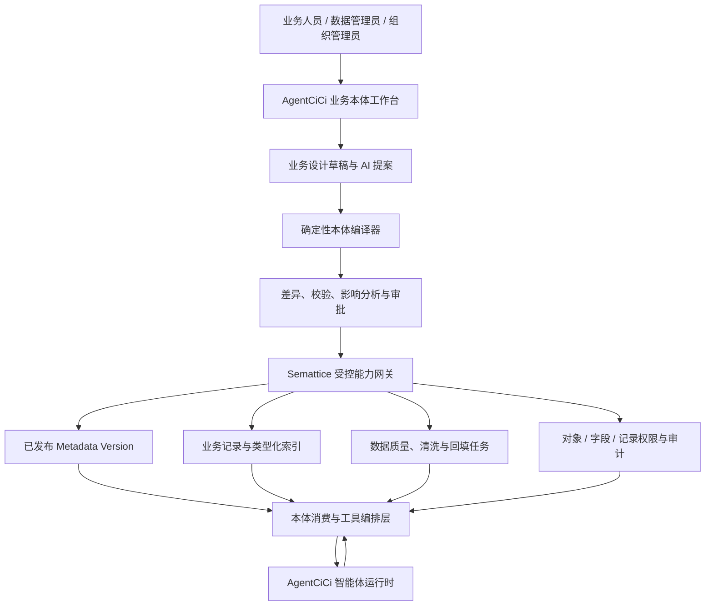
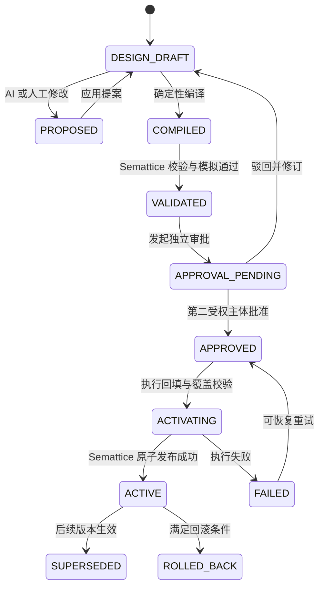
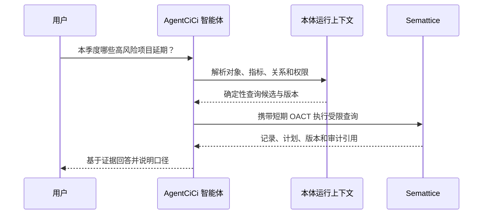

# FEAT-160 - AgentCiCi 与 Semattice 业务本体四阶段建设方案

## 1. 文档目的

本文定义 AgentCiCi 业务本体能力与 Semattice 数据智能能力的统一产品定位、目标架构、完整功能范围和四阶段实施路线。它解决三个核心问题：

1. AgentCiCi 已有本体 V1，Semattice 也已有版本化业务对象元数据，两者如何协同而不是重复建设。
2. 本体建模、数据映射、数据清洗、语义查询和智能体执行如何形成完整闭环。
3. 第一至第四阶段分别交付什么、依赖什么、如何验收，以及哪些能力不能提前越界。

本文是后续实现 AgentCiCi 本体 V2 和 Semattice 适配的主规格。FEAT-118 继续作为已上线的 AgentCiCi 本体 V1 事实记录；本文不回改其历史结论。

## 实施状态（2026-08-05）

第一阶段的 AgentCiCi 侧骨架已实现但尚未发布：`semattice` 只读数据源适配器以受控 capability 网关读取当前已发布 metadata 与记录；确定性编译器为对象、字段和关系生成稳定 API 名、语义注解与内容摘要；V105 保存绑定、元素映射和生命周期操作。组织管理员 API 支持绑定、漂移检查、导入提案、编译、独立审批申请和激活请求；前端“运行治理”标签已接入本体工作台。已绑定 Semattice 的工作区不再开放原有的直接版本发布按钮，必须从本标签完成编译、独立审批和激活。所有跨系统调用仍在服务端使用短期 OACT，浏览器不接触令牌、租户标识或 capability 输入。生产迁移、真实租户数据读取及元数据发布尚未执行，必须在独立发布窗口完成。

## 2. 产品结论

### 2.1 一句话定位

**AgentCiCi 是面向业务人员和智能体的业务语义设计、治理与消费入口；Semattice 是已发布业务模型、业务数据、权限、索引和数据处理任务的可信执行底座。**

### 2.2 两个平台的职责

| 能力域 | AgentCiCi | Semattice |
|---|---|---|
| 业务建模体验 | 负责业务术语、对象、属性、关系、指标、动作的可视化设计 | 不复制业务设计器，接收确定性的可执行元数据 |
| AI 建模 | 负责自然语言理解、模型建议、映射建议、质量规则建议和影响解释 | 不直接接受大模型自由输出，只执行校验后的确定性定义 |
| 草稿与提案 | 业务设计草稿、AI 提案和人工修改的事实源 | 保存准备执行的候选 metadata version |
| 已发布执行模型 | 保存设计版本、发布映射和展示投影 | 当前生效 metadata version 的运行事实源 |
| 业务数据 | 不复制 Semattice 托管记录；按需读取、展示和供智能体使用 | 业务记录、类型索引、关系索引和运行时查询的事实源 |
| 数据质量与清洗 | 规则设计、AI 建议、审批、任务观察和结果解释 | 画像、规则执行、清洗、回填、去重和质量结果的执行事实源 |
| 权限与身份 | 组织、Principal、OACT 签发、人工审批事实 | 本地验签 OACT，执行对象、字段、记录和能力权限 |
| 智能体运行 | 理解意图、选择本体、编排工具、确认和回答 | 提供受控查询、变更、质量和审计能力 |

### 2.3 不采用“双本体中心”

不能让 AgentCiCi 和 Semattice 分别维护一份可独立发布且可独立修改的线上业务模型，否则必然出现版本漂移、字段身份不一致和权限绕过。

统一规则如下：

- AgentCiCi 的草稿是“业务设计事实”。
- Semattice 的当前已发布元数据是“运行事实”。
- AgentCiCi 只能通过编译、差异、校验、审批和发布流程推进 Semattice 版本。
- Semattice 发布成功后，AgentCiCi 才将对应设计版本标记为 `ACTIVE`。
- 发现 Semattice 被其他受权入口修改时，AgentCiCi 只创建“外部变更待同步”状态；不得静默覆盖，也不得把旧草稿重新发布。
- 所有跨系统引用必须使用稳定 ID 和内容摘要，不以中文名称或 API Name 猜测身份。

## 3. 已验证现状

### 3.1 AgentCiCi 已有能力

FEAT-118 已在生产交付通用本体 V1，当前代码和数据结构已经具备：

- 本体工作区和组织隔离。
- 概念 `Concept`、属性 `Property`、关系 `Relation`、指标 `Metric`、动作 `Action`。
- 数据源、物理对象、物理字段和语义映射。
- AI 提案生成、差异预览、人工应用；AI 不能发布。
- 草稿修订、校验、确定性 JSON Schema / GraphQL SDL / 查询契约编译。
- 不可变版本发布、版本浏览和查询审计。
- `INLINE_SAMPLE` 与 CloudCC 适配器。
- 已发布模型上的受限只读语义查询及 explain。
- 本体列表、创建向导、画布、属性检查器、映射和发布界面。

当前明确限制：

- AgentCiCi 本体运行时尚未把 Semattice 作为正式 `DataSourceAdapter`。
- V1 查询最多一跳，不能跨数据源联邦。
- 动作只有定义，没有通用执行器。
- 数据映射只有轻量白名单转换，不是完整的数据清洗平台。
- 指标表达能力只有基础聚合。
- AgentCiCi 本地发布版本与 Semattice metadata version 没有统一生命周期。

### 3.2 Semattice 已有能力

当前 Semattice 已具备：

- 组织受控开户和 AgentCiCi `company_id` 绑定。
- OACT 本地验签、Principal、角色、对象/字段/记录授权和审计。
- `metadata.version.create/get/get-current/publish`。
- `metadata.object.upsert`、`metadata.field.upsert`、`metadata.relation.upsert`。
- 初始元数据发布及后续 changeset 的校验、模拟、独立审批、回填、覆盖验证、发布、取消、回滚和受控清除。
- `runtime.record.create/get/update/delete/query`。
- 元数据约束、乐观锁、软删除、类型化索引、唯一性和关系索引。
- AgentCiCi “AI表格”通过短期 OACT 读取当前租户已发布业务对象和记录。

当前明确限制：

- Semattice 元数据中的 `semantic` 是扩展容器，但尚无与 AgentCiCi 本体文档完全一致的规范。
- Semattice 没有 AgentCiCi 本体工作区的业务指标、动作、画布和 AI 提案模型。
- 目前没有通用数据画像、质量规则、清洗流水线、重复实体识别和质量评分能力。
- 目前没有跨系统本体同步状态、稳定元素映射和漂移处理协议。
- 记录查询是受限对象查询，不等同于完整的本体关系查询和指标引擎。

### 3.3 已有协作基础

- AgentCiCi 是组织身份及 Semattice 订阅绑定事实源。
- AgentCiCi 可以给 HUMAN 或 SERVICE Principal 签发短期 OACT。
- Semattice 只依据 AgentCiCi JWKS 验签，不接收浏览器自报租户或原始服务凭证。
- 元数据高风险发布已有独立审批事实和 `approvals` claim。
- AgentCiCi 已有服务端代理模式，浏览器不会接触 OACT、tenant ID 或内部 capability 输入。

因此，本方案不重新设计身份和开户体系，而是在现有安全基础上建立本体契约和数据治理闭环。

## 4. 目标用户与核心场景

### 4.1 目标用户

- 业务架构师：定义组织统一的业务语言和概念关系。
- 数据管理员：连接数据、映射字段、配置质量规则和处理异常。
- 组织管理员：审批发布、控制权限、查看影响和审计。
- 智能体设计者：为 Agent 绑定允许使用的本体、指标和动作。
- 业务用户：通过自然语言获取有证据的业务回答或发起受控动作。
- 审计与合规人员：追踪模型、数据、规则、执行者和回答来源。

### 4.2 核心用户故事

1. 业务架构师用自然语言描述“客户经营”，AI 生成对象、属性、关系、指标和动作草稿。
2. 数据管理员选择 Semattice 已发布对象或其他连接器，将物理字段映射为统一业务属性。
3. 系统扫描数据后发现手机号格式、客户名称空值和重复客户问题，AI 给出规则建议，但只有人工批准的规则才会执行。
4. 管理员查看模型变更对现有记录、索引、智能体和指标的影响，完成独立审批后发布。
5. 智能体理解“本季度高风险商机”，先解析本体和指标，再调用受控语义查询，返回数据版本和证据。
6. 用户要求“把这些重复客户合并”，智能体先生成执行草案、影响范围和冲突项；高风险写操作必须再次确认并由 Semattice 幂等执行。

## 5. 目标架构



### 5.1 控制面与数据面

**控制面在 AgentCiCi：**

- 业务术语和本体设计。
- AI 提案与人工编辑。
- 数据映射和质量规则设计。
- 版本差异、影响说明和审批发起。
- Agent 与本体、指标、动作的绑定。

**数据面和确定性执行面在 Semattice：**

- 已发布对象、字段、关系和约束。
- 业务记录及其索引和关系。
- 查询、写入、回填、清洗、去重等任务。
- 对象、字段、记录和能力级权限。
- 执行审计、任务状态和运行证据。

### 5.2 跨系统发布状态机



AgentCiCi 不得在 `Semattice ACTIVE` 前向智能体暴露候选模型。候选版本失败时，当前线上版本继续工作。

## 6. 统一业务本体模型

### 6.1 本体聚合

每个本体工作区至少包含：

- `workspaceId`：AgentCiCi 稳定工作区 ID。
- `companyId`：AgentCiCi 组织 ID。
- `sematticeTenantId`：受控绑定得到的 Semattice 租户 ID，只在服务端保存。
- `ontologyKey`：组织内稳定业务键。
- `name`、`description`、`businessDomain`。
- `draftRevision`、`designVersion`、`status`。
- `sematticeMetadataVersionId`、`sematticeSequence`、`snapshotDigest`。
- `syncStatus`：`LOCAL_ONLY | LINKED | IN_SYNC | DRIFTED | PUBLISHING | FAILED`。
- `createdBy`、`updatedBy`、`publishedBy` 和时间戳。

### 6.2 业务对象

业务对象不等同于数据库表。完整定义包括：

- 稳定 `conceptKey` 和展示名称。
- `ENTITY | EVENT` 类型。
- 主显示属性、说明、同义词和业务标签。
- 生命周期状态、是否可查询、是否允许动作。
- 画布位置和分组，仅用于设计，不下沉为运行约束。
- 与 Semattice `object_id` / `api_name` 的稳定绑定。

### 6.3 业务属性

属性至少支持：

- 文本、长文本、整数、小数、布尔、日期、时间、枚举、引用。
- 必填、多值、唯一、索引、敏感、可查询和默认可见。
- 业务说明、同义词、单位、格式、值域和枚举解释。
- 默认值语义、生命周期、前序字段和兼容迁移策略。
- 与 Semattice `field_id` 的稳定绑定。
- 数据质量规则、清洗规则和血缘来源引用。

### 6.4 业务关系

关系包括：

- 来源对象、目标对象和稳定关系键。
- 一对一、一对多、多对一、多对多。
- 正向和反向业务读法。
- 删除行为、是否可查询和关系敏感级别。
- Semattice `relation_id` 绑定和底层关联字段。
- 查询最大深度、基数预算和循环检测策略。

### 6.5 业务指标

指标必须成为独立的一等资产，而不是保存在提示词中：

- `metricKey`、名称、说明、负责人和适用对象。
- 聚合：`COUNT | SUM | AVG | MIN | MAX | DISTINCT_COUNT`。
- 度量属性、维度、默认时间属性、时间粒度和过滤条件。
- 单位、格式、空值处理、口径版本和生效时间。
- 可见范围和敏感规则。
- 确定性编译结果和依赖字段集合。

第一、第二阶段只同步 Semattice 能执行的基础指标；复杂窗口、漏斗、留存和跨源指标在第三阶段后扩展。

### 6.6 业务动作

动作定义包括：

- `actionKey`、名称、用途、适用对象。
- 输入参数、前置条件、输出契约和错误契约。
- 风险等级、所需 scope、是否需要用户确认、是否需要独立审批。
- 幂等键策略、乐观锁字段和补偿策略。
- 对应 Semattice capability 或受控外部连接器能力。

动作定义本身不能授权执行。智能体每次执行仍要通过当前 Principal、OACT、数据权限和运行时确认。

### 6.7 术语、同义词和语义注释

为提升 AI 理解能力，每个元素可携带：

- 业务术语、英文别名、历史名称和常见简称。
- 正例和反例。
- 使用说明和易混淆概念。
- 数据敏感等级和合规标签。
- AI 可见摘要和禁止进入模型上下文的内部注释。

语义注释写入 Semattice `semantic` 时必须遵循版本化 JSON Schema，不能把任意提示词直接塞入运行模型。

## 7. AgentCiCi 与 Semattice 契约映射

| AgentCiCi 设计元素 | Semattice 运行元素 | 映射规则 |
|---|---|---|
| OntologyWorkspace | Tenant + MetadataVersion | 一个工作区绑定一个租户中的版本链，不以名称匹配 |
| Concept | ObjectDefinition | `conceptKey → api_name`，并保存稳定 `object_id` |
| Property | FieldDefinition | 映射类型、必填、索引、唯一、默认值、约束和 `field_id` |
| Relation | RelationDefinition | 映射来源/目标稳定 ID、关系类型和删除行为 |
| Metric | semantic.metric 或后续指标资产 | 只有确定性可执行口径才能发布 |
| Action | Capability Binding | 动作只引用已注册 capability，不携带任意代码 |
| Mapping | Source Binding / Lineage | 保存物理来源、转换、置信度、验证和血缘 |
| OntologyVersion | MetadataVersion + digest | 设计版本与运行版本一一登记，可追溯但编号不要求相同 |
| AI Proposal | 无直接运行对象 | 必须先应用为 AgentCiCi 草稿，再编译校验 |

### 7.1 统一语义扩展结构

Semattice 对象、字段和关系的 `semantic` 建议使用以下受控结构：

```json
{
  "schema": "agentcici.ontology.semantic/v1",
  "workspace_id": "01J...",
  "element_id": "01J...",
  "element_key": "customer",
  "business_definition": "与本组织发生或可能发生交易的法人或个人",
  "synonyms": ["客户", "客户主体"],
  "tags": ["customer-operations"],
  "sensitivity": "internal",
  "source_revision": 12,
  "source_digest": "sha256:..."
}
```

服务端必须执行 JSON Schema 校验、大小限制和字段白名单。模型提示、凭证、个人秘密和未经授权的样本数据不得进入该结构。

### 7.2 类型转换

编译器维护显式转换表：

- AgentCiCi `TEXT/LONG_TEXT` → Semattice 文本类型。
- `INTEGER/DECIMAL` → 对应数值类型并携带精度约束。
- `DATE/DATETIME` → 日期或时间类型并指定时区语义。
- `ENUM` → 文本/枚举约束和允许值。
- `REFERENCE` → 字段及 RelationDefinition，不用普通字符串替代关系。
- `multiple=true` 只有 Semattice 明确支持对应集合类型时才可发布，否则必须拆成关联对象或阻止编译。

任何无损映射无法成立的属性都必须产生阻断级校验问题，禁止静默降级。

## 8. 数据接入、映射与血缘

### 8.1 数据源类型

完整目标支持：

- Semattice 当前租户已发布对象。
- CloudCC CRM。
- 数据库只读连接器。
- API / Webhook。
- 文件和对象存储。
- ETL / ELT、CDC 和消息流。
- 组织内受控示例数据。

第一、第二阶段只实现 Semattice 连接和已有 AgentCiCi 适配器兼容，不承诺同时新增所有连接器。

### 8.2 映射能力

- 对象到物理对象映射。
- 属性到物理字段映射。
- 关系到关联字段或关系表映射。
- 枚举值映射。
- 单位和格式转换。
- 空值回退和默认值。
- 来源优先级和冲突策略。
- 映射置信度、AI/人工来源、验证状态和最近验证时间。
- 单字段、多字段合成和受控拆分。

### 8.3 血缘

每个发布属性和指标应能回答：

- 来自哪个连接器、对象和字段。
- 经过哪些映射、清洗和计算规则。
- 哪个本体和元数据版本生效。
- 被哪些指标、动作和智能体依赖。
- 最近一次成功处理时间和质量状态。

第一阶段提供字段级直接血缘；第二阶段提供版本与发布血缘；第三阶段补齐规则和任务血缘；第四阶段补齐回答与动作血缘。

## 9. 数据质量与数据清洗完整范围

数据清洗不是在 AgentCiCi 后端对返回结果做临时字符串处理，而是可版本化、可审批、可重放、可审计的数据治理能力。

### 9.1 数据画像

- 记录数、空值率、唯一率和重复率。
- 最小值、最大值、均值、分位数和长度分布。
- 枚举分布、异常值、格式分布和时间新鲜度。
- 关系孤儿、引用完整性和基数异常。
- 按对象、字段、数据源和时间窗口查看趋势。

### 9.2 质量规则

- 必填和非空。
- 类型和格式。
- 长度、范围、正则和枚举集合。
- 唯一性和组合唯一性。
- 跨字段条件，如“关闭日期不能早于创建日期”。
- 关系完整性和孤儿检测。
- 跨对象一致性。
- 新鲜度、完整性和数量波动。
- 自定义规则只允许受控 DSL，不允许任意 SQL 或脚本。

### 9.3 清洗转换

- 去除首尾空格、大小写和全半角统一。
- 日期、时区、数字、币种和单位标准化。
- 电话、邮箱、证件号和地址格式规范化。
- 枚举映射、别名归一和无效值隔离。
- 空值补全和默认值，但必须标记补全来源。
- 字段拆分、合并和受控计算。
- 敏感字段掩码、哈希和令牌化。

### 9.4 重复检测与实体解析

- 精确键匹配。
- 多字段加权匹配。
- 标准化后匹配。
- AI 可提出候选相似实体，但不能直接合并。
- 合并策略必须明确主记录、字段保留、关系迁移和冲突处理。
- 合并属于高风险动作，要求预览、确认、幂等和审计；不可逆时要求独立审批。

### 9.5 异常处置

- 拒绝写入。
- 接受但标记告警。
- 隔离到待处理队列。
- 自动修复低风险问题。
- 分派人工处理。
- 批量回填和失败重试。

### 9.6 质量评分

按完整性、有效性、一致性、唯一性、及时性和关联完整性生成可解释分数。评分必须能下钻到规则和异常记录，不能只给出模型生成的主观分数。

### 9.7 AI 与清洗的边界

AI 可以：

- 根据字段语义和画像建议规则。
- 解释异常模式和业务影响。
- 推荐标准化、枚举映射和去重策略。
- 对非结构化文本提出结构化候选。

AI 不可以：

- 无审批修改已发布规则。
- 直接批量覆盖业务记录。
- 用无法复现的模型输出作为唯一清洗结果。
- 把推测值伪装成原始事实。

所有正式清洗必须编译为确定性规则或进入人工复核队列。

## 10. AI 与业务本体的结合方式

### 10.1 AI 建模副驾驶

输入包括领域描述、现有术语、允许查看的元数据和可选样本摘要；输出是结构化提案：

- 新增、修改、删除对象。
- 属性、类型、枚举和敏感性建议。
- 关系、正反向读法和基数建议。
- 指标口径和动作契约建议。
- 数据映射和质量规则建议。

每条建议必须带理由、置信度、证据来源和影响范围。应用提案仍是人工动作。

### 10.2 AI 查询规划



模型只负责把自然语言转换为受限结构化意图。字段、关系、指标、权限、预算和最终执行计划由服务端确定性校验。

### 10.3 AI 动作规划

动作执行采用：

1. 意图理解。
2. 本体动作匹配。
3. 参数补齐和权限预检。
4. 生成执行草案和影响预览。
5. 用户确认；高风险动作再进入独立审批。
6. Semattice 或受控连接器幂等执行。
7. 回读结果和审计证据。

### 10.4 本体与知识库、记忆的区别

- 本体定义“企业如何描述和操作业务”。
- Semattice 记录保存“当前结构化业务事实”。
- 知识库保存“文档、制度、手册和非结构化知识”。
- Agent 记忆保存“受治理的会话、偏好和交互信息”。

智能体可以联合使用四者，但回答必须区分结构化事实、文档依据、历史记忆和模型推断，不能混为同一种证据。

## 11. 四阶段实施路线

### 11.1 第一阶段：Semattice 读通与统一契约

#### 阶段目标

让 AgentCiCi 本体工作台能够安全地发现、导入、绑定和查询 Semattice 已发布业务模型，建立稳定 ID、版本和语义扩展规范。

#### 交付范围

- 新增 `SEMATTICE` 本体数据源适配器。
- 通过 AgentCiCi 服务端短期 OACT 调用 `metadata.version.get-current`。
- 发现 Semattice 对象、字段、关系及其稳定 ID。
- 将 Semattice 元数据作为“已发布运行模型”导入 AgentCiCi 映射工作台。
- 支持从 Semattice 反向生成 AgentCiCi 本体草稿，但默认只生成提案，不直接修改现有草稿。
- 建立工作区、租户、metadata version、对象、字段、关系的绑定登记。
- 实现 `semantic` v1 JSON Schema 和内容摘要校验。
- AgentCiCi semantic query 可把已发布本体查询编译为 Semattice `runtime.record.query`，先支持单对象过滤、分页和直接字段。
- 返回数据时携带设计版本、Semattice metadata version、查询计划和审计引用。
- 检测远端版本变化并标记 `DRIFTED`，不自动覆盖。

#### 不包含

- AgentCiCi 向 Semattice 写入或发布元数据。
- 数据清洗任务。
- 复杂关系遍历、跨源联邦和通用动作写回。

#### 验收标准

- 当前组织只能看到自身绑定的 Semattice 租户元数据。
- 浏览器不接触 OACT、tenant ID 和上游 capability 输入。
- 可从真实 Semattice 发布版本生成包含对象、字段和关系的本体提案。
- 稳定 ID 绑定后，重命名不会创建重复对象。
- 至少完成一个对象的字段过滤、分页、版本证据和跨租户拒绝测试。
- 远端版本变化只产生漂移提示，不覆盖本地草稿。

### 11.2 第二阶段：受控编译、审批与发布闭环

#### 阶段目标

让 AgentCiCi 成为 Semattice 业务模型的正式设计入口，实现从业务草稿到候选元数据、影响分析、独立审批、回填和原子激活的完整闭环。

#### 交付范围

- AgentCiCi 本体编译器生成 Semattice metadata draft。
- 显式类型、约束、默认值、索引、唯一性、关系和语义扩展转换。
- 新建模型调用 `metadata.version.create` 和 definition upsert。
- 已有模型调用 changeset 流程，不允许绕过差异校验直接发布。
- 展示新增、兼容修改、需回填修改和破坏性修改。
- 调用 `metadata.changeset.validate/simulate/get-status` 展示记录数量、索引影响、回填需求和风险等级。
- 复用 AgentCiCi 独立审批，审批 ID 仅进入原发起人的短期 OACT。
- 执行 approve、backfill、validate-coverage 和 publish；批处理可恢复且可观察。
- 发布成功后登记双端版本和 digest，并将 AgentCiCi 设计版本标为 `ACTIVE`。
- 支持满足条件的 rollback；破坏性 purge 必须再次独立审批。
- 建立“本体被哪些 Agent、指标、动作和页面使用”的影响清单。

#### 不包含

- 任意 SQL、脚本或绕过 Semattice capability 的直接数据库修改。
- 完整数据质量平台和自动实体合并。
- 无用户确认的通用业务写动作。

#### 验收标准

- 初始模型能由 AgentCiCi 设计并在 Semattice 形成首个不可变发布版本。
- 后续新增可选字段可无损发布；新增必填字段必须进入回填流程。
- 自审被拒绝，第二受权主体批准后才能继续。
- 候选失败不影响当前运行版本。
- AgentCiCi 与 Semattice 的版本、稳定 ID 和 digest 可双向追溯。
- 重试使用同一幂等操作，不创建重复 metadata version 或 definition。
- 回滚、取消和失败恢复都有真实自动化测试。

### 11.3 第三阶段：数据质量、清洗与语义指标

#### 阶段目标

在已发布业务模型上建立可观测、可审批、可重放的数据质量和清洗能力，并把基础本体扩展为可计算的指标语义层。

#### 交付范围

- 数据画像任务和字段分布。
- 版本化质量规则、规则集和适用范围。
- 确定性清洗 DSL 和执行计划。
- 异常队列、修复建议、人工复核和批处理。
- 标准化、枚举归一、类型转换、空值处理和敏感处理。
- 重复检测、实体解析候选、主记录选择和受控合并。
- 质量评分、趋势、SLA 和告警。
- 规则、任务、记录和本体字段的血缘。
- 指标口径、维度、时间语义和基础指标查询。
- AI 质量规则建议、异常解释和修复策略建议。

#### 不包含

- 让大模型直接修改正式数据。
- 无审计的后台批量脚本。
- 未定义成本和权限边界的任意跨源联邦。

#### 验收标准

- 画像结果可复现并关联 metadata version。
- 每条异常可定位规则、字段、记录和任务批次。
- 清洗任务支持 dry-run、影响预览、幂等、暂停、恢复和失败重试。
- 高风险合并需要确认和独立审批。
- 原始值、标准化值和处理来源可追溯。
- 指标回答能返回口径版本、时间范围、数据版本和来源。

### 11.4 第四阶段：智能体原生语义运行时

#### 阶段目标

让所有 AgentCiCi 智能体以统一业务本体理解、查询和操作企业数据，使本体成为智能体的运行契约，而不仅是管理后台的建模功能。

#### 交付范围

- Agent 与本体版本、对象、指标、动作和数据范围绑定。
- 自然语言到结构化语义计划的统一编译。
- 多跳关系查询、受预算控制的聚合和必要的跨源联邦。
- 动作目录、参数契约、风险分级、确认和补偿。
- Agent 查询、回答、动作、质量任务的统一 Trace。
- 回答引用数据版本、指标口径、字段血缘和权限裁剪事实。
- 面向多智能体共享的术语和状态，不在各 Agent 提示词中复制口径。
- 反馈闭环：识别未命中术语、错误映射、低质量字段和常用查询，形成待审阅提案。
- 本体能力评测：意图解析准确率、查询计划正确率、权限拒绝率、证据完整度和动作安全率。

#### 验收标准

- 同一业务问题由不同 Agent 使用同一已发布口径得到一致结果。
- 模型无法引用不存在的字段、关系、指标或动作。
- 权限过滤发生在数据执行层，不依赖模型自律。
- 写动作未经确认不得执行；高风险动作未经独立审批不得执行。
- 每次回答和动作都可追溯到 Agent、Principal、本体版本、元数据版本、工具调用和审计记录。
- Semattice 或某个连接器不可用时，Agent 明确降级，不伪造业务事实。

## 12. 四阶段依赖和退出条件

| 阶段 | 关键依赖 | 退出条件 | 下一阶段前不得遗留 |
|---|---|---|---|
| 第一阶段 | 现有 OACT、租户绑定、metadata read、record query | 真实租户只读闭环和稳定 ID 绑定通过 | 名称猜测绑定、浏览器持有 OACT、静默漂移 |
| 第二阶段 | 第一阶段契约、元数据独立审批、changeset | 初始发布和后续变更闭环通过 | 双写事实源、绕过审批、失败污染当前版本 |
| 第三阶段 | 稳定已发布模型、任务框架、审计 | 清洗和指标可复现、可回滚、可追溯 | 大模型直接改数据、无规则版本、无异常明细 |
| 第四阶段 | 统一语义查询、指标、动作和质量证据 | 多 Agent 一致、安全、可解释运行 | 提示词复制口径、模型侧权限、无确认写入 |

第一、第二阶段可以作为一个近期项目并行设计，但上线顺序必须是第一阶段先通过真实只读验收，再启用第二阶段的写入 capability。

## 13. 第一、第二阶段建议实施切片

### Slice A：契约与绑定

- 定义 `SematticeOntologyBinding` 和稳定元素绑定模型。
- 定义 `agentcici.ontology.semantic/v1`。
- 实现 metadata bundle DTO 和类型转换表。
- 完成跨租户、摘要和漂移测试。

### Slice B：只读适配器

- 实现 `SEMATTICE` 数据源发现。
- 导入对象、字段、关系和语义注释。
- 实现单对象 semantic query → `runtime.record.query`。
- 返回版本、计划和审计证据。

### Slice C：反向建模

- 从 Semattice bundle 生成确定性基础草稿。
- AI 只增强业务说明、同义词、指标和动作建议。
- 展示新增、绑定、忽略和冲突项。

### Slice D：编译与候选版本

- 将 AgentCiCi 草稿编译为 Semattice definitions。
- 生成稳定 ID、upsert 顺序和 operation digest。
- 实现首次发布和后续 changeset 分流。

### Slice E：审批与激活

- 接入影响模拟和独立审批。
- 编排回填、覆盖验证和原子发布。
- 更新双端状态，不把失败候选暴露给 Agent。

### Slice F：管理界面

- 在本体工作台展示 Semattice 连接、运行版本、漂移和健康。
- 展示编译问题、变更风险、记录影响和任务进度。
- 支持取消、重试、回滚和受控清除入口。

## 14. API 设计建议

以下为 AgentCiCi 对浏览器暴露的建议 API；浏览器不得直接调用 Semattice：

### 14.1 绑定与发现

- `POST /admin/ontologies/{workspaceId}/semattice/link`
- `GET /admin/ontologies/{workspaceId}/semattice/status`
- `POST /admin/ontologies/{workspaceId}/semattice/discover`
- `POST /admin/ontologies/{workspaceId}/semattice/import-proposal`
- `POST /admin/ontologies/{workspaceId}/semattice/drift-check`

### 14.2 编译与发布

- `POST /admin/ontologies/{workspaceId}/semattice/compile`
- `POST /admin/ontologies/{workspaceId}/semattice/validate`
- `GET /admin/ontologies/{workspaceId}/semattice/changes/{operationId}`
- `POST /admin/ontologies/{workspaceId}/semattice/approval-request`
- `POST /admin/ontologies/{workspaceId}/semattice/activate`
- `POST /admin/ontologies/{workspaceId}/semattice/cancel`
- `POST /admin/ontologies/{workspaceId}/semattice/rollback`

### 14.3 运行查询

现有 `/semantic-query/explain` 和 `/semantic-query/execute` 保持稳定，由服务端根据工作区绑定选择 Semattice 适配器。请求不得接收浏览器提供的 tenant ID、metadata version ID 或 capability ID。

### 14.4 幂等与并发

所有创建候选、发起审批、回填、激活、回滚和清除请求必须包含服务端生成的 operation ID，并以工作区、草稿修订、目标 digest 和操作类型组成幂等事实。草稿修订或远端运行版本变化时返回冲突，不自动重放旧计划。

## 15. 建议持久化模型

第一、第二阶段建议新增以下 AgentCiCi 侧投影，不复制 Semattice 业务记录：

### 15.1 `ontology_semattice_binding`

- `company_id`、`workspace_id`。
- `semattice_tenant_id`。
- `active_metadata_version_id`、`active_sequence`、`active_digest`。
- `sync_status`、`last_checked_at`、`last_error_code`。
- 唯一约束：`workspace_id`；同一运行模型是否允许多个工作区绑定必须由产品策略明确，默认不允许。

### 15.2 `ontology_semattice_element_binding`

- `workspace_id`、`element_type`、`element_key`。
- `semattice_element_id`、`semattice_api_name`。
- `first_bound_revision`、`last_synced_revision`。
- `source_digest`、`status`。
- 唯一约束：工作区内元素身份、Semattice 稳定元素 ID。

### 15.3 `ontology_semattice_operation`

- `operation_id`、`workspace_id`、`operation_type`。
- `source_revision`、`source_digest`、`base_metadata_version_id`、`candidate_metadata_version_id`、`changeset_id`。
- `status`、`risk_level`、`requires_backfill`、`approval_request_id`。
- `requested_by`、`approved_by`、时间戳和脱敏错误。

完整影响模拟和执行日志仍以 Semattice 为事实源；AgentCiCi 只保存显示和恢复编排所需投影。

## 16. 权限、安全与合规

### 16.1 权限模型

- 查看本体：组织内明确授权成员。
- 编辑草稿：本体设计者或组织管理员。
- 连接 Semattice：组织管理员。
- 发起发布：具备元数据发布权限的 HUMAN 或受治理 SERVICE Principal。
- 独立审批：不能与发起人为同一 Principal。
- 数据查询和动作：继续按当前 Principal 的对象、字段、记录和 capability 权限执行。

### 16.2 凭证边界

- 浏览器只调用 AgentCiCi 同源 API。
- OACT 由 AgentCiCi 服务端按当前会话短时签发。
- Semattice 本地验签，不回调获取授权，也不接受浏览器自报 approval ID。
- 日志、任务表和错误响应不得保存 OACT、secret、原始连接器凭证或敏感过滤值。

### 16.3 AI 安全

- 提示上下文只包含当前 Principal 可见的元数据和脱敏画像。
- AI 输出先做 Schema、引用、预算和安全校验。
- AI 永远不能直接发布本体、批准自身提案、执行批量清洗或越过用户确认。
- AI 生成的业务解释必须标记为建议，不能成为未经验证的企业事实。

### 16.4 租户隔离

- 所有 AgentCiCi 绑定均带 `company_id`。
- `semattice_tenant_id` 只能由受控开户绑定解析，不能由请求参数指定。
- 跨租户资源统一返回不可枚举的拒绝结果。
- 缓存键至少包含 company、Principal、本体版本、metadata version 和权限摘要。

## 17. 可观测性与审计

统一 Trace 至少串联：

- AgentCiCi request / conversation / trace ID。
- 当前 HUMAN 或 SERVICE Principal。
- company、workspace、design revision 和 ontology version。
- Semattice tenant、metadata version、changeset、quality job。
- capability、approval、idempotency key 和 audit reference。
- 模型调用只记录模型、耗时、Token 和提案摘要，不记录秘密及未脱敏业务数据。

核心指标：

- 元数据发现和查询成功率、延迟。
- 漂移数量和持续时间。
- 编译阻断问题数和按类型分布。
- 变更校验、回填和发布耗时。
- 质量异常数、修复率和复发率。
- 语义查询计划成功率和权限拒绝率。
- AI 提案接受率、人工修改率和回滚率。

## 18. 非功能要求

- 所有读取有明确 limit、游标和超时。
- 元数据与绑定读取可缓存，但远端版本变化必须失效。
- 发布、回填和清洗使用异步可恢复任务，不占用长 HTTP 请求。
- 当前运行版本在候选失败期间保持可用。
- 所有版本和操作使用内容摘要验证完整性。
- 破坏性变更必须有备份、审批、影响预览和恢复策略。
- 管理端只要求桌面端生产质量，不在本范围增加移动端适配。

## 19. 测试策略

### 19.1 契约测试

- AgentCiCi DTO 与 Semattice capability Schema 双向样例。
- 类型、关系、默认值、约束和 semantic JSON Schema。
- 未知字段、非法枚举和超限 payload fail closed。

### 19.2 集成测试

- 真实 PostgreSQL / Flyway。
- AgentCiCi OACT → Semattice 验签 → capability → 响应。
- 跨租户、跨 Principal、过期 OACT、错误 audience 和缺少 scope。
- 初始发布、后续 changeset、回填、覆盖验证、发布和回滚。

### 19.3 状态机测试

- 并发编译、重复请求、超时后重试。
- 草稿修订变化和远端版本漂移。
- 审批被拒、过期、撤销和自审失败。
- 任务部分成功、重启恢复和当前版本不受污染。

### 19.4 AI 评测

- 对象、属性、关系识别准确率。
- 映射 Top-K 命中率。
- 质量规则建议有效率。
- 自然语言到结构化查询计划正确率。
- 幻觉字段、越权字段和不存在动作的阻断率必须为 100%。

### 19.5 产品验收

- 从业务描述建模。
- 从 Semattice 反向生成提案。
- 人工编辑、差异、影响、审批和发布。
- 查询返回真实记录和证据。
- 错误、漂移、失败恢复和回滚可理解。

## 20. 风险与应对

| 风险 | 影响 | 应对 |
|---|---|---|
| 双端版本漂移 | 查询和设计不一致 | 稳定 ID、digest、显式 `DRIFTED`，禁止静默覆盖 |
| 类型能力不对称 | 发布后语义丢失 | 显式类型矩阵，不可映射即阻断 |
| AI 生成错误模型 | 污染运行数据 | 提案、确定性校验、人工应用、独立审批 |
| 大变更回填耗时 | 发布阻塞或数据不完整 | 模拟、分批、断点恢复、覆盖验证和原子激活 |
| 数据清洗不可逆 | 原始事实丢失 | dry-run、原值血缘、隔离、审批、备份和补偿 |
| 权限在模型层泄漏 | 越权访问 | Semattice 执行层强制权限，模型不参与授权判断 |
| 跨源查询成本失控 | 延迟和资源风险 | 延后到第四阶段，显式预算和可解释计划 |
| 旧 Agent 提示词复制口径 | 结果不一致 | 第四阶段迁移到本体绑定，废止提示词内硬编码口径 |

## 21. 回滚与降级

- 第一阶段适配器异常时，标记 Semattice 数据源不可用；不得返回演示数据或旧租户缓存。
- 第二阶段候选失败时保留当前 metadata version；AgentCiCi operation 标记失败并允许安全重试。
- 非破坏性 changeset 可使用 Semattice rollback；破坏性清除必须遵循单独恢复方案。
- AgentCiCi 可临时关闭 Semattice 发布功能开关，仅保留本地草稿和只读运行版本。
- 第三阶段质量任务失败不得影响原始记录可读性；自动修复规则可按版本暂停。
- 第四阶段语义规划不可用时，Agent 明确说明无法访问实时业务事实，不降级为模型猜测。

## 22. 实施决策与开放项

### 已决定

- 共分四阶段，不能把第三、第四阶段压缩进前两阶段。
- 第一阶段只读，第二阶段才启用 Semattice 元数据写入与发布。
- AgentCiCi 是业务设计与 AI 入口，Semattice 是运行元数据和业务数据事实源。
- AI 只生成提案和计划，不能直接发布或批量改数。
- 数据清洗必须是确定性、版本化、可审计的能力。
- 使用现有 OACT、Principal、独立审批和受控开户，不另建平行身份体系。

### 实现前需在任务中定稿

- Semattice 数据类型全集与 AgentCiCi 类型的最终映射矩阵。
- 一个 Semattice metadata version 是否允许由多个 AgentCiCi 工作区组合生成；首版建议禁止。
- 指标在第二阶段写入 `semantic` 还是等第三阶段建立独立指标 capability；建议第二阶段只发布可完整回读的基础定义。
- 外部 Semattice 管理入口是否保留元数据写权限；若保留，必须接受 AgentCiCi 漂移检测和导入流程。

这些开放项不影响第一阶段只读适配器开工，但必须在第二阶段编译器实现前形成 ADR。

## 23. 文档交付状态与下一步

本次仅落地四阶段详细设计，不实现运行代码、数据库迁移或 Semattice capability。

推荐下一步：

1. 基于本文创建第一、第二阶段实施计划和逐项测试清单。
2. 在两个仓库建立共享契约样例，先做 Semattice metadata bundle 的只读契约测试。
3. 完成第一阶段真实租户只读验收后，再启用第二阶段的 metadata 写 scope。
4. 第三、第四阶段保持为后续里程碑，不与前两阶段同时上线。
